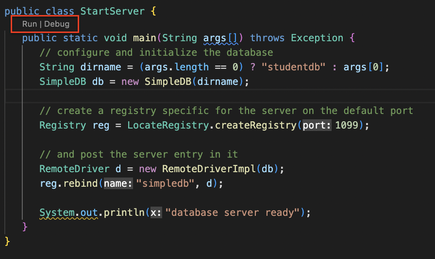
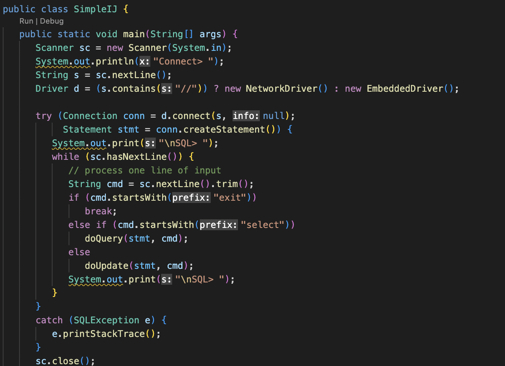

# SimpleDB

Download from http://cs.bc.edu/~sciore/simpledb/

## Setup

Open the `SimpleDB_3.4` folder with vscode.

### Server

1. Open `simpledb/server/StartServer.java`
1. Run
    

    You'll see the following message:
    ```
    creating new database
    transaction 1 committed
    database server ready
    ```
    `studentdb` directory will be created at the root directly of `SimpleDB_3.4`.

### Client

1. Open `simpleclient/SimpleIJ.java`
1. Run
    
    You'll see the following message and you can connect with **embedded mode**:
    ```
    Connect>
    jdbc:simpledb:test_db
    creating new database
    transaction 1 committed

    SQL>
    ```

    or you can connect with **network mode**: (never tried)

    ```
    jdbc:simpledb://localhost/test_db
    ```

## References

1. https://github.com/SixingYan/SimpleDB_3.00
1. https://github.com/chaoyangnz/simpledb
