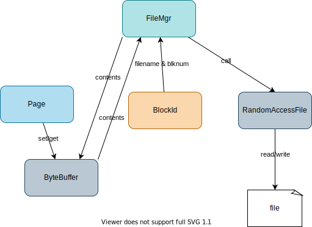

# simpledb from scratch

## 1. Initialize a project

```
gradle init
```

<details>

```
Select type of project to generate:
  1: basic
  2: application
  3: library
  4: Gradle plugin
Enter selection (default: basic) [1..4] 2

Select implementation language:
  1: C++
  2: Groovy
  3: Java
  4: Kotlin
  5: Scala
  6: Swift
Enter selection (default: Java) [1..6] 3

Split functionality across multiple subprojects?:
  1: no - only one application project
  2: yes - application and library projects
Enter selection (default: no - only one application project) [1..2]

Select build script DSL:
  1: Groovy
  2: Kotlin
Enter selection (default: Groovy) [1..2] 2

Generate build using new APIs and behavior (some features may change in the next minor release)? (default: no) [yes, no]

Select test framework:
  1: JUnit 4
  2: TestNG
  3: Spock
  4: JUnit Jupiter
Enter selection (default: JUnit Jupiter) [1..4]

Project name (default: simpledb):

Source package (default: simpledb):


> Task :init
Get more help with your project: https://docs.gradle.org/7.5.1/samples/sample_building_java_applications.html

BUILD SUCCESSFUL in 24s
2 actionable tasks: 2 executed
```

</details>

Run the app

```
./gradlew run
```

Bundle the app

```
./gradlew build
```

## 2. Disk and File Management `FileMgr`



### 2.1. Write/read contents to/from a file

Database needs to write/read data to disk.

File <-> FileMgr <-> ByteBuffer

1. Create `FileMgr.java`

    ```java
    package simpledb.file;

    import java.io.File;
    import java.io.IOException;
    import java.io.RandomAccessFile;
    import java.nio.ByteBuffer;
    import java.nio.charset.Charset;
    import java.nio.charset.StandardCharsets;
    import java.util.HashMap;
    import java.util.Map;

    public class FileMgr {
      private File dbDirectory;
      private int blocksize;
      private boolean isNew;
      private Map<String, RandomAccessFile> openFiles = new HashMap<>();
      public static Charset CHARSET = StandardCharsets.US_ASCII;

      public FileMgr(File dbDirectory, int blocksize) {
        this.dbDirectory = dbDirectory;
        this.blocksize = blocksize;
        isNew = !dbDirectory.exists();

        // create the directory if not exists
        if (isNew)
          dbDirectory.mkdirs();

        // remove any leftover temporary tables
        for (String filename : dbDirectory.list())
          if (filename.startsWith("temp"))
            new File(dbDirectory, filename).delete();
      }

      public synchronized void read(String filename) {
        try {
          RandomAccessFile f = getFile(filename);
          f.seek(0); // TODO: enable to read from the specified position
          ByteBuffer bb = ByteBuffer.allocateDirect(blocksize);
          bb.position(0); // [B@8bcc55f
          int readBytes = f.getChannel().read(bb);
          System.out.println("readBytes: " + readBytes);

          // getBytes
          bb.position(0);
          int length = bb.getInt(); // get first int that indicates the length to read
          System.out.println("lenth:" + length);
          byte[] b = new byte[length];
          bb.get(b);
          System.out.println(b);

          // get String from []bytes
          String msg = new String(b, CHARSET); // TODO: enable to read Int and String
          System.out.println("read message from file: " + msg);
        } catch (IOException e) {
          throw new RuntimeException("cannot read file " + filename);
        }
      }

      public synchronized void write(String filename) {
        try {
          RandomAccessFile f = getFile(filename);
          f.seek(0); // TODO: enable to write from the specified position
          String msg = "test"; // TODO: enable to pass the contents
          System.out.println("write message: " + msg);
          byte[] b = msg.getBytes(CHARSET);

          // setBytes
          ByteBuffer bb = ByteBuffer.allocateDirect(blocksize);
          bb.position(0);
          bb.putInt(b.length); // put length before the content
          bb.put(b); // put the content
          bb.position(0);
          f.getChannel().write(bb);
        } catch (IOException e) {
          throw new RuntimeException("cannot write to file " + filename);
        }
      }

      private RandomAccessFile getFile(String filename) throws IOException {
        RandomAccessFile f = openFiles.get(filename);
        if (f == null) {
          File dbTable = new File(dbDirectory, filename);
          f = new RandomAccessFile(dbTable, "rws");
          openFiles.put(filename, f);
        }
        return f;
      }
    }
    ```

1. Update `main` in `App.java`.

    ```java
    public static void main(String[] args) {
        File dbDirectory = new File("datadir");
        FileMgr fm = new FileMgr(dbDirectory, 400);
        String filename = "test.txt";
        fm.write(filename);
        fm.read(filename);
    }
    ```

1. Run the code
    ```
    ./gradlew run
    ```

    <details>

    ```
    > Task :app:run
    write message: test
    readBytes: 400
    lenth:4
    [B@1540e19d
    read message from file: test

    BUILD SUCCESSFUL in 633ms
    2 actionable tasks: 1 executed, 1 up-to-date
    ```

    </details>

1. Check file.

    ```
    tree app/datadir
    app/datadir
    └── test.txt

    0 directories, 1 file
    ```

### 2.2. Write/Read `Page` <-> File

File <-> FileMgr <-> Page(ButeBuffer)

`Page`: A container to wrap a `ByteBuffer` and responsible read and write `ByteBuffer` with `offset`. A page is initialized with the specified blocksize.


1. Create `Page` class.

    ```java
    package simpledb.file;

    import java.nio.ByteBuffer;
    import java.nio.charset.Charset;
    import java.nio.charset.StandardCharsets;

    public class Page {
      private ByteBuffer bb;
      public static Charset CHARSET = StandardCharsets.US_ASCII;

      public Page(int blocksize) {
        bb = ByteBuffer.allocateDirect(blocksize);
      }

      public int getInt(int offset) {
        return bb.getInt(offset);
      }

      public void setInt(int offset, int n) {
        bb.putInt(offset, n);
      }

      public byte[] getBytes(int offset) {
        bb.position(offset);
        int length = bb.getInt();
        byte[] b = new byte[length];
        bb.get(b);
        return b;
      }

      public void setBytes(int offset, byte[] b) {
        bb.position(offset);
        bb.putInt(b.length);
        bb.put(b);
      }

      public String getString(int offset) {
        byte[] b = getBytes(offset);
        return new String(b, CHARSET);
      }

      public void setString(int offset, String s) {
        byte[] b = s.getBytes(CHARSET);
        setBytes(offset, b);
      }

      public static int maxLength(int strlen) {
        float bytesPerChar = CHARSET.newEncoder().maxBytesPerChar();
        return Integer.BYTES + (strlen & (int) bytesPerChar);
      }

      ByteBuffer contents() {
        bb.position(0);
        return bb;
      }
    }
    ```

1. `FileMgr.read` and `FileMgr.write` just receive `filename` and `page`. So file manager interact with them in between.

    File <--  FileMgr --> Page

    read:
    ```java
      public synchronized void read(String filename, Page p) {
        try {
          RandomAccessFile f = getFile(filename);
          f.seek(0); // TODO: enable to read from the specified position
          f.getChannel().read(p.contents());
        } catch (IOException e) {
          throw new RuntimeException("cannot read file " + filename);
        }
      }
    ```
    write:
    ```java
      public synchronized void write(String filename, Page page) {
        try {
          RandomAccessFile f = getFile(filename);
          f.seek(0); // TODO: enable to write from the specified position
          f.getChannel().write(page.contents());
        } catch (IOException e) {
          throw new RuntimeException("cannot write to file " + filename);
        }
      }
    ```
1. Add a method `blockSize` to `FileMgr`
    ```java
      public int blockSize() {
        return blocksize;
      }
    ```
1. Update `main`

    1. Initialize `FileMgr` and `Page`.
    1. `FileMgr` write `Page`'s content to a file. (`Page` -> file)
    1. `FileMgr` read the content of the file to `Page`. (file -> `Page`)


    ```java
    public static void main(String[] args) {
        File dbDirectory = new File("datadir");
        FileMgr fm = new FileMgr(dbDirectory, 400);
        String filename = "test.txt";

        // Page -> File
        Page page1 = new Page(fm.blockSize());
        page1.setString(0, "test");
        fm.write(filename, page1);

        // File -> Page
        Page page2 = new Page(fm.blockSize());
        fm.read(filename, page2);
        System.out.println("read message: " + page2.getString(0));
    }
    ```

    Now you can set arbitrary contents with `Page.setString(offset, string)`. (currently `offset` doesn't make effect as `FileMgr` reads and writes from position 0, which will be fixed later.)

1. Run

    ```
    ./gradlew run
    read message: test
    ```

### 2.3. Write/Read `Page` <-> Block (File)

`BlockId`: A container to hold a filename and block number

1. Create `BlockId.java`

    ```java
    package simpledb.file;

    public class BlockId {
      private String filename;
      private int blknum;

      public BlockId(String filename, int blknum) {
        this.filename = filename;
        this.blknum = blknum;
      }

      public String fileName() {
        return filename;
      }

      public int number() {
        return blknum;
      }

      public boolean equals(Object obj) {
        BlockId blk = (BlockId) obj;
        if (blk == null)
          return false;
        return filename.equals(blk.fileName()) && blknum == blk.number();
      }

      public String toString() {
        return "[file " + filename + ", block " + blknum + "]";
      }

      public int hashCode() {
        return toString().hashCode();
      }
    }
    ```
1. Replace file in `FileMgr` with `BlockId`.

    read:
    ```java
    public synchronized void read(BlockId blk, Page p) {
      try {
        RandomAccessFile f = getFile(blk.fileName());
        f.seek(blk.number() * blocksize);
        f.getChannel().read(p.contents());
      } catch (IOException e) {
        throw new RuntimeException("cannot read file " + blk.fileName());
      }
    }
    ```

    write:
    ```java
    public synchronized void write(BlockId blk, Page page) {
      try {
        RandomAccessFile f = getFile(blk.fileName());
        f.seek(blk.number() * blocksize);
        f.getChannel().write(page.contents());
      } catch (IOException e) {
        throw new RuntimeException("cannot write to file " + blk.fileName());
      }
    }
    ```

1. Update `main`

    ```java
    public static void main(String[] args) {
        File dbDirectory = new File("datadir");
        FileMgr fm = new FileMgr(dbDirectory, 400);
        String filename = "test.txt";
        // Init BlockId
        BlockId blk = new BlockId(filename, fm.blockSize());

        String msg = "test";
        int pos = 0;

        // Page -> File
        Page page1 = new Page(fm.blockSize());
        page1.setString(pos, msg);
        fm.write(blk, page1);

        // File -> Page
        Page page2 = new Page(fm.blockSize());
        fm.read(blk, page2);
        System.out.println("read message: " + page2.getString(pos));
    }
    ```

    Now the content and position in ByteBuffer can be specified with `msg` and `pos`.

    `Page(ByteBuffer)` <-- `FileMgr` --> `BlockId(File)`
1. Run
    ```
    ./gradlew run
    read message: test
    ```

## 3. Memory Management `LogMgr` and `BufferMgr`

### 3.1. LogMgr

The log manager writes log record into a log file.

1. Add `append` and `length` to `file/FileMgr.java`

    ```java
    public synchronized BlockId append(String filename) {
      int newblknum = length(filename);
      BlockId blk = new BlockId(filename, newblknum);
      byte[] b = new byte[blocksize];
      try {
        RandomAccessFile f = getFile(blk.fileName());
        f.seek(blk.number() * blocksize);
        f.write(b);
      } catch (IOException e) {
        throw new RuntimeException("cannot append block " + blk);
      }
      return blk;
    }

    public int length(String filename) {
      try {
        RandomAccessFile f = getFile(filename);
        return (int) (f.length() / blocksize);
      } catch (IOException e) {
        throw new RuntimeException("cannot access " + filename);
      }
    }
    ```

1. Add `log/LogMgr.java`

    `LogMgr` is initialized with `FileMgr` and `logfile`.

    ```java
    package simpledb.log;

    import java.util.Iterator;

    import simpledb.file.BlockId;
    import simpledb.file.FileMgr;
    import simpledb.file.Page;

    public class LogMgr {
      private FileMgr fm;
      private String logfile;
      private Page logpage;
      private BlockId currentblk;
      private int latestLSN = 0;
      private int lastSavedLSN = 0;

      public LogMgr(FileMgr fm, String logfile) {
        this.fm = fm;
        this.logfile = logfile;
        byte[] b = new byte[fm.blockSize()];
        logpage = new Page(b);
        int logsize = fm.length(logfile);
        if (logsize == 0) {
          currentblk = appendNewBlock();
        } else {
          currentblk = new BlockId(logfile, logsize - 1);
          fm.read(currentblk, logpage);
        }
      }

      public synchronized int append(byte[] logrec) {
        int boundary = logpage.getInt(0);
        int recsize = logrec.length;
        int bytesneeded = recsize + Integer.BYTES;
        if (boundary - bytesneeded < Integer.BYTES) {
          flush();
          currentblk = appendNewBlock();
          boundary = logpage.getInt(0);
        }
        int recpos = boundary - bytesneeded;

        logpage.setBytes(recpos, logrec);
        logpage.setInt(0, recpos);
        latestLSN += 1;
        return latestLSN;
      }

      private BlockId appendNewBlock() {
        BlockId blk = fm.append(logfile);
        logpage.setInt(0, fm.blockSize());
        fm.write(blk, logpage);
        return blk;
      }

      private void flush() {
        fm.write(currentblk, logpage);
        lastSavedLSN = latestLSN;
      }

      public Iterator<byte[]> iterator() {
        flush(); // why flush here?
        return new LogIterator(fm, currentblk);
      }
    }
    ```

1. Add `log/LogIterator.java`

    ```java
    package simpledb.log;

    import java.util.Iterator;

    import simpledb.file.BlockId;
    import simpledb.file.FileMgr;
    import simpledb.file.Page;

    public class LogIterator implements Iterator<byte[]> {
      private FileMgr fm;
      private BlockId blk;
      private Page p;
      private int currentpos;
      private int boundary; // what is the boundary?

      public LogIterator(FileMgr fm, BlockId blk) {
        this.fm = fm;
        this.blk = blk;
        byte[] b = new byte[fm.blockSize()];
        p = new Page(b);
        moveToBlock(blk);
      }

      public boolean hasNext() {
        return currentpos < fm.blockSize() || blk.number() > 0;
      }

      public byte[] next() {
        if (currentpos == fm.blockSize()) {
          blk = new BlockId(blk.fileName(), blk.number() - 1); // why -1?
          moveToBlock(blk);
        }
        byte[] rec = p.getBytes(currentpos);
        currentpos += Integer.BYTES + rec.length;
        return rec;
      }

      private void moveToBlock(BlockId blk) {
        fm.read(blk, p);
        boundary = p.getInt(0);
        currentpos = boundary;
      }
    }
    ```

1. Update `App.java`

    1. Add the following methods

        ```java
        private static void printLogRecords(LogMgr lm, String msg) {
            System.out.println(msg);
            Iterator<byte[]> iter = lm.iterator();
            while (iter.hasNext()) {
                byte[] rec = iter.next();
                Page p = new Page(rec);
                String s = p.getString(0);
                int npos = Page.maxLength(s.length());
                int val = p.getInt(npos);
                System.out.println("[" + s + ", " + val + "]");
            }
            System.out.println();
        }

        private static void createRecords(LogMgr lm, int start, int end) {
            System.out.print("Creating records: ");
            for (int i = start; i <= end; i++) {
                byte[] rec = createLogRecord("record" + i, i + 100);
                int lsn = lm.append(rec);
                System.out.print(lsn + " ");
            }
            System.out.println();
        }

        // Create a log record having two values: a string and an integer.
        private static byte[] createLogRecord(String s, int n) {
            int spos = 0;
            int npos = spos + Page.maxLength(s.length());
            byte[] b = new byte[npos + Integer.BYTES];
            Page p = new Page(b);
            p.setString(spos, s);
            p.setInt(npos, n);
            return b;
        }
        ```

    1. Use them in `main()`

        ```java
        // 3. LogMgr
        LogMgr lm = new LogMgr(fm, "simpledb.log");
        printLogRecords(lm, "The initial empty log file:"); // print an empty log file
        System.out.println("done");
        createRecords(lm, 1, 35);
        printLogRecords(lm, "The log file now has these records:");
        createRecords(lm, 36, 70);
        lm.flush(65);
        printLogRecords(lm, "The log file now has these records:");
        ```

1. Run

    ```
    ./gradlew run
    ```

    <details>

    ```

    > Task :app:run
    read message: test
    The initial empty log file:

    done
    Creating records: 1 2 3 4 5 6 7 8 9 10 11 12 13 14 15 16 17 18 19 20 21 22 23 24 25 26 27 28 29 30 31 32 33 34 35
    The log file now has these records:
    [record35, 135]
    [record34, 134]
    [record33, 133]
    [record32, 132]
    [record31, 131]
    [record30, 130]
    [record29, 129]
    [record28, 128]
    [record27, 127]
    [record26, 126]
    [record25, 125]
    [record24, 124]
    [record23, 123]
    [record22, 122]
    [record21, 121]
    [record20, 120]
    [record19, 119]
    [record18, 118]
    [record17, 117]
    [record16, 116]
    [record15, 115]
    [record14, 114]
    [record13, 113]
    [record12, 112]
    [record11, 111]
    [record10, 110]
    [record9, 109]
    [record8, 108]
    [record7, 107]
    [record6, 106]
    [record5, 105]
    [record4, 104]
    [record3, 103]
    [record2, 102]
    [record1, 101]

    Creating records: 36 37 38 39 40 41 42 43 44 45 46 47 48 49 50 51 52 53 54 55 56 57 58 59 60 61 62 63 64 65 66 67 68 69 70
    The log file now has these records:
    [record70, 170]
    [record69, 169]
    [record68, 168]
    [record67, 167]
    [record66, 166]
    [record65, 165]
    [record64, 164]
    [record63, 163]
    [record62, 162]
    [record61, 161]
    [record60, 160]
    [record59, 159]
    [record58, 158]
    [record57, 157]
    [record56, 156]
    [record55, 155]
    [record54, 154]
    [record53, 153]
    [record52, 152]
    [record51, 151]
    [record50, 150]
    [record49, 149]
    [record48, 148]
    [record47, 147]
    [record46, 146]
    [record45, 145]
    [record44, 144]
    [record43, 143]
    [record42, 142]
    [record41, 141]
    [record40, 140]
    [record39, 139]
    [record38, 138]
    [record37, 137]
    [record36, 136]
    [record35, 135]
    [record34, 134]
    [record33, 133]
    [record32, 132]
    [record31, 131]
    [record30, 130]
    [record29, 129]
    [record28, 128]
    [record27, 127]
    [record26, 126]
    [record25, 125]
    [record24, 124]
    [record23, 123]
    [record22, 122]
    [record21, 121]
    [record20, 120]
    [record19, 119]
    [record18, 118]
    [record17, 117]
    [record16, 116]
    [record15, 115]
    [record14, 114]
    [record13, 113]
    [record12, 112]
    [record11, 111]
    [record10, 110]
    [record9, 109]
    [record8, 108]
    [record7, 107]
    [record6, 106]
    [record5, 105]
    [record4, 104]
    [record3, 103]
    [record2, 102]
    [record1, 101]


    BUILD SUCCESSFUL in 828ms
    2 actionable tasks: 1 executed, 1 up-to-date
    ```

    ```
    cat app/datadir/simpledb.log
          record20record19record18record17record16record15record14record13record12record11record10nrecord9mrecord8lrecord7krecord6jrecord5irecord4hrecord3grecord2frecord1rrecord39record38record37record36record35record34record33record32record31record30record29record28record2record26record25record24record23record22record21rerecord58record57record56record55record54record53record52record51record50record49record48record47record46record45record44record43record42record41record40�rerecord58record57record56record55record54record53record52record70record69record68record67record66record65record64record63record62record61record60record59�%
    ```


    </details>
