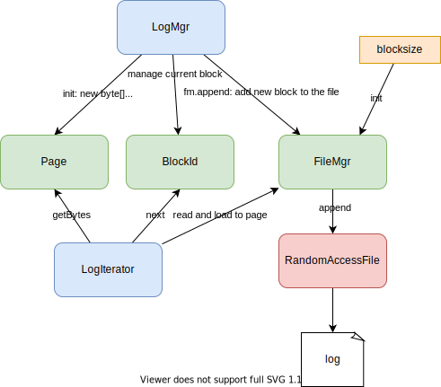
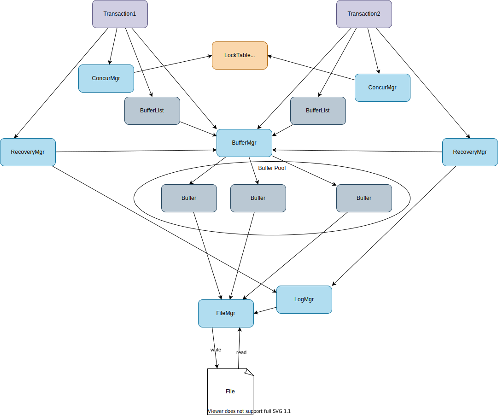

# simpledb from scratch

## 1. Initialize a project

```
gradle init
```

<details>

```
Select type of project to generate:
  1: basic
  2: application
  3: library
  4: Gradle plugin
Enter selection (default: basic) [1..4] 2

Select implementation language:
  1: C++
  2: Groovy
  3: Java
  4: Kotlin
  5: Scala
  6: Swift
Enter selection (default: Java) [1..6] 3

Split functionality across multiple subprojects?:
  1: no - only one application project
  2: yes - application and library projects
Enter selection (default: no - only one application project) [1..2]

Select build script DSL:
  1: Groovy
  2: Kotlin
Enter selection (default: Groovy) [1..2] 2

Generate build using new APIs and behavior (some features may change in the next minor release)? (default: no) [yes, no]

Select test framework:
  1: JUnit 4
  2: TestNG
  3: Spock
  4: JUnit Jupiter
Enter selection (default: JUnit Jupiter) [1..4]

Project name (default: simpledb):

Source package (default: simpledb):


> Task :init
Get more help with your project: https://docs.gradle.org/7.5.1/samples/sample_building_java_applications.html

BUILD SUCCESSFUL in 24s
2 actionable tasks: 2 executed
```

</details>

Run the app

```
./gradlew run
```

Bundle the app

```
./gradlew build
```

## 2. Disk and File Management `FileMgr`


### 2.1. Write/read contents to/from a file

1. Overview
    Database needs to write/read data to disk.
    File <-> FileMgr <-> ByteBuffer
    FileMgr writes `<length><content>`

1. Create `FileMgr.java`

    ```java
    package simpledb.file;

    import java.io.File;
    import java.io.IOException;
    import java.io.RandomAccessFile;
    import java.nio.ByteBuffer;
    import java.nio.charset.Charset;
    import java.nio.charset.StandardCharsets;
    import java.util.HashMap;
    import java.util.Map;

    public class FileMgr {
      private File dbDirectory;
      private int blocksize;
      private boolean isNew;
      private Map<String, RandomAccessFile> openFiles = new HashMap<>();
      public static Charset CHARSET = StandardCharsets.US_ASCII;

      public FileMgr(File dbDirectory, int blocksize) {
        this.dbDirectory = dbDirectory;
        this.blocksize = blocksize;
        isNew = !dbDirectory.exists();

        // create the directory if not exists
        if (isNew)
          dbDirectory.mkdirs();

        // remove any leftover temporary tables
        for (String filename : dbDirectory.list())
          if (filename.startsWith("temp"))
            new File(dbDirectory, filename).delete();
      }

      public synchronized void read(String filename) {
        try {
          RandomAccessFile f = getFile(filename);
          f.seek(0); // TODO: enable to read from the specified position
          ByteBuffer bb = ByteBuffer.allocateDirect(blocksize);
          bb.position(0); // [B@8bcc55f
          int readBytes = f.getChannel().read(bb);
          System.out.println("readBytes: " + readBytes);

          // getBytes
          bb.position(0);
          int length = bb.getInt(); // get first int that indicates the length to read
          System.out.println("lenth:" + length);
          byte[] b = new byte[length];
          bb.get(b);
          System.out.println(b);

          // get String from []bytes
          String msg = new String(b, CHARSET); // TODO: enable to read Int and String
          System.out.println("read message from file: " + msg);
        } catch (IOException e) {
          throw new RuntimeException("cannot read file " + filename);
        }
      }

      public synchronized void write(String filename) {
        try {
          RandomAccessFile f = getFile(filename);
          f.seek(0); // TODO: enable to write from the specified position
          String msg = "test"; // TODO: enable to pass the contents
          System.out.println("write message: " + msg);
          byte[] b = msg.getBytes(CHARSET);

          // setBytes
          ByteBuffer bb = ByteBuffer.allocateDirect(blocksize);
          bb.position(0);
          bb.putInt(b.length); // put length before the content
          bb.put(b); // put the content
          bb.position(0);
          f.getChannel().write(bb);
        } catch (IOException e) {
          throw new RuntimeException("cannot write to file " + filename);
        }
      }

      private RandomAccessFile getFile(String filename) throws IOException {
        RandomAccessFile f = openFiles.get(filename);
        if (f == null) {
          File dbTable = new File(dbDirectory, filename);
          f = new RandomAccessFile(dbTable, "rws");
          openFiles.put(filename, f);
        }
        return f;
      }
    }
    ```

1. Update `main` in `App.java`.

    ```java
    public static void main(String[] args) {
        File dbDirectory = new File("datadir");
        FileMgr fm = new FileMgr(dbDirectory, 400);
        String filename = "test.txt";
        fm.write(filename);
        fm.read(filename);
    }
    ```

1. Run the code
    ```
    ./gradlew run
    ```

    <details>

    ```
    > Task :app:run
    write message: test
    readBytes: 400
    lenth:4
    [B@1540e19d
    read message from file: test

    BUILD SUCCESSFUL in 633ms
    2 actionable tasks: 1 executed, 1 up-to-date
    ```

    </details>

1. Check file.

    ```
    tree app/datadir
    app/datadir
    └── test.txt

    0 directories, 1 file
    ```

### 2.2. Write/Read `Page` <-> File

1. Overview
    1. File <-> FileMgr <-> Page(ButeBuffer)
    1. `Page`: A container to wrap a `ByteBuffer` and responsible read and write `ByteBuffer` with `offset`. A page is initialized with the specified blocksize.
    1. A Page object holds the contents of a disk block.
    1. `Page.setInt` saves the Integer in the page by calling `ByteBuffer.putInt`
    1. `Page.setBytes` saves a **blob** (binary large object) as two values: first the number of bytes in the specified blob and the nthe bytes themselves.

1. Create `Page` class.

    ```java
    package simpledb.file;

    import java.nio.ByteBuffer;
    import java.nio.charset.Charset;
    import java.nio.charset.StandardCharsets;

    public class Page {
      private ByteBuffer bb;
      public static Charset CHARSET = StandardCharsets.US_ASCII;

      public Page(int blocksize) {
        bb = ByteBuffer.allocateDirect(blocksize);
      }

      public int getInt(int offset) {
        return bb.getInt(offset);
      }

      public void setInt(int offset, int n) {
        bb.putInt(offset, n);
      }

      public byte[] getBytes(int offset) {
        bb.position(offset);
        int length = bb.getInt();
        byte[] b = new byte[length];
        bb.get(b);
        return b;
      }

      public void setBytes(int offset, byte[] b) {
        bb.position(offset);
        bb.putInt(b.length);
        bb.put(b);
      }

      public String getString(int offset) {
        byte[] b = getBytes(offset);
        return new String(b, CHARSET);
      }

      public void setString(int offset, String s) {
        byte[] b = s.getBytes(CHARSET);
        setBytes(offset, b);
      }

      public static int maxLength(int strlen) {
        float bytesPerChar = CHARSET.newEncoder().maxBytesPerChar();
        return Integer.BYTES + (strlen & (int) bytesPerChar);
      }

      ByteBuffer contents() {
        bb.position(0);
        return bb;
      }
    }
    ```

1. `FileMgr.read` and `FileMgr.write` just receive `filename` and `page`. So file manager interact with them in between.

    File <--  FileMgr --> Page

    read:
    ```java
      public synchronized void read(String filename, Page p) {
        try {
          RandomAccessFile f = getFile(filename);
          f.seek(0); // TODO: enable to read from the specified position
          f.getChannel().read(p.contents());
        } catch (IOException e) {
          throw new RuntimeException("cannot read file " + filename);
        }
      }
    ```
    write:
    ```java
      public synchronized void write(String filename, Page page) {
        try {
          RandomAccessFile f = getFile(filename);
          f.seek(0); // TODO: enable to write from the specified position
          f.getChannel().write(page.contents());
        } catch (IOException e) {
          throw new RuntimeException("cannot write to file " + filename);
        }
      }
    ```
1. Add a method `blockSize` to `FileMgr`
    ```java
      public int blockSize() {
        return blocksize;
      }
    ```
1. Update `main`

    1. Initialize `FileMgr` and `Page`.
    1. `FileMgr` write `Page`'s content to a file. (`Page` -> file)
    1. `FileMgr` read the content of the file to `Page`. (file -> `Page`)


    ```java
    public static void main(String[] args) {
        File dbDirectory = new File("datadir");
        FileMgr fm = new FileMgr(dbDirectory, 400);
        String filename = "test.txt";

        // Page -> File
        Page page1 = new Page(fm.blockSize());
        page1.setString(0, "test");
        fm.write(filename, page1);

        // File -> Page
        Page page2 = new Page(fm.blockSize());
        fm.read(filename, page2);
        System.out.println("read message: " + page2.getString(0));
    }
    ```

    Now you can set arbitrary contents with `Page.setString(offset, string)`. (currently `offset` doesn't make effect as `FileMgr` reads and writes from position 0, which will be fixed later.)

1. Run

    ```
    ./gradlew run
    read message: test
    ```

### 2.3. Write/Read `Page` <-> Block (File)

`BlockId`: A container to hold a filename and block number

1. Create `BlockId.java`

    ```java
    package simpledb.file;

    public class BlockId {
      private String filename;
      private int blknum;

      public BlockId(String filename, int blknum) {
        this.filename = filename;
        this.blknum = blknum;
      }

      public String fileName() {
        return filename;
      }

      public int number() {
        return blknum;
      }

      public boolean equals(Object obj) {
        BlockId blk = (BlockId) obj;
        if (blk == null)
          return false;
        return filename.equals(blk.fileName()) && blknum == blk.number();
      }

      public String toString() {
        return "[file " + filename + ", block " + blknum + "]";
      }

      public int hashCode() {
        return toString().hashCode();
      }
    }
    ```
1. Replace file in `FileMgr` with `BlockId`.

    read:
    ```java
    public synchronized void read(BlockId blk, Page p) {
      try {
        RandomAccessFile f = getFile(blk.fileName());
        f.seek(blk.number() * blocksize);
        f.getChannel().read(p.contents());
      } catch (IOException e) {
        throw new RuntimeException("cannot read file " + blk.fileName());
      }
    }
    ```

    write:
    ```java
    public synchronized void write(BlockId blk, Page page) {
      try {
        RandomAccessFile f = getFile(blk.fileName());
        f.seek(blk.number() * blocksize);
        f.getChannel().write(page.contents());
      } catch (IOException e) {
        throw new RuntimeException("cannot write to file " + blk.fileName());
      }
    }
    ```

1. Update `main`

    ```java
    public static void main(String[] args) {
        File dbDirectory = new File("datadir");
        FileMgr fm = new FileMgr(dbDirectory, 400);
        String filename = "test.txt";
        // Init BlockId
        BlockId blk = new BlockId(filename, fm.blockSize());

        String msg = "test";
        int pos = 0;

        // Page -> File
        Page page1 = new Page(fm.blockSize());
        page1.setString(pos, msg);
        fm.write(blk, page1);

        // File -> Page
        Page page2 = new Page(fm.blockSize());
        fm.read(blk, page2);
        System.out.println("read message: " + page2.getString(pos));
    }
    ```

    Now the content and position in ByteBuffer can be specified with `msg` and `pos`.

    `Page(ByteBuffer)` <-- `FileMgr` --> `BlockId(File)`
1. Run
    ```
    ./gradlew run
    read message: test
    ```

## 3. Memory Management `LogMgr` and `BufferMgr`

### 3.1. LogMgr



1. Overview
    1. The log manager writes log record into a log file.
    1. In a block, a new log record is added from right to left.
    1. To know the position to save the new record, `boudary` holds the offset of the most recently added record.
    1. `LogIterator` can read logs from new to old until no more logs exist.

1. Add `append` and `length` to `file/FileMgr.java`

    ```java
    public synchronized BlockId append(String filename) {
      int newblknum = length(filename);
      BlockId blk = new BlockId(filename, newblknum);
      byte[] b = new byte[blocksize];
      try {
        RandomAccessFile f = getFile(blk.fileName());
        f.seek(blk.number() * blocksize);
        f.write(b);
      } catch (IOException e) {
        throw new RuntimeException("cannot append block " + blk);
      }
      return blk;
    }

    public int length(String filename) {
      try {
        RandomAccessFile f = getFile(filename);
        return (int) (f.length() / blocksize);
      } catch (IOException e) {
        throw new RuntimeException("cannot access " + filename);
      }
    }
    ```

1. Add `log/LogMgr.java`

    `LogMgr` is initialized with `FileMgr` and `logfile`.

    ```java
    package simpledb.log;

    import java.util.Iterator;

    import simpledb.file.BlockId;
    import simpledb.file.FileMgr;
    import simpledb.file.Page;

    public class LogMgr {
      private FileMgr fm;
      private String logfile;
      private Page logpage;
      private BlockId currentblk;
      private int latestLSN = 0;
      private int lastSavedLSN = 0;

      public LogMgr(FileMgr fm, String logfile) {
        this.fm = fm;
        this.logfile = logfile;
        byte[] b = new byte[fm.blockSize()];
        logpage = new Page(b);
        int logsize = fm.length(logfile);
        if (logsize == 0) {
          currentblk = appendNewBlock();
        } else {
          currentblk = new BlockId(logfile, logsize - 1);
          fm.read(currentblk, logpage);
        }
      }

      public synchronized int append(byte[] logrec) {
        int boundary = logpage.getInt(0);
        int recsize = logrec.length;
        int bytesneeded = recsize + Integer.BYTES;
        if (boundary - bytesneeded < Integer.BYTES) {
          flush();
          currentblk = appendNewBlock();
          boundary = logpage.getInt(0);
        }
        int recpos = boundary - bytesneeded;

        logpage.setBytes(recpos, logrec);
        logpage.setInt(0, recpos);
        latestLSN += 1;
        return latestLSN;
      }

      private BlockId appendNewBlock() {
        BlockId blk = fm.append(logfile);
        logpage.setInt(0, fm.blockSize());
        fm.write(blk, logpage);
        return blk;
      }

      private void flush() {
        fm.write(currentblk, logpage);
        lastSavedLSN = latestLSN;
      }

      public Iterator<byte[]> iterator() {
        flush(); // why flush here?
        return new LogIterator(fm, currentblk);
      }
    }
    ```

1. Add `log/LogIterator.java`

    ```java
    package simpledb.log;

    import java.util.Iterator;

    import simpledb.file.BlockId;
    import simpledb.file.FileMgr;
    import simpledb.file.Page;

    public class LogIterator implements Iterator<byte[]> {
      private FileMgr fm;
      private BlockId blk;
      private Page p;
      private int currentpos;
      private int boundary; // what is the boundary?

      public LogIterator(FileMgr fm, BlockId blk) {
        this.fm = fm;
        this.blk = blk;
        byte[] b = new byte[fm.blockSize()];
        p = new Page(b);
        moveToBlock(blk);
      }

      public boolean hasNext() {
        return currentpos < fm.blockSize() || blk.number() > 0;
      }

      public byte[] next() {
        if (currentpos == fm.blockSize()) {
          blk = new BlockId(blk.fileName(), blk.number() - 1); // decrement block number to move to next block
          moveToBlock(blk);
        }
        byte[] rec = p.getBytes(currentpos);
        currentpos += Integer.BYTES + rec.length;
        return rec;
      }

      private void moveToBlock(BlockId blk) {
        fm.read(blk, p);
        boundary = p.getInt(0);
        currentpos = boundary;
      }
    }
    ```

1. Update `App.java`

    1. Add the following methods

        ```java
        private static void printLogRecords(LogMgr lm, String msg) {
            System.out.println(msg);
            Iterator<byte[]> iter = lm.iterator();
            while (iter.hasNext()) {
                byte[] rec = iter.next();
                Page p = new Page(rec);
                String s = p.getString(0);
                int npos = Page.maxLength(s.length());
                int val = p.getInt(npos);
                System.out.println("[" + s + ", " + val + "]");
            }
            System.out.println();
        }

        private static void createRecords(LogMgr lm, int start, int end) {
            System.out.print("Creating records: ");
            for (int i = start; i <= end; i++) {
                byte[] rec = createLogRecord("record" + i, i + 100);
                int lsn = lm.append(rec);
                System.out.print(lsn + " ");
            }
            System.out.println();
        }

        // Create a log record having two values: a string and an integer.
        private static byte[] createLogRecord(String s, int n) {
            int spos = 0;
            int npos = spos + Page.maxLength(s.length());
            byte[] b = new byte[npos + Integer.BYTES];
            Page p = new Page(b);
            p.setString(spos, s);
            p.setInt(npos, n);
            return b;
        }
        ```

    1. Use them in `main()`

        ```java
        // 3.1. LogMgr
        LogMgr lm = new LogMgr(fm, "simpledb.log");
        printLogRecords(lm, "The initial empty log file:"); // print an empty log file
        System.out.println("done");
        createRecords(lm, 1, 35);
        printLogRecords(lm, "The log file now has these records:");
        createRecords(lm, 36, 70);
        lm.flush(65);
        printLogRecords(lm, "The log file now has these records:");
        ```

1. Run

    ```
    ./gradlew run
    ```

    <details>

    ```

    > Task :app:run
    read message: test
    The initial empty log file:

    done
    Creating records: 1 2 3 4 5 6 7 8 9 10 11 12 13 14 15 16 17 18 19 20 21 22 23 24 25 26 27 28 29 30 31 32 33 34 35
    The log file now has these records:
    [record35, 135]
    [record34, 134]
    [record33, 133]
    [record32, 132]
    [record31, 131]
    [record30, 130]
    [record29, 129]
    [record28, 128]
    [record27, 127]
    [record26, 126]
    [record25, 125]
    [record24, 124]
    [record23, 123]
    [record22, 122]
    [record21, 121]
    [record20, 120]
    [record19, 119]
    [record18, 118]
    [record17, 117]
    [record16, 116]
    [record15, 115]
    [record14, 114]
    [record13, 113]
    [record12, 112]
    [record11, 111]
    [record10, 110]
    [record9, 109]
    [record8, 108]
    [record7, 107]
    [record6, 106]
    [record5, 105]
    [record4, 104]
    [record3, 103]
    [record2, 102]
    [record1, 101]

    Creating records: 36 37 38 39 40 41 42 43 44 45 46 47 48 49 50 51 52 53 54 55 56 57 58 59 60 61 62 63 64 65 66 67 68 69 70
    The log file now has these records:
    [record70, 170]
    [record69, 169]
    [record68, 168]
    [record67, 167]
    [record66, 166]
    [record65, 165]
    [record64, 164]
    [record63, 163]
    [record62, 162]
    [record61, 161]
    [record60, 160]
    [record59, 159]
    [record58, 158]
    [record57, 157]
    [record56, 156]
    [record55, 155]
    [record54, 154]
    [record53, 153]
    [record52, 152]
    [record51, 151]
    [record50, 150]
    [record49, 149]
    [record48, 148]
    [record47, 147]
    [record46, 146]
    [record45, 145]
    [record44, 144]
    [record43, 143]
    [record42, 142]
    [record41, 141]
    [record40, 140]
    [record39, 139]
    [record38, 138]
    [record37, 137]
    [record36, 136]
    [record35, 135]
    [record34, 134]
    [record33, 133]
    [record32, 132]
    [record31, 131]
    [record30, 130]
    [record29, 129]
    [record28, 128]
    [record27, 127]
    [record26, 126]
    [record25, 125]
    [record24, 124]
    [record23, 123]
    [record22, 122]
    [record21, 121]
    [record20, 120]
    [record19, 119]
    [record18, 118]
    [record17, 117]
    [record16, 116]
    [record15, 115]
    [record14, 114]
    [record13, 113]
    [record12, 112]
    [record11, 111]
    [record10, 110]
    [record9, 109]
    [record8, 108]
    [record7, 107]
    [record6, 106]
    [record5, 105]
    [record4, 104]
    [record3, 103]
    [record2, 102]
    [record1, 101]


    BUILD SUCCESSFUL in 828ms
    2 actionable tasks: 1 executed, 1 up-to-date
    ```

    ```
    cat app/datadir/simpledb.log
          record20record19record18record17record16record15record14record13record12record11record10nrecord9mrecord8lrecord7krecord6jrecord5irecord4hrecord3grecord2frecord1rrecord39record38record37record36record35record34record33record32record31record30record29record28record2record26record25record24record23record22record21rerecord58record57record56record55record54record53record52record51record50record49record48record47record46record45record44record43record42record41record40�rerecord58record57record56record55record54record53record52record70record69record68record67record66record65record64record63record62record61record60record59�%
    ```


    </details>

### 3.2. BufferMgr


1. Overview
    1. The **buffer manager** is responsible for the pages that hold user data. The buffer manager allocates a fixed set of pages, called the *buffer pool*. (should fit in physical memory)
    1. These pages should come from the **I/O buffers held by the OS**
    1. A page is *pinned* if some client is currently pinning it; otherwise, the page is *unpinned*.
    1. **BufferMgr** has **bufferpool** as a list of **Buffer**, choose an available buffer to *pin* and *unpin* if client finished using.
    1. **Buffer** holds `FileMgr` for writing/reading to/from file, `LogMgr` for logging, `Page` for contents, `BlockId` for block num and filenam and the information about pins.
1. Add `buffer/Buffer.java`
    ```java
    package simpledb.buffer;

    import simpledb.file.BlockId;
    import simpledb.file.FileMgr;
    import simpledb.file.Page;
    import simpledb.log.LogMgr;

    public class Buffer {
      private FileMgr fm;
      private LogMgr lm;
      private Page contents;
      private BlockId blk = null;
      private int pins = 0;
      private int txnum = -1;
      private int lsn = -1;

      public Buffer(FileMgr fm, LogMgr lm) {
        this.fm = fm;
        this.lm = lm;
        contents = new Page(fm.blockSize());
      }

      /*
      * Returns a block allocated to the buffer
      */
      public BlockId block() {
        return blk;
      }

      public boolean isPinned() {
        return pins > 0;
      }

      void assignToBlock(BlockId b) {
        flush();
        blk = b;
        fm.read(blk, contents);
        pins = 0;
      }

      /*
      * Write the buffer to its disk block if it is dirty.
      */
      void flush() {
        if (txnum >= 0) {
          lm.flush(lsn);
          fm.write(blk, contents);
          txnum = -1;
        }
      }

      void pin() {
        pins++;
      }

      void unpin() {
        pins--;
      }
    }
    ```
1. Add `buffer/BufferManager.java`
    ```java
    package simpledb.buffer;

    import simpledb.file.BlockId;
    import simpledb.file.FileMgr;
    import simpledb.log.LogMgr;

    public class BufferMgr {
      private Buffer[] bufferpool;
      private int numAvailable;
      private static final long MAX_TIME = 10000; // 10 seconds

      public BufferMgr(FileMgr fm, LogMgr lm, int numbuffs) {
        bufferpool = new Buffer[numbuffs];
        numAvailable = numbuffs;
        for (int i = 0; i < numbuffs; i++)
          bufferpool[i] = new Buffer(fm, lm);
      }

      public synchronized int available() {
        return numAvailable;
      }

      public synchronized void unpin(Buffer buff) {
        buff.unpin();
        if (!buff.isPinned()) {
          numAvailable++;
          notifyAll();
        }
      }

      public synchronized Buffer pin(BlockId blk) {
        try {
          long timestamp = System.currentTimeMillis();
          Buffer buff = tryToPin(blk);
          while (buff == null && !waitingTooLong(timestamp)) {
            wait(MAX_TIME);
            buff = tryToPin(blk);
          }
          if (buff == null)
            throw new BufferAbortException();
          return buff;
        } catch (InterruptedException e) {
          throw new BufferAbortException();
        }
      }

      private boolean waitingTooLong(long starttime) {
        return System.currentTimeMillis() - starttime > MAX_TIME;
      }

      private Buffer tryToPin(BlockId blk) {
        Buffer buff = findExistingBuffer(blk);
        if (buff == null) {
          buff = chooseUnpinnedBuffer();
          if (buff == null)
            return null;
          buff.assignToBlock(blk);
        }
        if (!buff.isPinned())
          numAvailable--;
        buff.pin();
        return buff;
      }

      private Buffer findExistingBuffer(BlockId blk) {
        for (Buffer buff : bufferpool) {
          BlockId b = buff.block();
          if (b != null && b.equals(blk))
            return buff;
        }
        return null;
      }

      private Buffer chooseUnpinnedBuffer() {
        for (Buffer buff : bufferpool)
          if (!buff.isPinned())
            return buff;
        return null;
      }
    }
    ```
1. Add `buffer/BufferAbortException.java`
    ```java
    package simpledb.buffer;

    @SuppressWarnings("serial")
    public class BufferAbortException extends RuntimeException {

    }
    ```
1. Update `main()` in `App.java`

    1. Init `BufferMgr` with bufferpool 3.
    1. Call `bm.pin` with a `BlockId` several times.
    1. When the number of pinned blocks reaches the bufferpool size, `bm.pin` will time out.
    1. After unpinning, we can pin again.
    1. Finally check all the buffers in the bufferpool.
    ```java
        // 3.2. BufferMgr
        BufferMgr bm = new BufferMgr(fm, lm, 3);
        Buffer[] buff = new Buffer[6];
        buff[0] = bm.pin(new BlockId("testfile", 0));
        buff[1] = bm.pin(new BlockId("testfile", 1));
        buff[2] = bm.pin(new BlockId("testfile", 2));
        bm.unpin(buff[1]);
        buff[1] = null;
        buff[3] = bm.pin(new BlockId("testfile", 0)); // block 0 pinned twice
        buff[4] = bm.pin(new BlockId("testfile", 1)); // block 1 repinned
        System.out.println("Available buffers: " + bm.available());
        try {
            System.out.println("Attempting to pin block3...");
            buff[5] = bm.pin(new BlockId("testfile", 3)); // will not work; no buffer available
        } catch (BufferAbortException e) {
            System.out.println("Exception: No available buffers");
        }
        bm.unpin(buff[2]);
        buff[2] = null;
        buff[5] = bm.pin(new BlockId("testfile", 3)); // works as there's available buffer
        System.out.println("Final Buffer Allocation:");
        for (int i = 0; i < buff.length; i++) {
            Buffer b = buff[i];
            if (b != null)
                System.out.println("buff[" + i + "] pinned to block " + b.block());
        }
    ```
1. Run
    ```
    ./gradlew run
    Available buffers: 0
    Attempting to pin block3...
    Exception: No available buffers
    Final Buffer Allocation:
    buff[0] pinned to block [file testfile, block 0]
    buff[3] pinned to block [file testfile, block 0]
    buff[4] pinned to block [file testfile, block 1]
    buff[5] pinned to block [file testfile, block 3]
    ```

## 4. Transaction Management



### 4.1. RecoveryManager

1. Overview
    1. `Transaction`: a group of operations that behaves as a single operation.
        1. “single” operation: **ACID** properties
            1. ***Atomicity***: All or nothing. Succeed **(commit)** or fail **(rollback)**
            1. ***Consistency***: every transaction leaves the database in a consistent state. a complete work that can be executed independently of other transactions.
            1. ***Isolation***: behave as if it is the only thread using the engine.
            1. ***Durability***: the changes made by a committed transactions are guaranteed to be permanent
        1. Three types of methods:
            1. **transaction lifespan**: `commit()`, `rollback()`, `recovery()`
            1. **access buffer**: `pin()`, `unpin()`, `getInt()`, `getString()`
            1. **related to FileMgr**: `size()`, `append()`, `blockSize()`
        1. Each transaction has recovery manager.
    1. `RecoveryMgr`: writes the log records for a transaction and recover from them when a system crashes. (*undo-only algorithm*)
    1. `LogRecord`: Object to store an activity of database operation. The first value of the byte array denotes the *operator*: `CHECKPOINT`, `START`, `COMMIT`, `ROLLBACK`, `SETINT`, or `SETSTRING`. Each LogRecord has `writeToLog`.
        1. `CheckipointRecord`
        1. `CommitRecord`
        1. `RollbackRecord`
        1. `SetIntRecord`: has non-empty `undo`
        1. `SetStringRecord`: has non-empty `undo`
        1. `StartRecord`
    1. `ConcurerncyMgr`: Manage concurrency with lock protocol using `LockTable`. Each transaction has its own concurrency manager. The lock table is shared among all concurrency managers.

1. Create `tx/Transaction.java`

    ```java
    package simpledb.tx;

    import simpledb.buffer.Buffer;
    import simpledb.buffer.BufferMgr;
    import simpledb.file.BlockId;
    import simpledb.file.FileMgr;
    import simpledb.file.Page;
    import simpledb.log.LogMgr;
    import simpledb.tx.concurrency.ConcurrencyMgr;
    import simpledb.tx.recovery.RecoveryMgr;

    public class Transaction {
      private static int nextTxNum = 0;
      private static final int END_OF_FILE = -1;
      private RecoveryMgr recoveryMgr;
      private ConcurrencyMgr concurMgr;
      private BufferMgr bm;
      private FileMgr fm;
      private int txnum;
      private BufferList mybuffers;

      public Transaction(FileMgr fm, LogMgr lm, BufferMgr bm) {
        this.fm = fm;
        this.bm = bm;
        txnum = nextTxNumber();
        recoveryMgr = new RecoveryMgr(this, txnum, lm, bm);
        concurMgr = new ConcurrencyMgr();
        mybuffers = new BufferList(bm);
      }

      public void commit() {
        recoveryMgr.commit();
        System.out.println("transaction " + txnum + " committed");
        concurMgr.release();
        mybuffers.unpinAll();
      }

      public void rollback() {
        recoveryMgr.rollback();
        System.out.println("transaction " + txnum + " rolled back");
        concurMgr.release();
        mybuffers.unpinAll();
      }

      public void recover() {
        bm.flushAll(txnum);
        recoveryMgr.recover();
      }

      public void pin(BlockId blk) {
        mybuffers.pin(blk);
      }

      public void unpin(BlockId blk) {
        mybuffers.unpin(blk);
      }

      public int getInt(BlockId blk, int offset) {
        concurMgr.sLock(blk);
        Buffer buff = mybuffers.getBuffer(blk);
        return buff.contents().getInt(offset);
      }

      public String getString(BlockId blk, int offset) {
        concurMgr.sLock(blk);
        Buffer buff = mybuffers.getBuffer(blk);
        return buff.contents().getString(offset);
      }

      public void setInt(BlockId blk, int offset, int val, boolean okToLog) {
        concurMgr.xLock(blk);
        Buffer buff = mybuffers.getBuffer(blk);
        int lsn = -1;
        if (okToLog)
          lsn = recoveryMgr.setInt(buff, offset);
        Page p = buff.contents();
        p.setInt(offset, val);
        buff.setModified(txnum, lsn);
      }

      public void setString(BlockId blk, int offset, String val, boolean okToLog) {
        concurMgr.xLock(blk);
        Buffer buff = mybuffers.getBuffer(blk);
        int lsn = -1;
        if (okToLog)
          lsn = recoveryMgr.setString(buff, offset);

        Page p = buff.contents();
        p.setString(offset, val);
        buff.setModified(txnum, lsn);
      }

      private static synchronized int nextTxNumber() {
        nextTxNum++;
        return nextTxNum;
      }
    }
    ```

1. Create `tx/recovery/RecoveryManager.java`

    ```java
    package simpledb.tx.recovery;

    import java.util.ArrayList;
    import java.util.Collection;
    import java.util.Iterator;

    import simpledb.buffer.Buffer;
    import simpledb.buffer.BufferMgr;
    import simpledb.file.BlockId;
    import simpledb.log.LogMgr;
    import simpledb.tx.Transaction;

    public class RecoveryMgr {
      private LogMgr lm;
      private BufferMgr bm;
      private Transaction tx;
      private int txnum;

      public RecoveryMgr(Transaction tx, int txnum, LogMgr lm, BufferMgr bm) {
        this.tx = tx;
        this.txnum = txnum;
        this.lm = lm;
        this.bm = bm;
        StartRecord.writeToLog(lm, txnum);
      }

      public void commit() {
        bm.flushAll(txnum);
        int lsn = CommitRecord.writeToLog(lm, txnum);
        lm.flush(lsn);
      }

      public void rollback() {
        doRollback();
        bm.flushAll(txnum);
        int lsn = RollbackRecord.writeToLog(lm, txnum);
        lm.flush(lsn);
      }

      public void recover() {
        doRecover();
        bm.flushAll(txnum);
        int lsn = CheckpointRecord.writeToLog(lm);
        lm.flush(lsn);
      }

      public int setInt(Buffer buff, int offset) {
        int oldval = buff.contents().getInt(offset);
        BlockId blk = buff.block();
        return SetIntRecord.writeToLog(lm, txnum, blk, offset, oldval);
      }

      public int setString(Buffer buff, int offset) {
        String oldval = buff.contents().getString(offset);
        BlockId blk = buff.block();
        return SetStringRecord.writeToLog(lm, txnum, blk, offset, oldval);
      }

      /*
      * iterate through the log records from new to old
      * if it finds log records in the transaction, it calls undo of the log record
      * until the start record of the transaction
      */
      private void doRollback() {
        Iterator<byte[]> iter = lm.iterator();
        while (iter.hasNext()) {
          byte[] bytes = iter.next();
          LogRecord rec = LogRecord.createLogRecord(bytes);
          if (rec.txNumber() == txnum) {
            if (rec.op() == LogRecord.START)
              return;
            rec.undo(tx);
          }
        }
      }

      /*
      * it reads log records until it hits a quiescent checkpoint or reaches the end of the log
      * it undoes uncommited update records
      */
      private void doRecover() {
        Collection<Integer> finishedTxs = new ArrayList<>();
        Iterator<byte[]> iter = lm.iterator();
        while (iter.hasNext()) {
          byte[] bytes = iter.next();
          LogRecord rec = LogRecord.createLogRecord(bytes);
          if (rec.op() == LogRecord.CHECKPOINT)
            return;
          if (rec.op() == LogRecord.COMMIT || rec.op() == LogRecord.ROLLBACK)
            finishedTxs.add(rec.txNumber());
          else if (!finishedTxs.contains(rec.txNumber()))
            rec.undo(tx);
        }
      }
    }
    ```

1. Create `recovery/LogRecord.java`

    ```java
    package simpledb.tx.recovery;

    import simpledb.file.Page;
    import simpledb.tx.Transaction;

    public interface LogRecord {
      static final int CHECKPOINT = 0;
      static final int START = 1;
      static final int COMMIT = 2;
      static final int ROLLBACK = 3;
      static final int SETINT = 4;
      static final int SETSTRING = 5;

      int op();

      int txNumber();

      void undo(Transaction tx);

      static LogRecord createLogRecord(byte[] bytes) {
        Page p = new Page(bytes);
        switch (p.getInt(0)) {
          case CHECKPOINT:
            return new CheckpointRecord();
          case COMMIT:
            return new CommitRecord(p);
          case ROLLBACK:
            return new RollbackRecord(p);
          case SETINT:
            return new SetIntRecord(p);
          case SETSTRING:
            return new SetStringRecord(p);
          case START:
            return new StartRecord(p);
          default:
            System.out.println("LogRecord p.getInt: " + p.getInt(0));
            return null;
        }
      }
    }
    ```

    `CheckpointRecord`, `CommitRecord`, `RollbackRecord`, `SetIntRecord`, `SetStringRecord`, and `StartRecord` need to be created.

1. Update `buffer/BufferMgr.java` and `buffer/Buffer.java`

    BufferMgr:
    ```java
    public synchronized void flushAll(int txnum) {
      for (Buffer buff: bufferpool) {
        if (buff.modifyingTx() == txnum)
          buff.flush();
      }
    }
    ```

    Buffer:
    ```java
    public int modifyingTx() {
      return txnum;
    }
    ```

    ```java
    public void setModified(int txnum, int lsn) {
      this.txnum = txnum;
      if (lsn >= 0)
        this.lsn = lsn;
    }
    ```

    ```java
    public Page contents() {
      return contents;
    }
    ```
1. Create `tx/concurrency/ConcurrencyManager.java`

    ```java
    package simpledb.tx.concurrency;

    import java.util.HashMap;
    import java.util.Map;

    import simpledb.file.BlockId;

    /*
    * Concurrency Manager implements lock protocol using block-level granularity.
    * and created for a transaction. The same lock table needs to be shared.
    */
    public class ConcurrencyMgr {
      /*
      * The lock table is shared among all Concurrency Manager as it's a static
      * variable
      */
      private static LockTable locktbl = new LockTable();
      /*
      * The lock state of block:
      * S if THE transaction holds slock on the block
      * X if THE transaction holds xlock on the block
      */
      private Map<BlockId, String> locks = new HashMap<>();

      /*
      * Shared Lock
      */
      public void sLock(BlockId blk) {
        System.out.println("[ConcurrentMgr] starting sLock on " + blk.number() + ": " + toString());
        locks.computeIfAbsent(blk, k -> {
          locktbl.sLock(k);
          return "S";
        });
        System.out.println("[ConcurrentMgr] completed sLock on " + blk.number() + ": " + toString());
      }

      /*
      * Exclusive Lock
      * If the block doesn't have xlock, firstly get sLock and them promote to xlock
      */
      public void xLock(BlockId blk) {
        System.out.println("[ConcurrentMgr] starting xLock on " + blk.number() + ": " + toString());
        if (!hasXLock(blk)) {
          sLock(blk);
          locktbl.xLock(blk);
          locks.put(blk, "X");
        }
        System.out.println("[ConcurrentMgr] completed xLock on " + blk.number() + ": " + toString());
      }

      /*
      * Release all locks
      */
      public void release() {
        System.out.println("[ConcurrentMgr] starting release: " + toString());
        for (BlockId blk : locks.keySet())
          locktbl.unlock(blk);
        locks.clear();
        System.out.println("[ConcurrentMgr] completed release: " + toString());
      }

      private boolean hasXLock(BlockId blk) {
        String locktype = locks.get(blk);
        return locktype != null && locktype.equals("X");
      }

      public String toString() {
        return locks.toString();
      }
    }
    ```
1. Update `App.java`

    ```java
    // 4. Concurrency Management
    BlockId blk0 = new BlockId("testfile", 0);
    BlockId blk1 = new BlockId("testfile", 1);
    // init
    Transaction tx1 = new Transaction(fm, lm, bm);
    Transaction tx2 = new Transaction(fm, lm, bm);
    tx1.pin(blk0);
    tx2.pin(blk1);
    pos = 0;
    for (int i = 0; i < 6; i++) {
      tx1.setInt(blk0, pos, pos, false); // get xlock through concurMgr
      tx2.setInt(blk1, pos, pos, false); // xlock
      pos += Integer.BYTES;
    }
    tx1.setString(blk0, 30, "abc", false); // xlock
    tx2.setString(blk1, 30, "def", false); // xlock
    tx1.commit();
    tx2.commit();
    printValues(fm, "After initialization:", blk0, blk1);

    // modify
    Transaction tx3 = new Transaction(fm, lm, bm);
    Transaction tx4 = new Transaction(fm, lm, bm);
    tx3.pin(blk0);
    tx4.pin(blk1);
    pos = 0;
    for (int i = 0; i < 6; i++) {
      tx3.setInt(blk0, pos, pos + 100, true);
      tx4.setInt(blk1, pos, pos + 100, true);
      pos += Integer.BYTES;
    }
    System.out.println("setInt is done. now start setString");
    tx3.setString(blk0, 30, "uvw", true);
    tx4.setString(blk1, 30, "xyz", true);
    bm.flushAll(3);
    bm.flushAll(4);
    printValues(fm, "After modifications:", blk0, blk1);
    tx3.rollback();
    printValues(fm, "After rollback", blk0, blk1);
    // tx4 stops here without commiting or rolling back,
    // so all its changes should be undone during recovery.

    // // TODO: recovery as it needs to be executed at startup
    // Transaction tx5 = new Transaction(fm, lm, bm);
    // tx5.recover();
    // printValues(fm, "After recovery", blk0, blk1);
    ```
1. Run
    ```
    ./gradlew run
    ```

    <details>

    ```
    ...
    [ConcurrentMgr] starting xLock on 0: {}
    [ConcurrentMgr] starting sLock on 0: {}
    [LockTable] starting slock on 0
    [LockTable] getLockVal for 0 is null
    [LockTable] getLockVal for 0 is null
    [LockTable] getLockVal for 0 is null
    [LockTable] completed slock on 0
    [ConcurrentMgr] completed sLock on 0: {[file testfile, block 0]=S}
    [LockTable] starting xlock on 0
    [LockTable] getLockVal for 0 is 1
    [LockTable] getLockVal for 0 is 1
    [LockTable] completed xlock on 0
    [ConcurrentMgr] completed xLock on 0: {[file testfile, block 0]=X}
    [ConcurrentMgr] starting xLock on 1: {}
    [ConcurrentMgr] starting sLock on 1: {}
    [LockTable] starting slock on 1
    [LockTable] getLockVal for 1 is null
    [LockTable] getLockVal for 1 is null
    [LockTable] getLockVal for 1 is null
    [LockTable] completed slock on 1
    [ConcurrentMgr] completed sLock on 1: {[file testfile, block 1]=S}
    [LockTable] starting xlock on 1
    [LockTable] getLockVal for 1 is 1
    [LockTable] getLockVal for 1 is 1
    [LockTable] completed xlock on 1
    [ConcurrentMgr] completed xLock on 1: {[file testfile, block 1]=X}
    [ConcurrentMgr] starting xLock on 0: {[file testfile, block 0]=X}
    [ConcurrentMgr] completed xLock on 0: {[file testfile, block 0]=X}
    [ConcurrentMgr] starting xLock on 1: {[file testfile, block 1]=X}
    [ConcurrentMgr] completed xLock on 1: {[file testfile, block 1]=X}
    [ConcurrentMgr] starting xLock on 0: {[file testfile, block 0]=X}
    [ConcurrentMgr] completed xLock on 0: {[file testfile, block 0]=X}
    [ConcurrentMgr] starting xLock on 1: {[file testfile, block 1]=X}
    [ConcurrentMgr] completed xLock on 1: {[file testfile, block 1]=X}
    [ConcurrentMgr] starting xLock on 0: {[file testfile, block 0]=X}
    [ConcurrentMgr] completed xLock on 0: {[file testfile, block 0]=X}
    [ConcurrentMgr] starting xLock on 1: {[file testfile, block 1]=X}
    [ConcurrentMgr] completed xLock on 1: {[file testfile, block 1]=X}
    [ConcurrentMgr] starting xLock on 0: {[file testfile, block 0]=X}
    [ConcurrentMgr] completed xLock on 0: {[file testfile, block 0]=X}
    [ConcurrentMgr] starting xLock on 1: {[file testfile, block 1]=X}
    [ConcurrentMgr] completed xLock on 1: {[file testfile, block 1]=X}
    [ConcurrentMgr] starting xLock on 0: {[file testfile, block 0]=X}
    [ConcurrentMgr] completed xLock on 0: {[file testfile, block 0]=X}
    [ConcurrentMgr] starting xLock on 1: {[file testfile, block 1]=X}
    [ConcurrentMgr] completed xLock on 1: {[file testfile, block 1]=X}
    [ConcurrentMgr] starting xLock on 0: {[file testfile, block 0]=X}
    [ConcurrentMgr] completed xLock on 0: {[file testfile, block 0]=X}
    [ConcurrentMgr] starting xLock on 1: {[file testfile, block 1]=X}
    [ConcurrentMgr] completed xLock on 1: {[file testfile, block 1]=X}
    transaction 1 committed
    [ConcurrentMgr] starting release: {[file testfile, block 0]=X}
    [LockTable] starting unlock on 0
    [LockTable] getLockVal for 0 is -1
    [LockTable] completed unlock on 0
    [ConcurrentMgr] completed release: {}
    transaction 2 committed
    [ConcurrentMgr] starting release: {[file testfile, block 1]=X}
    [LockTable] starting unlock on 1
    [LockTable] getLockVal for 1 is -1
    [LockTable] completed unlock on 1
    [ConcurrentMgr] completed release: {}
    After initialization:
    0 0 4 4 8 8 12 12 16 16 20 20 abc def
    [ConcurrentMgr] starting xLock on 0: {}
    [ConcurrentMgr] starting sLock on 0: {}
    [LockTable] starting slock on 0
    [LockTable] getLockVal for 0 is null
    [LockTable] getLockVal for 0 is null
    [LockTable] getLockVal for 0 is null
    [LockTable] completed slock on 0
    [ConcurrentMgr] completed sLock on 0: {[file testfile, block 0]=S}
    [LockTable] starting xlock on 0
    [LockTable] getLockVal for 0 is 1
    [LockTable] getLockVal for 0 is 1
    [LockTable] completed xlock on 0
    [ConcurrentMgr] completed xLock on 0: {[file testfile, block 0]=X}
    [ConcurrentMgr] starting xLock on 1: {}
    [ConcurrentMgr] starting sLock on 1: {}
    [LockTable] starting slock on 1
    [LockTable] getLockVal for 1 is null
    [LockTable] getLockVal for 1 is null
    [LockTable] getLockVal for 1 is null
    [LockTable] completed slock on 1
    [ConcurrentMgr] completed sLock on 1: {[file testfile, block 1]=S}
    [LockTable] starting xlock on 1
    [LockTable] getLockVal for 1 is 1
    [LockTable] getLockVal for 1 is 1
    [LockTable] completed xlock on 1
    [ConcurrentMgr] completed xLock on 1: {[file testfile, block 1]=X}
    [ConcurrentMgr] starting xLock on 0: {[file testfile, block 0]=X}
    [ConcurrentMgr] completed xLock on 0: {[file testfile, block 0]=X}
    [ConcurrentMgr] starting xLock on 1: {[file testfile, block 1]=X}
    [ConcurrentMgr] completed xLock on 1: {[file testfile, block 1]=X}
    [ConcurrentMgr] starting xLock on 0: {[file testfile, block 0]=X}
    [ConcurrentMgr] completed xLock on 0: {[file testfile, block 0]=X}
    [ConcurrentMgr] starting xLock on 1: {[file testfile, block 1]=X}
    [ConcurrentMgr] completed xLock on 1: {[file testfile, block 1]=X}
    [ConcurrentMgr] starting xLock on 0: {[file testfile, block 0]=X}
    [ConcurrentMgr] completed xLock on 0: {[file testfile, block 0]=X}
    [ConcurrentMgr] starting xLock on 1: {[file testfile, block 1]=X}
    [ConcurrentMgr] completed xLock on 1: {[file testfile, block 1]=X}
    [ConcurrentMgr] starting xLock on 0: {[file testfile, block 0]=X}
    [ConcurrentMgr] completed xLock on 0: {[file testfile, block 0]=X}
    [ConcurrentMgr] starting xLock on 1: {[file testfile, block 1]=X}
    [ConcurrentMgr] completed xLock on 1: {[file testfile, block 1]=X}
    [ConcurrentMgr] starting xLock on 0: {[file testfile, block 0]=X}
    [ConcurrentMgr] completed xLock on 0: {[file testfile, block 0]=X}
    [ConcurrentMgr] starting xLock on 1: {[file testfile, block 1]=X}
    [ConcurrentMgr] completed xLock on 1: {[file testfile, block 1]=X}
    setInt is done. now start setString
    [ConcurrentMgr] starting xLock on 0: {[file testfile, block 0]=X}
    [ConcurrentMgr] completed xLock on 0: {[file testfile, block 0]=X}
    [ConcurrentMgr] starting xLock on 1: {[file testfile, block 1]=X}
    [ConcurrentMgr] completed xLock on 1: {[file testfile, block 1]=X}
    After modifications:
    100 100 104 104 108 108 112 112 116 116 120 120 uvw xyz
    [ConcurrentMgr] starting xLock on 0: {[file testfile, block 0]=X}
    [ConcurrentMgr] completed xLock on 0: {[file testfile, block 0]=X}
    [ConcurrentMgr] starting xLock on 0: {[file testfile, block 0]=X}
    [ConcurrentMgr] completed xLock on 0: {[file testfile, block 0]=X}
    [ConcurrentMgr] starting xLock on 0: {[file testfile, block 0]=X}
    [ConcurrentMgr] completed xLock on 0: {[file testfile, block 0]=X}
    [ConcurrentMgr] starting xLock on 0: {[file testfile, block 0]=X}
    [ConcurrentMgr] completed xLock on 0: {[file testfile, block 0]=X}
    [ConcurrentMgr] starting xLock on 0: {[file testfile, block 0]=X}
    [ConcurrentMgr] completed xLock on 0: {[file testfile, block 0]=X}
    [ConcurrentMgr] starting xLock on 0: {[file testfile, block 0]=X}
    [ConcurrentMgr] completed xLock on 0: {[file testfile, block 0]=X}
    [ConcurrentMgr] starting xLock on 0: {[file testfile, block 0]=X}
    [ConcurrentMgr] completed xLock on 0: {[file testfile, block 0]=X}
    transaction 3 rolled back
    [ConcurrentMgr] starting release: {[file testfile, block 0]=X}
    [LockTable] starting unlock on 0
    [LockTable] getLockVal for 0 is -1
    [LockTable] completed unlock on 0
    [ConcurrentMgr] completed release: {}
    After rollback
    0 100 4 104 8 108 12 112 16 116 20 120 abc xyz

    BUILD SUCCESSFUL in 10s
    2 actionable tasks: 2 executed
    ```

    </details>
