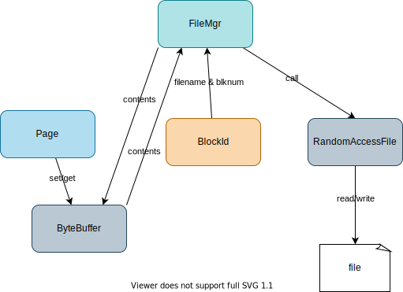

## Chapter 3: Disk and File Management `FileMgr`



### 3.1. Write/read contents to/from a file

1. Overview
    Database needs to write/read data to disk.
    File <-> FileMgr <-> ByteBuffer
    FileMgr writes `<length><content>`

1. Create `FileMgr.java`

    ```java
    package simpledb.file;

    import java.io.File;
    import java.io.IOException;
    import java.io.RandomAccessFile;
    import java.nio.ByteBuffer;
    import java.nio.charset.Charset;
    import java.nio.charset.StandardCharsets;
    import java.util.HashMap;
    import java.util.Map;

    public class FileMgr {
      private File dbDirectory;
      private int blocksize;
      private boolean isNew;
      private Map<String, RandomAccessFile> openFiles = new HashMap<>();
      public static Charset CHARSET = StandardCharsets.US_ASCII;

      public FileMgr(File dbDirectory, int blocksize) {
        this.dbDirectory = dbDirectory;
        this.blocksize = blocksize;
        isNew = !dbDirectory.exists();

        // create the directory if not exists
        if (isNew)
          dbDirectory.mkdirs();

        // remove any leftover temporary tables
        for (String filename : dbDirectory.list())
          if (filename.startsWith("temp"))
            new File(dbDirectory, filename).delete();
      }

      public synchronized void read(String filename) {
        try {
          RandomAccessFile f = getFile(filename);
          f.seek(0); // TODO: enable to read from the specified position
          ByteBuffer bb = ByteBuffer.allocateDirect(blocksize);
          bb.position(0); // [B@8bcc55f
          int readBytes = f.getChannel().read(bb);
          System.out.println("readBytes: " + readBytes);

          // getBytes
          bb.position(0);
          int length = bb.getInt(); // get first int that indicates the length to read
          System.out.println("lenth:" + length);
          byte[] b = new byte[length];
          bb.get(b);
          System.out.println(b);

          // get String from []bytes
          String msg = new String(b, CHARSET); // TODO: enable to read Int and String
          System.out.println("read message from file: " + msg);
        } catch (IOException e) {
          throw new RuntimeException("cannot read file " + filename);
        }
      }

      public synchronized void write(String filename) {
        try {
          RandomAccessFile f = getFile(filename);
          f.seek(0); // TODO: enable to write from the specified position
          String msg = "test"; // TODO: enable to pass the contents
          System.out.println("write message: " + msg);
          byte[] b = msg.getBytes(CHARSET);

          // setBytes
          ByteBuffer bb = ByteBuffer.allocateDirect(blocksize);
          bb.position(0);
          bb.putInt(b.length); // put length before the content
          bb.put(b); // put the content
          bb.position(0);
          f.getChannel().write(bb);
        } catch (IOException e) {
          throw new RuntimeException("cannot write to file " + filename);
        }
      }

      private RandomAccessFile getFile(String filename) throws IOException {
        RandomAccessFile f = openFiles.get(filename);
        if (f == null) {
          File dbTable = new File(dbDirectory, filename);
          f = new RandomAccessFile(dbTable, "rws");
          openFiles.put(filename, f);
        }
        return f;
      }
    }
    ```

1. Update `main` in `App.java`.

    ```java
    public static void main(String[] args) {
        File dbDirectory = new File("datadir");
        FileMgr fm = new FileMgr(dbDirectory, 400);
        String filename = "test.txt";
        fm.write(filename);
        fm.read(filename);
    }
    ```

1. Run the code
    ```
    ./gradlew run
    ```

    <details>

    ```
    > Task :app:run
    write message: test
    readBytes: 400
    lenth:4
    [B@1540e19d
    read message from file: test

    BUILD SUCCESSFUL in 633ms
    2 actionable tasks: 1 executed, 1 up-to-date
    ```

    </details>

1. Check file.

    ```
    tree app/datadir
    app/datadir
    └── test.txt

    0 directories, 1 file
    ```

### 3.2. Write/Read `Page` <-> File

1. Overview
    1. File <-> FileMgr <-> Page(ButeBuffer)
    1. `Page`: A container to wrap a `ByteBuffer` and responsible read and write `ByteBuffer` with `offset`. A page is initialized with the specified blocksize.
    1. A Page object holds the contents of a disk block.
    1. `Page.setInt` saves the Integer in the page by calling `ByteBuffer.putInt`
    1. `Page.setBytes` saves a **blob** (binary large object) as two values: first the number of bytes in the specified blob and the nthe bytes themselves.

1. Create `Page` class.

    ```java
    package simpledb.file;

    import java.nio.ByteBuffer;
    import java.nio.charset.Charset;
    import java.nio.charset.StandardCharsets;

    public class Page {
      private ByteBuffer bb;
      public static Charset CHARSET = StandardCharsets.US_ASCII;

      public Page(int blocksize) {
        bb = ByteBuffer.allocateDirect(blocksize);
      }

      public int getInt(int offset) {
        return bb.getInt(offset);
      }

      public void setInt(int offset, int n) {
        bb.putInt(offset, n);
      }

      public byte[] getBytes(int offset) {
        bb.position(offset);
        int length = bb.getInt();
        byte[] b = new byte[length];
        bb.get(b);
        return b;
      }

      public void setBytes(int offset, byte[] b) {
        bb.position(offset);
        bb.putInt(b.length);
        bb.put(b);
      }

      public String getString(int offset) {
        byte[] b = getBytes(offset);
        return new String(b, CHARSET);
      }

      public void setString(int offset, String s) {
        byte[] b = s.getBytes(CHARSET);
        setBytes(offset, b);
      }

      public static int maxLength(int strlen) {
        float bytesPerChar = CHARSET.newEncoder().maxBytesPerChar();
        return Integer.BYTES + (strlen & (int) bytesPerChar);
      }

      ByteBuffer contents() {
        bb.position(0);
        return bb;
      }
    }
    ```

1. `FileMgr.read` and `FileMgr.write` just receive `filename` and `page`. So file manager interact with them in between.

    File <--  FileMgr --> Page

    read:
    ```java
      public synchronized void read(String filename, Page p) {
        try {
          RandomAccessFile f = getFile(filename);
          f.seek(0); // TODO: enable to read from the specified position
          f.getChannel().read(p.contents());
        } catch (IOException e) {
          throw new RuntimeException("cannot read file " + filename);
        }
      }
    ```
    write:
    ```java
      public synchronized void write(String filename, Page page) {
        try {
          RandomAccessFile f = getFile(filename);
          f.seek(0); // TODO: enable to write from the specified position
          f.getChannel().write(page.contents());
        } catch (IOException e) {
          throw new RuntimeException("cannot write to file " + filename);
        }
      }
    ```
1. Add a method `blockSize` to `FileMgr`
    ```java
      public int blockSize() {
        return blocksize;
      }
    ```
1. Update `main`

    1. Initialize `FileMgr` and `Page`.
    1. `FileMgr` write `Page`'s content to a file. (`Page` -> file)
    1. `FileMgr` read the content of the file to `Page`. (file -> `Page`)


    ```java
    public static void main(String[] args) {
        File dbDirectory = new File("datadir");
        FileMgr fm = new FileMgr(dbDirectory, 400);
        String filename = "test.txt";

        // Page -> File
        Page page1 = new Page(fm.blockSize());
        page1.setString(0, "test");
        fm.write(filename, page1);

        // File -> Page
        Page page2 = new Page(fm.blockSize());
        fm.read(filename, page2);
        System.out.println("read message: " + page2.getString(0));
    }
    ```

    Now you can set arbitrary contents with `Page.setString(offset, string)`. (currently `offset` doesn't make effect as `FileMgr` reads and writes from position 0, which will be fixed later.)

1. Run

    ```
    ./gradlew run
    read message: test
    ```

### 3.3. Write/Read `Page` <-> Block (File)

`BlockId`: A container to hold a filename and block number

1. Create `BlockId.java`

    ```java
    package simpledb.file;

    public class BlockId {
      private String filename;
      private int blknum;

      public BlockId(String filename, int blknum) {
        this.filename = filename;
        this.blknum = blknum;
      }

      public String fileName() {
        return filename;
      }

      public int number() {
        return blknum;
      }

      public boolean equals(Object obj) {
        BlockId blk = (BlockId) obj;
        if (blk == null)
          return false;
        return filename.equals(blk.fileName()) && blknum == blk.number();
      }

      public String toString() {
        return "[file " + filename + ", block " + blknum + "]";
      }

      public int hashCode() {
        return toString().hashCode();
      }
    }
    ```
1. Replace file in `FileMgr` with `BlockId`.

    read:
    ```java
    public synchronized void read(BlockId blk, Page p) {
      try {
        RandomAccessFile f = getFile(blk.fileName());
        f.seek(blk.number() * blocksize);
        f.getChannel().read(p.contents());
      } catch (IOException e) {
        throw new RuntimeException("cannot read file " + blk.fileName());
      }
    }
    ```

    write:
    ```java
    public synchronized void write(BlockId blk, Page page) {
      try {
        RandomAccessFile f = getFile(blk.fileName());
        f.seek(blk.number() * blocksize);
        f.getChannel().write(page.contents());
      } catch (IOException e) {
        throw new RuntimeException("cannot write to file " + blk.fileName());
      }
    }
    ```

1. Update `main`

    ```java
    public static void main(String[] args) {
        File dbDirectory = new File("datadir");
        FileMgr fm = new FileMgr(dbDirectory, 400);
        String filename = "test.txt";
        // Init BlockId
        BlockId blk = new BlockId(filename, fm.blockSize());

        String msg = "test";
        int pos = 0;

        // Page -> File
        Page page1 = new Page(fm.blockSize());
        page1.setString(pos, msg);
        fm.write(blk, page1);

        // File -> Page
        Page page2 = new Page(fm.blockSize());
        fm.read(blk, page2);
        System.out.println("read message: " + page2.getString(pos));
    }
    ```

    Now the content and position in ByteBuffer can be specified with `msg` and `pos`.

    `Page(ByteBuffer)` <-- `FileMgr` --> `BlockId(File)`
1. Run
    ```
    ./gradlew run
    read message: test
    ```
