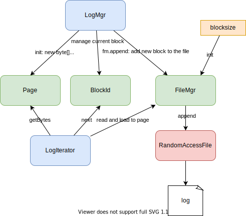
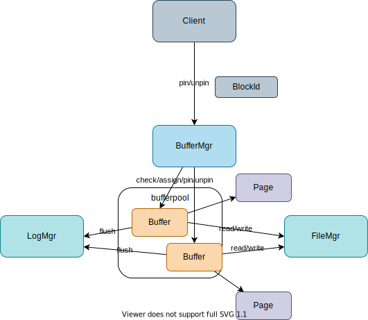

## Chapter 4: Memory Management `LogMgr` and `BufferMgr`

### 4.1. LogMgr



1. Overview
    1. The log manager writes log record into a log file.
    1. In a block, a new log record is added from right to left.
    1. To know the position to save the new record, `boudary` holds the offset of the most recently added record.
    1. `LogIterator` can read logs from new to old until no more logs exist.

1. Add `append` and `length` to `file/FileMgr.java`

    ```java
    public synchronized BlockId append(String filename) {
      int newblknum = length(filename);
      BlockId blk = new BlockId(filename, newblknum);
      byte[] b = new byte[blocksize];
      try {
        RandomAccessFile f = getFile(blk.fileName());
        f.seek(blk.number() * blocksize);
        f.write(b);
      } catch (IOException e) {
        throw new RuntimeException("cannot append block " + blk);
      }
      return blk;
    }

    public int length(String filename) {
      try {
        RandomAccessFile f = getFile(filename);
        return (int) (f.length() / blocksize);
      } catch (IOException e) {
        throw new RuntimeException("cannot access " + filename);
      }
    }
    ```

1. Add `log/LogMgr.java`

    `LogMgr` is initialized with `FileMgr` and `logfile`.

    ```java
    package simpledb.log;

    import java.util.Iterator;

    import simpledb.file.BlockId;
    import simpledb.file.FileMgr;
    import simpledb.file.Page;

    public class LogMgr {
      private FileMgr fm;
      private String logfile;
      private Page logpage;
      private BlockId currentblk;
      private int latestLSN = 0;
      private int lastSavedLSN = 0;

      public LogMgr(FileMgr fm, String logfile) {
        this.fm = fm;
        this.logfile = logfile;
        byte[] b = new byte[fm.blockSize()];
        logpage = new Page(b);
        int logsize = fm.length(logfile);
        if (logsize == 0) {
          currentblk = appendNewBlock();
        } else {
          currentblk = new BlockId(logfile, logsize - 1);
          fm.read(currentblk, logpage);
        }
      }

      public synchronized int append(byte[] logrec) {
        int boundary = logpage.getInt(0);
        int recsize = logrec.length;
        int bytesneeded = recsize + Integer.BYTES;
        if (boundary - bytesneeded < Integer.BYTES) {
          flush();
          currentblk = appendNewBlock();
          boundary = logpage.getInt(0);
        }
        int recpos = boundary - bytesneeded;

        logpage.setBytes(recpos, logrec);
        logpage.setInt(0, recpos);
        latestLSN += 1;
        return latestLSN;
      }

      private BlockId appendNewBlock() {
        BlockId blk = fm.append(logfile);
        logpage.setInt(0, fm.blockSize());
        fm.write(blk, logpage);
        return blk;
      }

      private void flush() {
        fm.write(currentblk, logpage);
        lastSavedLSN = latestLSN;
      }

      public Iterator<byte[]> iterator() {
        flush(); // why flush here?
        return new LogIterator(fm, currentblk);
      }
    }
    ```

1. Add `log/LogIterator.java`

    ```java
    package simpledb.log;

    import java.util.Iterator;

    import simpledb.file.BlockId;
    import simpledb.file.FileMgr;
    import simpledb.file.Page;

    public class LogIterator implements Iterator<byte[]> {
      private FileMgr fm;
      private BlockId blk;
      private Page p;
      private int currentpos;
      private int boundary; // what is the boundary?

      public LogIterator(FileMgr fm, BlockId blk) {
        this.fm = fm;
        this.blk = blk;
        byte[] b = new byte[fm.blockSize()];
        p = new Page(b);
        moveToBlock(blk);
      }

      public boolean hasNext() {
        return currentpos < fm.blockSize() || blk.number() > 0;
      }

      public byte[] next() {
        if (currentpos == fm.blockSize()) {
          blk = new BlockId(blk.fileName(), blk.number() - 1); // decrement block number to move to next block
          moveToBlock(blk);
        }
        byte[] rec = p.getBytes(currentpos);
        currentpos += Integer.BYTES + rec.length;
        return rec;
      }

      private void moveToBlock(BlockId blk) {
        fm.read(blk, p);
        boundary = p.getInt(0);
        currentpos = boundary;
      }
    }
    ```

1. Update `App.java`

    1. Add the following methods

        ```java
        private static void printLogRecords(LogMgr lm, String msg) {
            System.out.println(msg);
            Iterator<byte[]> iter = lm.iterator();
            while (iter.hasNext()) {
                byte[] rec = iter.next();
                Page p = new Page(rec);
                String s = p.getString(0);
                int npos = Page.maxLength(s.length());
                int val = p.getInt(npos);
                System.out.println("[" + s + ", " + val + "]");
            }
            System.out.println();
        }

        private static void createRecords(LogMgr lm, int start, int end) {
            System.out.print("Creating records: ");
            for (int i = start; i <= end; i++) {
                byte[] rec = createLogRecord("record" + i, i + 100);
                int lsn = lm.append(rec);
                System.out.print(lsn + " ");
            }
            System.out.println();
        }

        // Create a log record having two values: a string and an integer.
        private static byte[] createLogRecord(String s, int n) {
            int spos = 0;
            int npos = spos + Page.maxLength(s.length());
            byte[] b = new byte[npos + Integer.BYTES];
            Page p = new Page(b);
            p.setString(spos, s);
            p.setInt(npos, n);
            return b;
        }
        ```

    1. Use them in `main()`

        ```java
        // 3.1. LogMgr
        LogMgr lm = new LogMgr(fm, "simpledb.log");
        printLogRecords(lm, "The initial empty log file:"); // print an empty log file
        System.out.println("done");
        createRecords(lm, 1, 35);
        printLogRecords(lm, "The log file now has these records:");
        createRecords(lm, 36, 70);
        lm.flush(65);
        printLogRecords(lm, "The log file now has these records:");
        ```

1. Run

    ```
    ./gradlew run
    ```

    <details>

    ```

    > Task :app:run
    read message: test
    The initial empty log file:

    done
    Creating records: 1 2 3 4 5 6 7 8 9 10 11 12 13 14 15 16 17 18 19 20 21 22 23 24 25 26 27 28 29 30 31 32 33 34 35
    The log file now has these records:
    [record35, 135]
    [record34, 134]
    [record33, 133]
    [record32, 132]
    [record31, 131]
    [record30, 130]
    [record29, 129]
    [record28, 128]
    [record27, 127]
    [record26, 126]
    [record25, 125]
    [record24, 124]
    [record23, 123]
    [record22, 122]
    [record21, 121]
    [record20, 120]
    [record19, 119]
    [record18, 118]
    [record17, 117]
    [record16, 116]
    [record15, 115]
    [record14, 114]
    [record13, 113]
    [record12, 112]
    [record11, 111]
    [record10, 110]
    [record9, 109]
    [record8, 108]
    [record7, 107]
    [record6, 106]
    [record5, 105]
    [record4, 104]
    [record3, 103]
    [record2, 102]
    [record1, 101]

    Creating records: 36 37 38 39 40 41 42 43 44 45 46 47 48 49 50 51 52 53 54 55 56 57 58 59 60 61 62 63 64 65 66 67 68 69 70
    The log file now has these records:
    [record70, 170]
    [record69, 169]
    [record68, 168]
    [record67, 167]
    [record66, 166]
    [record65, 165]
    [record64, 164]
    [record63, 163]
    [record62, 162]
    [record61, 161]
    [record60, 160]
    [record59, 159]
    [record58, 158]
    [record57, 157]
    [record56, 156]
    [record55, 155]
    [record54, 154]
    [record53, 153]
    [record52, 152]
    [record51, 151]
    [record50, 150]
    [record49, 149]
    [record48, 148]
    [record47, 147]
    [record46, 146]
    [record45, 145]
    [record44, 144]
    [record43, 143]
    [record42, 142]
    [record41, 141]
    [record40, 140]
    [record39, 139]
    [record38, 138]
    [record37, 137]
    [record36, 136]
    [record35, 135]
    [record34, 134]
    [record33, 133]
    [record32, 132]
    [record31, 131]
    [record30, 130]
    [record29, 129]
    [record28, 128]
    [record27, 127]
    [record26, 126]
    [record25, 125]
    [record24, 124]
    [record23, 123]
    [record22, 122]
    [record21, 121]
    [record20, 120]
    [record19, 119]
    [record18, 118]
    [record17, 117]
    [record16, 116]
    [record15, 115]
    [record14, 114]
    [record13, 113]
    [record12, 112]
    [record11, 111]
    [record10, 110]
    [record9, 109]
    [record8, 108]
    [record7, 107]
    [record6, 106]
    [record5, 105]
    [record4, 104]
    [record3, 103]
    [record2, 102]
    [record1, 101]


    BUILD SUCCESSFUL in 828ms
    2 actionable tasks: 1 executed, 1 up-to-date
    ```

    ```
    cat app/datadir/simpledb.log
          record20record19record18record17record16record15record14record13record12record11record10nrecord9mrecord8lrecord7krecord6jrecord5irecord4hrecord3grecord2frecord1rrecord39record38record37record36record35record34record33record32record31record30record29record28record2record26record25record24record23record22record21rerecord58record57record56record55record54record53record52record51record50record49record48record47record46record45record44record43record42record41record40�rerecord58record57record56record55record54record53record52record70record69record68record67record66record65record64record63record62record61record60record59�%
    ```


    </details>

### 4.2. BufferMgr



1. Overview
    1. The **buffer manager** is responsible for the pages that hold user data. The buffer manager allocates a fixed set of pages, called the *buffer pool*. (should fit in physical memory)
    1. These pages should come from the **I/O buffers held by the OS**
    1. A page is *pinned* if some client is currently pinning it; otherwise, the page is *unpinned*.
    1. **BufferMgr** has **bufferpool** as a list of **Buffer**, choose an available buffer to *pin* and *unpin* if client finished using.
    1. **Buffer** holds `FileMgr` for writing/reading to/from file, `LogMgr` for logging, `Page` for contents, `BlockId` for block num and filenam and the information about pins.
1. Add `buffer/Buffer.java`
    ```java
    package simpledb.buffer;

    import simpledb.file.BlockId;
    import simpledb.file.FileMgr;
    import simpledb.file.Page;
    import simpledb.log.LogMgr;

    public class Buffer {
      private FileMgr fm;
      private LogMgr lm;
      private Page contents;
      private BlockId blk = null;
      private int pins = 0;
      private int txnum = -1;
      private int lsn = -1;

      public Buffer(FileMgr fm, LogMgr lm) {
        this.fm = fm;
        this.lm = lm;
        contents = new Page(fm.blockSize());
      }

      /*
      * Returns a block allocated to the buffer
      */
      public BlockId block() {
        return blk;
      }

      public boolean isPinned() {
        return pins > 0;
      }

      void assignToBlock(BlockId b) {
        flush();
        blk = b;
        fm.read(blk, contents);
        pins = 0;
      }

      /*
      * Write the buffer to its disk block if it is dirty.
      */
      void flush() {
        if (txnum >= 0) {
          lm.flush(lsn);
          fm.write(blk, contents);
          txnum = -1;
        }
      }

      void pin() {
        pins++;
      }

      void unpin() {
        pins--;
      }
    }
    ```
1. Add `buffer/BufferManager.java`
    ```java
    package simpledb.buffer;

    import simpledb.file.BlockId;
    import simpledb.file.FileMgr;
    import simpledb.log.LogMgr;

    public class BufferMgr {
      private Buffer[] bufferpool;
      private int numAvailable;
      private static final long MAX_TIME = 10000; // 10 seconds

      public BufferMgr(FileMgr fm, LogMgr lm, int numbuffs) {
        bufferpool = new Buffer[numbuffs];
        numAvailable = numbuffs;
        for (int i = 0; i < numbuffs; i++)
          bufferpool[i] = new Buffer(fm, lm);
      }

      public synchronized int available() {
        return numAvailable;
      }

      public synchronized void unpin(Buffer buff) {
        buff.unpin();
        if (!buff.isPinned()) {
          numAvailable++;
          notifyAll();
        }
      }

      public synchronized Buffer pin(BlockId blk) {
        try {
          long timestamp = System.currentTimeMillis();
          Buffer buff = tryToPin(blk);
          while (buff == null && !waitingTooLong(timestamp)) {
            wait(MAX_TIME);
            buff = tryToPin(blk);
          }
          if (buff == null)
            throw new BufferAbortException();
          return buff;
        } catch (InterruptedException e) {
          throw new BufferAbortException();
        }
      }

      private boolean waitingTooLong(long starttime) {
        return System.currentTimeMillis() - starttime > MAX_TIME;
      }

      private Buffer tryToPin(BlockId blk) {
        Buffer buff = findExistingBuffer(blk);
        if (buff == null) {
          buff = chooseUnpinnedBuffer();
          if (buff == null)
            return null;
          buff.assignToBlock(blk);
        }
        if (!buff.isPinned())
          numAvailable--;
        buff.pin();
        return buff;
      }

      private Buffer findExistingBuffer(BlockId blk) {
        for (Buffer buff : bufferpool) {
          BlockId b = buff.block();
          if (b != null && b.equals(blk))
            return buff;
        }
        return null;
      }

      private Buffer chooseUnpinnedBuffer() {
        for (Buffer buff : bufferpool)
          if (!buff.isPinned())
            return buff;
        return null;
      }
    }
    ```
1. Add `buffer/BufferAbortException.java`
    ```java
    package simpledb.buffer;

    @SuppressWarnings("serial")
    public class BufferAbortException extends RuntimeException {

    }
    ```
1. Update `main()` in `App.java`

    1. Init `BufferMgr` with bufferpool 3.
    1. Call `bm.pin` with a `BlockId` several times.
    1. When the number of pinned blocks reaches the bufferpool size, `bm.pin` will time out.
    1. After unpinning, we can pin again.
    1. Finally check all the buffers in the bufferpool.
    ```java
        // 3.2. BufferMgr
        BufferMgr bm = new BufferMgr(fm, lm, 3);
        Buffer[] buff = new Buffer[6];
        buff[0] = bm.pin(new BlockId("testfile", 0));
        buff[1] = bm.pin(new BlockId("testfile", 1));
        buff[2] = bm.pin(new BlockId("testfile", 2));
        bm.unpin(buff[1]);
        buff[1] = null;
        buff[3] = bm.pin(new BlockId("testfile", 0)); // block 0 pinned twice
        buff[4] = bm.pin(new BlockId("testfile", 1)); // block 1 repinned
        System.out.println("Available buffers: " + bm.available());
        try {
            System.out.println("Attempting to pin block3...");
            buff[5] = bm.pin(new BlockId("testfile", 3)); // will not work; no buffer available
        } catch (BufferAbortException e) {
            System.out.println("Exception: No available buffers");
        }
        bm.unpin(buff[2]);
        buff[2] = null;
        buff[5] = bm.pin(new BlockId("testfile", 3)); // works as there's available buffer
        System.out.println("Final Buffer Allocation:");
        for (int i = 0; i < buff.length; i++) {
            Buffer b = buff[i];
            if (b != null)
                System.out.println("buff[" + i + "] pinned to block " + b.block());
        }
    ```
1. Run
    ```
    ./gradlew run
    Available buffers: 0
    Attempting to pin block3...
    Exception: No available buffers
    Final Buffer Allocation:
    buff[0] pinned to block [file testfile, block 0]
    buff[3] pinned to block [file testfile, block 0]
    buff[4] pinned to block [file testfile, block 1]
    buff[5] pinned to block [file testfile, block 3]
    ```
