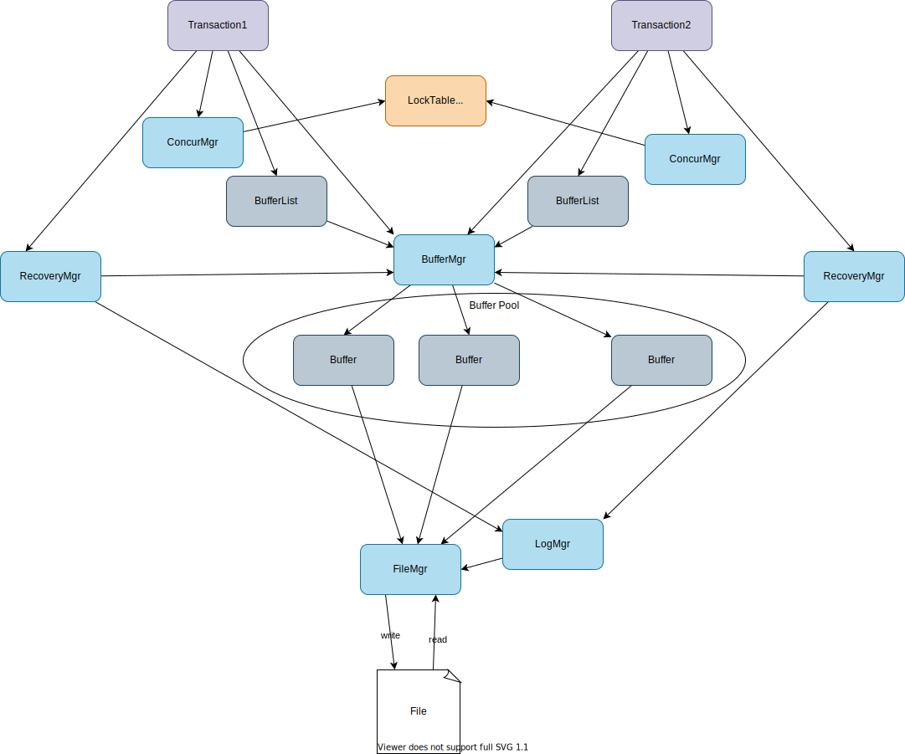

## Chapter 5: Transaction Management



1. Overview
    1. `Transaction`: a group of operations that behaves as a single operation.
        1. “single” operation: **ACID** properties
            1. ***Atomicity***: All or nothing. Succeed **(commit)** or fail **(rollback)**
            1. ***Consistency***: every transaction leaves the database in a consistent state. a complete work that can be executed independently of other transactions.
            1. ***Isolation***: behave as if it is the only thread using the engine.
            1. ***Durability***: the changes made by a committed transactions are guaranteed to be permanent
        1. Three types of methods:
            1. **transaction lifespan**: `commit()`, `rollback()`, `recovery()`
            1. **access buffer**: `pin()`, `unpin()`, `getInt()`, `getString()`
            1. **related to FileMgr**: `size()`, `append()`, `blockSize()`
        1. Each transaction has recovery manager.
    1. `RecoveryMgr`: writes the log records for a transaction and recover from them when a system crashes. (*undo-only algorithm*)
    1. `LogRecord`: Object to store an activity of database operation. The first value of the byte array denotes the *operator*: `CHECKPOINT`, `START`, `COMMIT`, `ROLLBACK`, `SETINT`, or `SETSTRING`. Each LogRecord has `writeToLog`.
        1. `CheckipointRecord`
        1. `CommitRecord`
        1. `RollbackRecord`
        1. `SetIntRecord`: has non-empty `undo`
        1. `SetStringRecord`: has non-empty `undo`
        1. `StartRecord`
    1. `ConcurerncyMgr`: Manage concurrency with lock protocol using `LockTable`. Each transaction has its own concurrency manager. The lock table is shared among all concurrency managers.

1. Create `tx/Transaction.java`

    ```java
    package simpledb.tx;

    import simpledb.buffer.Buffer;
    import simpledb.buffer.BufferMgr;
    import simpledb.file.BlockId;
    import simpledb.file.FileMgr;
    import simpledb.file.Page;
    import simpledb.log.LogMgr;
    import simpledb.tx.concurrency.ConcurrencyMgr;
    import simpledb.tx.recovery.RecoveryMgr;

    public class Transaction {
      private static int nextTxNum = 0;
      private static final int END_OF_FILE = -1;
      private RecoveryMgr recoveryMgr;
      private ConcurrencyMgr concurMgr;
      private BufferMgr bm;
      private FileMgr fm;
      private int txnum;
      private BufferList mybuffers;

      public Transaction(FileMgr fm, LogMgr lm, BufferMgr bm) {
        this.fm = fm;
        this.bm = bm;
        txnum = nextTxNumber();
        recoveryMgr = new RecoveryMgr(this, txnum, lm, bm);
        concurMgr = new ConcurrencyMgr();
        mybuffers = new BufferList(bm);
      }

      public void commit() {
        recoveryMgr.commit();
        System.out.println("transaction " + txnum + " committed");
        concurMgr.release();
        mybuffers.unpinAll();
      }

      public void rollback() {
        recoveryMgr.rollback();
        System.out.println("transaction " + txnum + " rolled back");
        concurMgr.release();
        mybuffers.unpinAll();
      }

      public void recover() {
        bm.flushAll(txnum);
        recoveryMgr.recover();
      }

      public void pin(BlockId blk) {
        mybuffers.pin(blk);
      }

      public void unpin(BlockId blk) {
        mybuffers.unpin(blk);
      }

      public int getInt(BlockId blk, int offset) {
        concurMgr.sLock(blk);
        Buffer buff = mybuffers.getBuffer(blk);
        return buff.contents().getInt(offset);
      }

      public String getString(BlockId blk, int offset) {
        concurMgr.sLock(blk);
        Buffer buff = mybuffers.getBuffer(blk);
        return buff.contents().getString(offset);
      }

      public void setInt(BlockId blk, int offset, int val, boolean okToLog) {
        concurMgr.xLock(blk);
        Buffer buff = mybuffers.getBuffer(blk);
        int lsn = -1;
        if (okToLog)
          lsn = recoveryMgr.setInt(buff, offset);
        Page p = buff.contents();
        p.setInt(offset, val);
        buff.setModified(txnum, lsn);
      }

      public void setString(BlockId blk, int offset, String val, boolean okToLog) {
        concurMgr.xLock(blk);
        Buffer buff = mybuffers.getBuffer(blk);
        int lsn = -1;
        if (okToLog)
          lsn = recoveryMgr.setString(buff, offset);

        Page p = buff.contents();
        p.setString(offset, val);
        buff.setModified(txnum, lsn);
      }

      private static synchronized int nextTxNumber() {
        nextTxNum++;
        return nextTxNum;
      }
    }
    ```

1. Create `tx/recovery/RecoveryManager.java`

    ```java
    package simpledb.tx.recovery;

    import java.util.ArrayList;
    import java.util.Collection;
    import java.util.Iterator;

    import simpledb.buffer.Buffer;
    import simpledb.buffer.BufferMgr;
    import simpledb.file.BlockId;
    import simpledb.log.LogMgr;
    import simpledb.tx.Transaction;

    public class RecoveryMgr {
      private LogMgr lm;
      private BufferMgr bm;
      private Transaction tx;
      private int txnum;

      public RecoveryMgr(Transaction tx, int txnum, LogMgr lm, BufferMgr bm) {
        this.tx = tx;
        this.txnum = txnum;
        this.lm = lm;
        this.bm = bm;
        StartRecord.writeToLog(lm, txnum);
      }

      public void commit() {
        bm.flushAll(txnum);
        int lsn = CommitRecord.writeToLog(lm, txnum);
        lm.flush(lsn);
      }

      public void rollback() {
        doRollback();
        bm.flushAll(txnum);
        int lsn = RollbackRecord.writeToLog(lm, txnum);
        lm.flush(lsn);
      }

      public void recover() {
        doRecover();
        bm.flushAll(txnum);
        int lsn = CheckpointRecord.writeToLog(lm);
        lm.flush(lsn);
      }

      public int setInt(Buffer buff, int offset) {
        int oldval = buff.contents().getInt(offset);
        BlockId blk = buff.block();
        return SetIntRecord.writeToLog(lm, txnum, blk, offset, oldval);
      }

      public int setString(Buffer buff, int offset) {
        String oldval = buff.contents().getString(offset);
        BlockId blk = buff.block();
        return SetStringRecord.writeToLog(lm, txnum, blk, offset, oldval);
      }

      /*
      * iterate through the log records from new to old
      * if it finds log records in the transaction, it calls undo of the log record
      * until the start record of the transaction
      */
      private void doRollback() {
        Iterator<byte[]> iter = lm.iterator();
        while (iter.hasNext()) {
          byte[] bytes = iter.next();
          LogRecord rec = LogRecord.createLogRecord(bytes);
          if (rec.txNumber() == txnum) {
            if (rec.op() == LogRecord.START)
              return;
            rec.undo(tx);
          }
        }
      }

      /*
      * it reads log records until it hits a quiescent checkpoint or reaches the end of the log
      * it undoes uncommited update records
      */
      private void doRecover() {
        Collection<Integer> finishedTxs = new ArrayList<>();
        Iterator<byte[]> iter = lm.iterator();
        while (iter.hasNext()) {
          byte[] bytes = iter.next();
          LogRecord rec = LogRecord.createLogRecord(bytes);
          if (rec.op() == LogRecord.CHECKPOINT)
            return;
          if (rec.op() == LogRecord.COMMIT || rec.op() == LogRecord.ROLLBACK)
            finishedTxs.add(rec.txNumber());
          else if (!finishedTxs.contains(rec.txNumber()))
            rec.undo(tx);
        }
      }
    }
    ```

1. Create `recovery/LogRecord.java`

    ```java
    package simpledb.tx.recovery;

    import simpledb.file.Page;
    import simpledb.tx.Transaction;

    public interface LogRecord {
      static final int CHECKPOINT = 0;
      static final int START = 1;
      static final int COMMIT = 2;
      static final int ROLLBACK = 3;
      static final int SETINT = 4;
      static final int SETSTRING = 5;

      int op();

      int txNumber();

      void undo(Transaction tx);

      static LogRecord createLogRecord(byte[] bytes) {
        Page p = new Page(bytes);
        switch (p.getInt(0)) {
          case CHECKPOINT:
            return new CheckpointRecord();
          case COMMIT:
            return new CommitRecord(p);
          case ROLLBACK:
            return new RollbackRecord(p);
          case SETINT:
            return new SetIntRecord(p);
          case SETSTRING:
            return new SetStringRecord(p);
          case START:
            return new StartRecord(p);
          default:
            System.out.println("LogRecord p.getInt: " + p.getInt(0));
            return null;
        }
      }
    }
    ```

    `CheckpointRecord`, `CommitRecord`, `RollbackRecord`, `SetIntRecord`, `SetStringRecord`, and `StartRecord` need to be created.

1. Update `buffer/BufferMgr.java` and `buffer/Buffer.java`

    BufferMgr:
    ```java
    public synchronized void flushAll(int txnum) {
      for (Buffer buff: bufferpool) {
        if (buff.modifyingTx() == txnum)
          buff.flush();
      }
    }
    ```

    Buffer:
    ```java
    public int modifyingTx() {
      return txnum;
    }
    ```

    ```java
    public void setModified(int txnum, int lsn) {
      this.txnum = txnum;
      if (lsn >= 0)
        this.lsn = lsn;
    }
    ```

    ```java
    public Page contents() {
      return contents;
    }
    ```
1. Create `tx/concurrency/ConcurrencyManager.java`

    ```java
    package simpledb.tx.concurrency;

    import java.util.HashMap;
    import java.util.Map;

    import simpledb.file.BlockId;

    /*
    * Concurrency Manager implements lock protocol using block-level granularity.
    * and created for a transaction. The same lock table needs to be shared.
    */
    public class ConcurrencyMgr {
      /*
      * The lock table is shared among all Concurrency Manager as it's a static
      * variable
      */
      private static LockTable locktbl = new LockTable();
      /*
      * The lock state of block:
      * S if THE transaction holds slock on the block
      * X if THE transaction holds xlock on the block
      */
      private Map<BlockId, String> locks = new HashMap<>();

      /*
      * Shared Lock
      */
      public void sLock(BlockId blk) {
        System.out.println("[ConcurrentMgr] starting sLock on " + blk.number() + ": " + toString());
        locks.computeIfAbsent(blk, k -> {
          locktbl.sLock(k);
          return "S";
        });
        System.out.println("[ConcurrentMgr] completed sLock on " + blk.number() + ": " + toString());
      }

      /*
      * Exclusive Lock
      * If the block doesn't have xlock, firstly get sLock and them promote to xlock
      */
      public void xLock(BlockId blk) {
        System.out.println("[ConcurrentMgr] starting xLock on " + blk.number() + ": " + toString());
        if (!hasXLock(blk)) {
          sLock(blk);
          locktbl.xLock(blk);
          locks.put(blk, "X");
        }
        System.out.println("[ConcurrentMgr] completed xLock on " + blk.number() + ": " + toString());
      }

      /*
      * Release all locks
      */
      public void release() {
        System.out.println("[ConcurrentMgr] starting release: " + toString());
        for (BlockId blk : locks.keySet())
          locktbl.unlock(blk);
        locks.clear();
        System.out.println("[ConcurrentMgr] completed release: " + toString());
      }

      private boolean hasXLock(BlockId blk) {
        String locktype = locks.get(blk);
        return locktype != null && locktype.equals("X");
      }

      public String toString() {
        return locks.toString();
      }
    }
    ```
1. Update `App.java`

    ```java
    // 4. Concurrency Management
    BlockId blk0 = new BlockId("testfile", 0);
    BlockId blk1 = new BlockId("testfile", 1);
    // init
    Transaction tx1 = new Transaction(fm, lm, bm);
    Transaction tx2 = new Transaction(fm, lm, bm);
    tx1.pin(blk0);
    tx2.pin(blk1);
    pos = 0;
    for (int i = 0; i < 6; i++) {
      tx1.setInt(blk0, pos, pos, false); // get xlock through concurMgr
      tx2.setInt(blk1, pos, pos, false); // xlock
      pos += Integer.BYTES;
    }
    tx1.setString(blk0, 30, "abc", false); // xlock
    tx2.setString(blk1, 30, "def", false); // xlock
    tx1.commit();
    tx2.commit();
    printValues(fm, "After initialization:", blk0, blk1);

    // modify
    Transaction tx3 = new Transaction(fm, lm, bm);
    Transaction tx4 = new Transaction(fm, lm, bm);
    tx3.pin(blk0);
    tx4.pin(blk1);
    pos = 0;
    for (int i = 0; i < 6; i++) {
      tx3.setInt(blk0, pos, pos + 100, true);
      tx4.setInt(blk1, pos, pos + 100, true);
      pos += Integer.BYTES;
    }
    System.out.println("setInt is done. now start setString");
    tx3.setString(blk0, 30, "uvw", true);
    tx4.setString(blk1, 30, "xyz", true);
    bm.flushAll(3);
    bm.flushAll(4);
    printValues(fm, "After modifications:", blk0, blk1);
    tx3.rollback();
    printValues(fm, "After rollback", blk0, blk1);
    // tx4 stops here without commiting or rolling back,
    // so all its changes should be undone during recovery.

    // // TODO: recovery as it needs to be executed at startup
    // Transaction tx5 = new Transaction(fm, lm, bm);
    // tx5.recover();
    // printValues(fm, "After recovery", blk0, blk1);
    ```
1. Run
    ```
    ./gradlew run
    ```

    <details>

    ```
    ...
    [ConcurrentMgr] starting xLock on 0: {}
    [ConcurrentMgr] starting sLock on 0: {}
    [LockTable] starting slock on 0
    [LockTable] getLockVal for 0 is null
    [LockTable] getLockVal for 0 is null
    [LockTable] getLockVal for 0 is null
    [LockTable] completed slock on 0
    [ConcurrentMgr] completed sLock on 0: {[file testfile, block 0]=S}
    [LockTable] starting xlock on 0
    [LockTable] getLockVal for 0 is 1
    [LockTable] getLockVal for 0 is 1
    [LockTable] completed xlock on 0
    [ConcurrentMgr] completed xLock on 0: {[file testfile, block 0]=X}
    [ConcurrentMgr] starting xLock on 1: {}
    [ConcurrentMgr] starting sLock on 1: {}
    [LockTable] starting slock on 1
    [LockTable] getLockVal for 1 is null
    [LockTable] getLockVal for 1 is null
    [LockTable] getLockVal for 1 is null
    [LockTable] completed slock on 1
    [ConcurrentMgr] completed sLock on 1: {[file testfile, block 1]=S}
    [LockTable] starting xlock on 1
    [LockTable] getLockVal for 1 is 1
    [LockTable] getLockVal for 1 is 1
    [LockTable] completed xlock on 1
    [ConcurrentMgr] completed xLock on 1: {[file testfile, block 1]=X}
    [ConcurrentMgr] starting xLock on 0: {[file testfile, block 0]=X}
    [ConcurrentMgr] completed xLock on 0: {[file testfile, block 0]=X}
    [ConcurrentMgr] starting xLock on 1: {[file testfile, block 1]=X}
    [ConcurrentMgr] completed xLock on 1: {[file testfile, block 1]=X}
    [ConcurrentMgr] starting xLock on 0: {[file testfile, block 0]=X}
    [ConcurrentMgr] completed xLock on 0: {[file testfile, block 0]=X}
    [ConcurrentMgr] starting xLock on 1: {[file testfile, block 1]=X}
    [ConcurrentMgr] completed xLock on 1: {[file testfile, block 1]=X}
    [ConcurrentMgr] starting xLock on 0: {[file testfile, block 0]=X}
    [ConcurrentMgr] completed xLock on 0: {[file testfile, block 0]=X}
    [ConcurrentMgr] starting xLock on 1: {[file testfile, block 1]=X}
    [ConcurrentMgr] completed xLock on 1: {[file testfile, block 1]=X}
    [ConcurrentMgr] starting xLock on 0: {[file testfile, block 0]=X}
    [ConcurrentMgr] completed xLock on 0: {[file testfile, block 0]=X}
    [ConcurrentMgr] starting xLock on 1: {[file testfile, block 1]=X}
    [ConcurrentMgr] completed xLock on 1: {[file testfile, block 1]=X}
    [ConcurrentMgr] starting xLock on 0: {[file testfile, block 0]=X}
    [ConcurrentMgr] completed xLock on 0: {[file testfile, block 0]=X}
    [ConcurrentMgr] starting xLock on 1: {[file testfile, block 1]=X}
    [ConcurrentMgr] completed xLock on 1: {[file testfile, block 1]=X}
    [ConcurrentMgr] starting xLock on 0: {[file testfile, block 0]=X}
    [ConcurrentMgr] completed xLock on 0: {[file testfile, block 0]=X}
    [ConcurrentMgr] starting xLock on 1: {[file testfile, block 1]=X}
    [ConcurrentMgr] completed xLock on 1: {[file testfile, block 1]=X}
    transaction 1 committed
    [ConcurrentMgr] starting release: {[file testfile, block 0]=X}
    [LockTable] starting unlock on 0
    [LockTable] getLockVal for 0 is -1
    [LockTable] completed unlock on 0
    [ConcurrentMgr] completed release: {}
    transaction 2 committed
    [ConcurrentMgr] starting release: {[file testfile, block 1]=X}
    [LockTable] starting unlock on 1
    [LockTable] getLockVal for 1 is -1
    [LockTable] completed unlock on 1
    [ConcurrentMgr] completed release: {}
    After initialization:
    0 0 4 4 8 8 12 12 16 16 20 20 abc def
    [ConcurrentMgr] starting xLock on 0: {}
    [ConcurrentMgr] starting sLock on 0: {}
    [LockTable] starting slock on 0
    [LockTable] getLockVal for 0 is null
    [LockTable] getLockVal for 0 is null
    [LockTable] getLockVal for 0 is null
    [LockTable] completed slock on 0
    [ConcurrentMgr] completed sLock on 0: {[file testfile, block 0]=S}
    [LockTable] starting xlock on 0
    [LockTable] getLockVal for 0 is 1
    [LockTable] getLockVal for 0 is 1
    [LockTable] completed xlock on 0
    [ConcurrentMgr] completed xLock on 0: {[file testfile, block 0]=X}
    [ConcurrentMgr] starting xLock on 1: {}
    [ConcurrentMgr] starting sLock on 1: {}
    [LockTable] starting slock on 1
    [LockTable] getLockVal for 1 is null
    [LockTable] getLockVal for 1 is null
    [LockTable] getLockVal for 1 is null
    [LockTable] completed slock on 1
    [ConcurrentMgr] completed sLock on 1: {[file testfile, block 1]=S}
    [LockTable] starting xlock on 1
    [LockTable] getLockVal for 1 is 1
    [LockTable] getLockVal for 1 is 1
    [LockTable] completed xlock on 1
    [ConcurrentMgr] completed xLock on 1: {[file testfile, block 1]=X}
    [ConcurrentMgr] starting xLock on 0: {[file testfile, block 0]=X}
    [ConcurrentMgr] completed xLock on 0: {[file testfile, block 0]=X}
    [ConcurrentMgr] starting xLock on 1: {[file testfile, block 1]=X}
    [ConcurrentMgr] completed xLock on 1: {[file testfile, block 1]=X}
    [ConcurrentMgr] starting xLock on 0: {[file testfile, block 0]=X}
    [ConcurrentMgr] completed xLock on 0: {[file testfile, block 0]=X}
    [ConcurrentMgr] starting xLock on 1: {[file testfile, block 1]=X}
    [ConcurrentMgr] completed xLock on 1: {[file testfile, block 1]=X}
    [ConcurrentMgr] starting xLock on 0: {[file testfile, block 0]=X}
    [ConcurrentMgr] completed xLock on 0: {[file testfile, block 0]=X}
    [ConcurrentMgr] starting xLock on 1: {[file testfile, block 1]=X}
    [ConcurrentMgr] completed xLock on 1: {[file testfile, block 1]=X}
    [ConcurrentMgr] starting xLock on 0: {[file testfile, block 0]=X}
    [ConcurrentMgr] completed xLock on 0: {[file testfile, block 0]=X}
    [ConcurrentMgr] starting xLock on 1: {[file testfile, block 1]=X}
    [ConcurrentMgr] completed xLock on 1: {[file testfile, block 1]=X}
    [ConcurrentMgr] starting xLock on 0: {[file testfile, block 0]=X}
    [ConcurrentMgr] completed xLock on 0: {[file testfile, block 0]=X}
    [ConcurrentMgr] starting xLock on 1: {[file testfile, block 1]=X}
    [ConcurrentMgr] completed xLock on 1: {[file testfile, block 1]=X}
    setInt is done. now start setString
    [ConcurrentMgr] starting xLock on 0: {[file testfile, block 0]=X}
    [ConcurrentMgr] completed xLock on 0: {[file testfile, block 0]=X}
    [ConcurrentMgr] starting xLock on 1: {[file testfile, block 1]=X}
    [ConcurrentMgr] completed xLock on 1: {[file testfile, block 1]=X}
    After modifications:
    100 100 104 104 108 108 112 112 116 116 120 120 uvw xyz
    [ConcurrentMgr] starting xLock on 0: {[file testfile, block 0]=X}
    [ConcurrentMgr] completed xLock on 0: {[file testfile, block 0]=X}
    [ConcurrentMgr] starting xLock on 0: {[file testfile, block 0]=X}
    [ConcurrentMgr] completed xLock on 0: {[file testfile, block 0]=X}
    [ConcurrentMgr] starting xLock on 0: {[file testfile, block 0]=X}
    [ConcurrentMgr] completed xLock on 0: {[file testfile, block 0]=X}
    [ConcurrentMgr] starting xLock on 0: {[file testfile, block 0]=X}
    [ConcurrentMgr] completed xLock on 0: {[file testfile, block 0]=X}
    [ConcurrentMgr] starting xLock on 0: {[file testfile, block 0]=X}
    [ConcurrentMgr] completed xLock on 0: {[file testfile, block 0]=X}
    [ConcurrentMgr] starting xLock on 0: {[file testfile, block 0]=X}
    [ConcurrentMgr] completed xLock on 0: {[file testfile, block 0]=X}
    [ConcurrentMgr] starting xLock on 0: {[file testfile, block 0]=X}
    [ConcurrentMgr] completed xLock on 0: {[file testfile, block 0]=X}
    transaction 3 rolled back
    [ConcurrentMgr] starting release: {[file testfile, block 0]=X}
    [LockTable] starting unlock on 0
    [LockTable] getLockVal for 0 is -1
    [LockTable] completed unlock on 0
    [ConcurrentMgr] completed release: {}
    After rollback
    0 100 4 104 8 108 12 112 16 116 20 120 abc xyz

    BUILD SUCCESSFUL in 10s
    2 actionable tasks: 2 executed
    ```

    </details>
