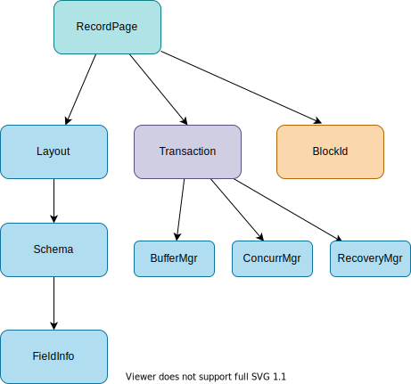
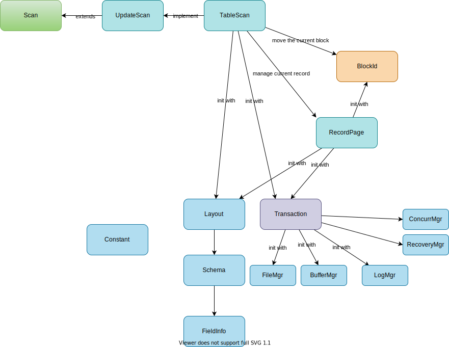
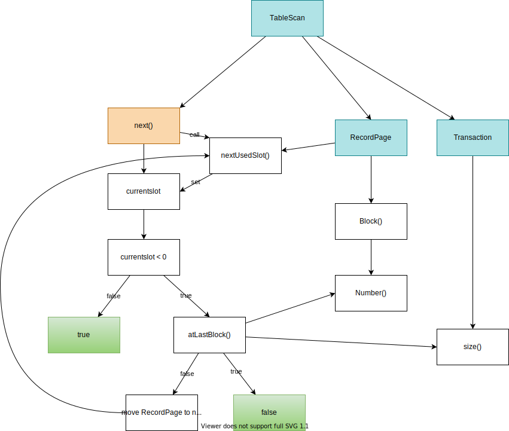

## Chapter 6: Record Management
### 6.1. RecordPage


1. Overview
    1. Record Manager addresses several issues. (Implemented as `RecordPage`)
        1. `spanned` or `unspanned`: Whether the same record is in the same block.
        1. `homogeneous` or `nonhomogeneous`: Whether one file consists of records of the same table or not.
        1. *fixed-length* or *variable-length* field: Whether a field is fixed-lengthe or variable-length
    1. `Schema`: store name, type, and the length of varchar field. This info corresponds to what a user would specify when creating a table. so no physical information.
    1. `Layout`: initialize with schema and hold `schema`, `offset` of each field, and `slotsize`. Layout also calculates the offset and slotsize.
    1. `RecordPage`: manages the records within a page.
1. `record/Schema.java`

    ```java
    package simpledb.record;

    import static java.sql.Types.INTEGER;
    import static java.sql.Types.VARCHAR;

    import java.util.ArrayList;
    import java.util.HashMap;
    import java.util.List;
    import java.util.Map;

    /*
    * The record schema of a table.
    * A schema contains the name, type, and the length of varchar field
    */
    public class Schema {
      private List<String> fields = new ArrayList<>();
      private Map<String, FieldInfo> info = new HashMap<>();

      public void addField(String fldname, int type, int length) {
        fields.add(fldname);
        info.put(fldname, new FieldInfo(type, length));
      }

      public void addIntField(String fldname) {
        addField(fldname, INTEGER, 0);
      }

      public void addStringField(String fldname, int length) {
        addField(fldname, VARCHAR, length);
      }

      public void add(String fldname, Schema schema) {
        int type = schema.type(fldname);
        int length = schema.length(fldname);
        addField(fldname, type, length);
      }

      public void addAll(Schema schema) {
        for (String fldname : schema.fields())
          add(fldname, schema);
      }

      public List<String> fields() {
        return fields;
      }

      public boolean hasField(String fldname) {
        return fields.contains(fldname);
      }

      public int type(String fldname) {
        return info.get(fldname).type;
      }

      public int length(String fldname) {
        return info.get(fldname).length;
      }

      class FieldInfo {
        int type;
        int length;

        public FieldInfo(int type, int length) {
          this.type = type;
          this.length = length;
        }
      }
    }
    ```
1. `record/Layout.java`

    ```java
    package simpledb.record;

    import static java.sql.Types.INTEGER;

    import java.util.HashMap;
    import java.util.Map;

    import simpledb.file.Page;

    /*
    * Description of the structure of a record.
    * It contains the name, type, length and offset of
    * each field of the table.
    */
    public class Layout {
      private Schema schema;
      private Map<String, Integer> offsets;
      private int slotsize;

      public Layout(Schema schema) {
        this.schema = schema;
        offsets = new HashMap<>();
        int pos = Integer.BYTES; // leave space for the empty/inuse flag
        for (String fldname : schema.fields()) {
          offsets.put(fldname, pos);
          pos += lengthInBytes(fldname);
        }
        slotsize = pos;
      }

      public Layout(Schema schema, Map<String, Integer> offsets, int slotsize) {
        this.schema = schema;
        this.offsets = offsets;
        this.slotsize = slotsize;
      }

      public Schema schema() {
        return schema;
      }

      public int offset(String fldname) {
        return offsets.get(fldname);
      }

      public int slotSize() {
        return slotsize;
      }

      private int lengthInBytes(String fldname) {
        int fldtype = schema.type(fldname);
        if (fldtype == INTEGER)
          return Integer.BYTES;
        else
          return Page.maxLength(schema.length(fldname));
      }
    }
    ```

1. Add `RecordPage.java`

    ```java
    package simpledb.record;

    import static java.sql.Types.INTEGER;

    import simpledb.file.BlockId;
    import simpledb.tx.Transaction;

    public class RecordPage {
      public static final int EMPTY = 0;
      public static final int USED = 1;
      private Transaction tx;
      private BlockId blk;
      private Layout layout;

      public RecordPage(Transaction tx, BlockId blk, Layout layout) {
        this.tx = tx;
        this.blk = blk;
        this.layout = layout;
        tx.pin(blk);
      }

      /*
      * get int from the spesified field at the specified slot.
      * slot is the number to specify a record (n-th record)
      */
      public int getInt(int slot, String fldname) {
        int fldpos = offset(slot) + layout.offset(fldname);
        return tx.getInt(blk, fldpos);
      }

      public String getString(int slot, String fldname) {
        int fldpos = offset(slot) + layout.offset(fldname);
        return tx.getString(blk, fldpos);
      }

      public void setInt(int slot, String fldname, int val) {
        int fldpos = offset(slot) + layout.offset(fldname);
        tx.setInt(blk, fldpos, val, true);
      }

      public void setString(int slot, String fldname, String val) {
        int fldpos = offset(slot) + layout.offset(fldname);
        tx.setString(blk, fldpos, val, true);
      }

      public void delete(int slot) {
        setFlag(slot, EMPTY);
      }

      /*
      * Format all slots in the block with zero-value.
      * These values are not logged as the old values are meaningless.
      */
      public void format() {
        int slot = 0;
        while (isValidSlot(slot)) {
          tx.setInt(blk, offset(slot), EMPTY, false);
          Schema schema = layout.schema();
          for (String fldname : schema.fields()) {
            int fldpos = offset(slot) + layout.offset(fldname);
            if (schema.type(fldname) == INTEGER)
              tx.setInt(blk, fldpos, 0, false);
            else
              tx.setString(blk, fldpos, "", false);
          }
          slot++;
        }
      }

      /*
      * Return the first used slot after the specified slot
      */
      public int nextUsedSlot(int slot) { // nextAfter in the original SimpleDB
        return searchAfter(slot, USED);
      }

      /*
      * Get the next available slot after the specified slot, set the flag to USED, and
      * return the slot.
      * Return -1 if there's no empty slot in the block
      * In SimpleDB, it's implemented as insertAfter, but this method doesn't insert,
      * so renamed to useNextEmptySlot
      */
      public int useNextEmptySlot(int slot) { // insertAfter in the original SimpleDB
        int newslot = searchAfter(slot, EMPTY);
        if (newslot >= 0)
          setFlag(newslot, USED);
        return newslot;
      }

      /*
      * Search for the first slot of the given flag after the given slot
      */
      public int searchAfter(int slot, int flag) {
        slot++;
        while (isValidSlot(slot)) {
          if (tx.getInt(blk, offset(slot)) == flag)
            return slot;
          slot++;
        }
        return -1;
      }

      /*
      * Set the given flag to the given slot
      */
      public void setFlag(int slot, int flag) {
        tx.setInt(blk, offset(slot), flag, true);
      }

      /*
      * Check if the slot fits in the block of the transaction.
      */
      private boolean isValidSlot(int slot) {
        return offset(slot + 1) <= tx.blockSize();
      }

      private int offset(int slot) {
        return slot * layout.slotSize();
      }
    }
    ```
1. Add two methods to `tx/Transaction.java`

    ```java
    /*
     * Append a new block to the specified file.
     * Get xlock for END_OF_FILE before appending
     */
    public BlockId append(String filename) {
      BlockId dummyblk = new BlockId(filename, END_OF_FILE);
      concurMgr.xLock(dummyblk);
      return fm.append(filename);
    }

    public int blockSize() {
      return fm.blockSize();
    }
    ```

1. Update `main` in `App.java`

    Add to 3.2:
    ```java
    // unpin all the pinned buffer
    for (int i = 0; i < buff.length; i++) {
      Buffer b = buff[i];
      if (b != null) {
        bm.unpin(b);
        System.out.println("buff[" + i + "] unpinned from block " + b.block());
      }
    }
    ```

    Add the following:
    ```java
    // 5. Record Management
    System.out.println("5. Record Management --------------------------");
    Transaction tx = new Transaction(fm, lm, bm);
    Schema sch = new Schema();
    sch.addIntField("A");
    sch.addStringField("B", 9);
    Layout layout = new Layout(sch);
    for (String fldname : layout.schema().fields()) {
      int offset = layout.offset(fldname);
      System.out.println(fldname + " has offset " + offset);
    }
    BlockId blk2 = new BlockId("testfile", 2);
    tx.pin(blk2);
    RecordPage rp = new RecordPage(tx, blk2, layout);
    rp.format(); // fill with zero-value

    System.out.println("Filling the page with random records.");
    int slot = rp.useNextEmptySlot(-1); // get the first available slot
    while (slot >= 0) { // nextEmptySlot will return if it reaches the end of the block
      int n = (int) Math.round(Math.random() * 50);
      rp.setInt(slot, "A", n);
      rp.setString(slot, "B", "rec" + n);
      System.out.println("inserting into slot " + slot + ": {" + n + ", " + "rec" + n + "}");
      slot = rp.useNextEmptySlot(slot); // get the next available slot
    }

    System.out.println("Deleting these records, whose A-values are less than 25");
    int count = 0;
    slot = rp.nextUsedSlot(-1); // get the first used slot
    while (slot >= 0) {
      int a = rp.getInt(slot, "A");
      String b = rp.getString(slot, "B");
      if (a < 25) {
        count++;
        System.out.println("Deleting slot " + slot + ": {" + a + ", " + b + "}");
        rp.delete(slot);
      }
      slot = rp.nextUsedSlot(slot);
    }
    System.out.println(count + " values under 25 were deleted.");

    System.out.println("Here are the remaining records.");
    slot = rp.nextUsedSlot(-1); // first used slot
    while (slot >= 0) {
      int a = rp.getInt(slot, "A");
      String b = rp.getString(slot, "B");
      System.out.println("slot " + slot + ": {" + a + ", " + b + "}");
      slot = rp.nextUsedSlot(slot);
    }
    tx.unpin(blk2);
    tx.commit();
    ```
1. Run
    ```
    ./gradlew run
    ```

    <details>

    ```
    5. Record Management --------------------------
    A has offset 4
    B has offset 8
    [Transaction] setInt to block 2 with offset 0 and val 0
    [ConcurrentMgr] starting xLock on 2: {}
    [ConcurrentMgr] starting sLock on 2: {}
    [LockTable] starting slock on 2
    [LockTable] getLockVal for 2 is null
    [LockTable] getLockVal for 2 is null
    [LockTable] getLockVal for 2 is null
    [LockTable] completed slock on 2
    [ConcurrentMgr] completed sLock on 2: {[file testfile, block 2]=S}
    [LockTable] starting xlock on 2
    [LockTable] getLockVal for 2 is 1
    [LockTable] getLockVal for 2 is 1
    [LockTable] completed xlock on 2
    [ConcurrentMgr] completed xLock on 2: {[file testfile, block 2]=X}
    [Transaction] setInt to block 2 with offset 4 and val 0
    [ConcurrentMgr] starting xLock on 2: {[file testfile, block 2]=X}
    [ConcurrentMgr] completed xLock on 2: {[file testfile, block 2]=X}
    [Transaction] setString to block 2 with offset 8 and val
    [ConcurrentMgr] starting xLock on 2: {[file testfile, block 2]=X}
    [ConcurrentMgr] completed xLock on 2: {[file testfile, block 2]=X}
    [Transaction] setInt to block 2 with offset 21 and val 0
    [ConcurrentMgr] starting xLock on 2: {[file testfile, block 2]=X}
    [ConcurrentMgr] completed xLock on 2: {[file testfile, block 2]=X}
    [Transaction] setInt to block 2 with offset 25 and val 0
    [ConcurrentMgr] starting xLock on 2: {[file testfile, block 2]=X}
    [ConcurrentMgr] completed xLock on 2: {[file testfile, block 2]=X}
    [Transaction] setString to block 2 with offset 29 and val
    [ConcurrentMgr] starting xLock on 2: {[file testfile, block 2]=X}
    [ConcurrentMgr] completed xLock on 2: {[file testfile, block 2]=X}
    [Transaction] setInt to block 2 with offset 42 and val 0
    [ConcurrentMgr] starting xLock on 2: {[file testfile, block 2]=X}
    [ConcurrentMgr] completed xLock on 2: {[file testfile, block 2]=X}
    [Transaction] setInt to block 2 with offset 46 and val 0
    [ConcurrentMgr] starting xLock on 2: {[file testfile, block 2]=X}
    [ConcurrentMgr] completed xLock on 2: {[file testfile, block 2]=X}
    [Transaction] setString to block 2 with offset 50 and val
    [ConcurrentMgr] starting xLock on 2: {[file testfile, block 2]=X}
    [ConcurrentMgr] completed xLock on 2: {[file testfile, block 2]=X}
    [Transaction] setInt to block 2 with offset 63 and val 0
    [ConcurrentMgr] starting xLock on 2: {[file testfile, block 2]=X}
    [ConcurrentMgr] completed xLock on 2: {[file testfile, block 2]=X}
    [Transaction] setInt to block 2 with offset 67 and val 0
    [ConcurrentMgr] starting xLock on 2: {[file testfile, block 2]=X}
    [ConcurrentMgr] completed xLock on 2: {[file testfile, block 2]=X}
    [Transaction] setString to block 2 with offset 71 and val
    [ConcurrentMgr] starting xLock on 2: {[file testfile, block 2]=X}
    [ConcurrentMgr] completed xLock on 2: {[file testfile, block 2]=X}
    [Transaction] setInt to block 2 with offset 84 and val 0
    [ConcurrentMgr] starting xLock on 2: {[file testfile, block 2]=X}
    [ConcurrentMgr] completed xLock on 2: {[file testfile, block 2]=X}
    [Transaction] setInt to block 2 with offset 88 and val 0
    [ConcurrentMgr] starting xLock on 2: {[file testfile, block 2]=X}
    [ConcurrentMgr] completed xLock on 2: {[file testfile, block 2]=X}
    [Transaction] setString to block 2 with offset 92 and val
    [ConcurrentMgr] starting xLock on 2: {[file testfile, block 2]=X}
    [ConcurrentMgr] completed xLock on 2: {[file testfile, block 2]=X}
    [Transaction] setInt to block 2 with offset 105 and val 0
    [ConcurrentMgr] starting xLock on 2: {[file testfile, block 2]=X}
    [ConcurrentMgr] completed xLock on 2: {[file testfile, block 2]=X}
    [Transaction] setInt to block 2 with offset 109 and val 0
    [ConcurrentMgr] starting xLock on 2: {[file testfile, block 2]=X}
    [ConcurrentMgr] completed xLock on 2: {[file testfile, block 2]=X}
    [Transaction] setString to block 2 with offset 113 and val
    [ConcurrentMgr] starting xLock on 2: {[file testfile, block 2]=X}
    [ConcurrentMgr] completed xLock on 2: {[file testfile, block 2]=X}
    [Transaction] setInt to block 2 with offset 126 and val 0
    [ConcurrentMgr] starting xLock on 2: {[file testfile, block 2]=X}
    [ConcurrentMgr] completed xLock on 2: {[file testfile, block 2]=X}
    [Transaction] setInt to block 2 with offset 130 and val 0
    [ConcurrentMgr] starting xLock on 2: {[file testfile, block 2]=X}
    [ConcurrentMgr] completed xLock on 2: {[file testfile, block 2]=X}
    [Transaction] setString to block 2 with offset 134 and val
    [ConcurrentMgr] starting xLock on 2: {[file testfile, block 2]=X}
    [ConcurrentMgr] completed xLock on 2: {[file testfile, block 2]=X}
    [Transaction] setInt to block 2 with offset 147 and val 0
    [ConcurrentMgr] starting xLock on 2: {[file testfile, block 2]=X}
    [ConcurrentMgr] completed xLock on 2: {[file testfile, block 2]=X}
    [Transaction] setInt to block 2 with offset 151 and val 0
    [ConcurrentMgr] starting xLock on 2: {[file testfile, block 2]=X}
    [ConcurrentMgr] completed xLock on 2: {[file testfile, block 2]=X}
    [Transaction] setString to block 2 with offset 155 and val
    [ConcurrentMgr] starting xLock on 2: {[file testfile, block 2]=X}
    [ConcurrentMgr] completed xLock on 2: {[file testfile, block 2]=X}
    [Transaction] setInt to block 2 with offset 168 and val 0
    [ConcurrentMgr] starting xLock on 2: {[file testfile, block 2]=X}
    [ConcurrentMgr] completed xLock on 2: {[file testfile, block 2]=X}
    [Transaction] setInt to block 2 with offset 172 and val 0
    [ConcurrentMgr] starting xLock on 2: {[file testfile, block 2]=X}
    [ConcurrentMgr] completed xLock on 2: {[file testfile, block 2]=X}
    [Transaction] setString to block 2 with offset 176 and val
    [ConcurrentMgr] starting xLock on 2: {[file testfile, block 2]=X}
    [ConcurrentMgr] completed xLock on 2: {[file testfile, block 2]=X}
    [Transaction] setInt to block 2 with offset 189 and val 0
    [ConcurrentMgr] starting xLock on 2: {[file testfile, block 2]=X}
    [ConcurrentMgr] completed xLock on 2: {[file testfile, block 2]=X}
    [Transaction] setInt to block 2 with offset 193 and val 0
    [ConcurrentMgr] starting xLock on 2: {[file testfile, block 2]=X}
    [ConcurrentMgr] completed xLock on 2: {[file testfile, block 2]=X}
    [Transaction] setString to block 2 with offset 197 and val
    [ConcurrentMgr] starting xLock on 2: {[file testfile, block 2]=X}
    [ConcurrentMgr] completed xLock on 2: {[file testfile, block 2]=X}
    [Transaction] setInt to block 2 with offset 210 and val 0
    [ConcurrentMgr] starting xLock on 2: {[file testfile, block 2]=X}
    [ConcurrentMgr] completed xLock on 2: {[file testfile, block 2]=X}
    [Transaction] setInt to block 2 with offset 214 and val 0
    [ConcurrentMgr] starting xLock on 2: {[file testfile, block 2]=X}
    [ConcurrentMgr] completed xLock on 2: {[file testfile, block 2]=X}
    [Transaction] setString to block 2 with offset 218 and val
    [ConcurrentMgr] starting xLock on 2: {[file testfile, block 2]=X}
    [ConcurrentMgr] completed xLock on 2: {[file testfile, block 2]=X}
    [Transaction] setInt to block 2 with offset 231 and val 0
    [ConcurrentMgr] starting xLock on 2: {[file testfile, block 2]=X}
    [ConcurrentMgr] completed xLock on 2: {[file testfile, block 2]=X}
    [Transaction] setInt to block 2 with offset 235 and val 0
    [ConcurrentMgr] starting xLock on 2: {[file testfile, block 2]=X}
    [ConcurrentMgr] completed xLock on 2: {[file testfile, block 2]=X}
    [Transaction] setString to block 2 with offset 239 and val
    [ConcurrentMgr] starting xLock on 2: {[file testfile, block 2]=X}
    [ConcurrentMgr] completed xLock on 2: {[file testfile, block 2]=X}
    [Transaction] setInt to block 2 with offset 252 and val 0
    [ConcurrentMgr] starting xLock on 2: {[file testfile, block 2]=X}
    [ConcurrentMgr] completed xLock on 2: {[file testfile, block 2]=X}
    [Transaction] setInt to block 2 with offset 256 and val 0
    [ConcurrentMgr] starting xLock on 2: {[file testfile, block 2]=X}
    [ConcurrentMgr] completed xLock on 2: {[file testfile, block 2]=X}
    [Transaction] setString to block 2 with offset 260 and val
    [ConcurrentMgr] starting xLock on 2: {[file testfile, block 2]=X}
    [ConcurrentMgr] completed xLock on 2: {[file testfile, block 2]=X}
    [Transaction] setInt to block 2 with offset 273 and val 0
    [ConcurrentMgr] starting xLock on 2: {[file testfile, block 2]=X}
    [ConcurrentMgr] completed xLock on 2: {[file testfile, block 2]=X}
    [Transaction] setInt to block 2 with offset 277 and val 0
    [ConcurrentMgr] starting xLock on 2: {[file testfile, block 2]=X}
    [ConcurrentMgr] completed xLock on 2: {[file testfile, block 2]=X}
    [Transaction] setString to block 2 with offset 281 and val
    [ConcurrentMgr] starting xLock on 2: {[file testfile, block 2]=X}
    [ConcurrentMgr] completed xLock on 2: {[file testfile, block 2]=X}
    [Transaction] setInt to block 2 with offset 294 and val 0
    [ConcurrentMgr] starting xLock on 2: {[file testfile, block 2]=X}
    [ConcurrentMgr] completed xLock on 2: {[file testfile, block 2]=X}
    [Transaction] setInt to block 2 with offset 298 and val 0
    [ConcurrentMgr] starting xLock on 2: {[file testfile, block 2]=X}
    [ConcurrentMgr] completed xLock on 2: {[file testfile, block 2]=X}
    [Transaction] setString to block 2 with offset 302 and val
    [ConcurrentMgr] starting xLock on 2: {[file testfile, block 2]=X}
    [ConcurrentMgr] completed xLock on 2: {[file testfile, block 2]=X}
    [Transaction] setInt to block 2 with offset 315 and val 0
    [ConcurrentMgr] starting xLock on 2: {[file testfile, block 2]=X}
    [ConcurrentMgr] completed xLock on 2: {[file testfile, block 2]=X}
    [Transaction] setInt to block 2 with offset 319 and val 0
    [ConcurrentMgr] starting xLock on 2: {[file testfile, block 2]=X}
    [ConcurrentMgr] completed xLock on 2: {[file testfile, block 2]=X}
    [Transaction] setString to block 2 with offset 323 and val
    [ConcurrentMgr] starting xLock on 2: {[file testfile, block 2]=X}
    [ConcurrentMgr] completed xLock on 2: {[file testfile, block 2]=X}
    [Transaction] setInt to block 2 with offset 336 and val 0
    [ConcurrentMgr] starting xLock on 2: {[file testfile, block 2]=X}
    [ConcurrentMgr] completed xLock on 2: {[file testfile, block 2]=X}
    [Transaction] setInt to block 2 with offset 340 and val 0
    [ConcurrentMgr] starting xLock on 2: {[file testfile, block 2]=X}
    [ConcurrentMgr] completed xLock on 2: {[file testfile, block 2]=X}
    [Transaction] setString to block 2 with offset 344 and val
    [ConcurrentMgr] starting xLock on 2: {[file testfile, block 2]=X}
    [ConcurrentMgr] completed xLock on 2: {[file testfile, block 2]=X}
    [Transaction] setInt to block 2 with offset 357 and val 0
    [ConcurrentMgr] starting xLock on 2: {[file testfile, block 2]=X}
    [ConcurrentMgr] completed xLock on 2: {[file testfile, block 2]=X}
    [Transaction] setInt to block 2 with offset 361 and val 0
    [ConcurrentMgr] starting xLock on 2: {[file testfile, block 2]=X}
    [ConcurrentMgr] completed xLock on 2: {[file testfile, block 2]=X}
    [Transaction] setString to block 2 with offset 365 and val
    [ConcurrentMgr] starting xLock on 2: {[file testfile, block 2]=X}
    [ConcurrentMgr] completed xLock on 2: {[file testfile, block 2]=X}
    [Transaction] setInt to block 2 with offset 378 and val 0
    [ConcurrentMgr] starting xLock on 2: {[file testfile, block 2]=X}
    [ConcurrentMgr] completed xLock on 2: {[file testfile, block 2]=X}
    [Transaction] setInt to block 2 with offset 382 and val 0
    [ConcurrentMgr] starting xLock on 2: {[file testfile, block 2]=X}
    [ConcurrentMgr] completed xLock on 2: {[file testfile, block 2]=X}
    [Transaction] setString to block 2 with offset 386 and val
    [ConcurrentMgr] starting xLock on 2: {[file testfile, block 2]=X}
    [ConcurrentMgr] completed xLock on 2: {[file testfile, block 2]=X}
    Filling the page with random records.
    [ConcurrentMgr] starting sLock on 2: {[file testfile, block 2]=X}
    [ConcurrentMgr] completed sLock on 2: {[file testfile, block 2]=X}
    [Transaction] setInt to block 2 with offset 0 and val 1
    [ConcurrentMgr] starting xLock on 2: {[file testfile, block 2]=X}
    [ConcurrentMgr] completed xLock on 2: {[file testfile, block 2]=X}
    [Transaction] setInt to block 2 with offset 4 and val 15
    [ConcurrentMgr] starting xLock on 2: {[file testfile, block 2]=X}
    [ConcurrentMgr] completed xLock on 2: {[file testfile, block 2]=X}
    [Transaction] setString to block 2 with offset 8 and val rec15
    [ConcurrentMgr] starting xLock on 2: {[file testfile, block 2]=X}
    [ConcurrentMgr] completed xLock on 2: {[file testfile, block 2]=X}
    inserting into slot 0: {15, rec15}
    [ConcurrentMgr] starting sLock on 2: {[file testfile, block 2]=X}
    [ConcurrentMgr] completed sLock on 2: {[file testfile, block 2]=X}
    [Transaction] setInt to block 2 with offset 21 and val 1
    [ConcurrentMgr] starting xLock on 2: {[file testfile, block 2]=X}
    [ConcurrentMgr] completed xLock on 2: {[file testfile, block 2]=X}
    [Transaction] setInt to block 2 with offset 25 and val 28
    [ConcurrentMgr] starting xLock on 2: {[file testfile, block 2]=X}
    [ConcurrentMgr] completed xLock on 2: {[file testfile, block 2]=X}
    [Transaction] setString to block 2 with offset 29 and val rec28
    [ConcurrentMgr] starting xLock on 2: {[file testfile, block 2]=X}
    [ConcurrentMgr] completed xLock on 2: {[file testfile, block 2]=X}
    inserting into slot 1: {28, rec28}
    [ConcurrentMgr] starting sLock on 2: {[file testfile, block 2]=X}
    [ConcurrentMgr] completed sLock on 2: {[file testfile, block 2]=X}
    [Transaction] setInt to block 2 with offset 42 and val 1
    [ConcurrentMgr] starting xLock on 2: {[file testfile, block 2]=X}
    [ConcurrentMgr] completed xLock on 2: {[file testfile, block 2]=X}
    [Transaction] setInt to block 2 with offset 46 and val 45
    [ConcurrentMgr] starting xLock on 2: {[file testfile, block 2]=X}
    [ConcurrentMgr] completed xLock on 2: {[file testfile, block 2]=X}
    [Transaction] setString to block 2 with offset 50 and val rec45
    [ConcurrentMgr] starting xLock on 2: {[file testfile, block 2]=X}
    [ConcurrentMgr] completed xLock on 2: {[file testfile, block 2]=X}
    [FileMgr] appending block (size 400) to simpledb.log
    [FileMgr] finished appending block. blknum: 6
    inserting into slot 2: {45, rec45}
    [ConcurrentMgr] starting sLock on 2: {[file testfile, block 2]=X}
    [ConcurrentMgr] completed sLock on 2: {[file testfile, block 2]=X}
    [Transaction] setInt to block 2 with offset 63 and val 1
    [ConcurrentMgr] starting xLock on 2: {[file testfile, block 2]=X}
    [ConcurrentMgr] completed xLock on 2: {[file testfile, block 2]=X}
    [Transaction] setInt to block 2 with offset 67 and val 21
    [ConcurrentMgr] starting xLock on 2: {[file testfile, block 2]=X}
    [ConcurrentMgr] completed xLock on 2: {[file testfile, block 2]=X}
    [Transaction] setString to block 2 with offset 71 and val rec21
    [ConcurrentMgr] starting xLock on 2: {[file testfile, block 2]=X}
    [ConcurrentMgr] completed xLock on 2: {[file testfile, block 2]=X}
    inserting into slot 3: {21, rec21}
    [ConcurrentMgr] starting sLock on 2: {[file testfile, block 2]=X}
    [ConcurrentMgr] completed sLock on 2: {[file testfile, block 2]=X}
    [Transaction] setInt to block 2 with offset 84 and val 1
    [ConcurrentMgr] starting xLock on 2: {[file testfile, block 2]=X}
    [ConcurrentMgr] completed xLock on 2: {[file testfile, block 2]=X}
    [Transaction] setInt to block 2 with offset 88 and val 47
    [ConcurrentMgr] starting xLock on 2: {[file testfile, block 2]=X}
    [ConcurrentMgr] completed xLock on 2: {[file testfile, block 2]=X}
    [Transaction] setString to block 2 with offset 92 and val rec47
    [ConcurrentMgr] starting xLock on 2: {[file testfile, block 2]=X}
    [ConcurrentMgr] completed xLock on 2: {[file testfile, block 2]=X}
    inserting into slot 4: {47, rec47}
    [ConcurrentMgr] starting sLock on 2: {[file testfile, block 2]=X}
    [ConcurrentMgr] completed sLock on 2: {[file testfile, block 2]=X}
    [Transaction] setInt to block 2 with offset 105 and val 1
    [ConcurrentMgr] starting xLock on 2: {[file testfile, block 2]=X}
    [ConcurrentMgr] completed xLock on 2: {[file testfile, block 2]=X}
    [Transaction] setInt to block 2 with offset 109 and val 16
    [ConcurrentMgr] starting xLock on 2: {[file testfile, block 2]=X}
    [ConcurrentMgr] completed xLock on 2: {[file testfile, block 2]=X}
    [Transaction] setString to block 2 with offset 113 and val rec16
    [ConcurrentMgr] starting xLock on 2: {[file testfile, block 2]=X}
    [ConcurrentMgr] completed xLock on 2: {[file testfile, block 2]=X}
    inserting into slot 5: {16, rec16}
    [ConcurrentMgr] starting sLock on 2: {[file testfile, block 2]=X}
    [ConcurrentMgr] completed sLock on 2: {[file testfile, block 2]=X}
    [Transaction] setInt to block 2 with offset 126 and val 1
    [ConcurrentMgr] starting xLock on 2: {[file testfile, block 2]=X}
    [ConcurrentMgr] completed xLock on 2: {[file testfile, block 2]=X}
    [Transaction] setInt to block 2 with offset 130 and val 26
    [ConcurrentMgr] starting xLock on 2: {[file testfile, block 2]=X}
    [ConcurrentMgr] completed xLock on 2: {[file testfile, block 2]=X}
    [FileMgr] appending block (size 400) to simpledb.log
    [FileMgr] finished appending block. blknum: 7
    [Transaction] setString to block 2 with offset 134 and val rec26
    [ConcurrentMgr] starting xLock on 2: {[file testfile, block 2]=X}
    [ConcurrentMgr] completed xLock on 2: {[file testfile, block 2]=X}
    inserting into slot 6: {26, rec26}
    [ConcurrentMgr] starting sLock on 2: {[file testfile, block 2]=X}
    [ConcurrentMgr] completed sLock on 2: {[file testfile, block 2]=X}
    [Transaction] setInt to block 2 with offset 147 and val 1
    [ConcurrentMgr] starting xLock on 2: {[file testfile, block 2]=X}
    [ConcurrentMgr] completed xLock on 2: {[file testfile, block 2]=X}
    [Transaction] setInt to block 2 with offset 151 and val 33
    [ConcurrentMgr] starting xLock on 2: {[file testfile, block 2]=X}
    [ConcurrentMgr] completed xLock on 2: {[file testfile, block 2]=X}
    [Transaction] setString to block 2 with offset 155 and val rec33
    [ConcurrentMgr] starting xLock on 2: {[file testfile, block 2]=X}
    [ConcurrentMgr] completed xLock on 2: {[file testfile, block 2]=X}
    inserting into slot 7: {33, rec33}
    [ConcurrentMgr] starting sLock on 2: {[file testfile, block 2]=X}
    [ConcurrentMgr] completed sLock on 2: {[file testfile, block 2]=X}
    [Transaction] setInt to block 2 with offset 168 and val 1
    [ConcurrentMgr] starting xLock on 2: {[file testfile, block 2]=X}
    [ConcurrentMgr] completed xLock on 2: {[file testfile, block 2]=X}
    [Transaction] setInt to block 2 with offset 172 and val 22
    [ConcurrentMgr] starting xLock on 2: {[file testfile, block 2]=X}
    [ConcurrentMgr] completed xLock on 2: {[file testfile, block 2]=X}
    [Transaction] setString to block 2 with offset 176 and val rec22
    [ConcurrentMgr] starting xLock on 2: {[file testfile, block 2]=X}
    [ConcurrentMgr] completed xLock on 2: {[file testfile, block 2]=X}
    inserting into slot 8: {22, rec22}
    [ConcurrentMgr] starting sLock on 2: {[file testfile, block 2]=X}
    [ConcurrentMgr] completed sLock on 2: {[file testfile, block 2]=X}
    [Transaction] setInt to block 2 with offset 189 and val 1
    [ConcurrentMgr] starting xLock on 2: {[file testfile, block 2]=X}
    [ConcurrentMgr] completed xLock on 2: {[file testfile, block 2]=X}
    [Transaction] setInt to block 2 with offset 193 and val 30
    [ConcurrentMgr] starting xLock on 2: {[file testfile, block 2]=X}
    [ConcurrentMgr] completed xLock on 2: {[file testfile, block 2]=X}
    [Transaction] setString to block 2 with offset 197 and val rec30
    [ConcurrentMgr] starting xLock on 2: {[file testfile, block 2]=X}
    [ConcurrentMgr] completed xLock on 2: {[file testfile, block 2]=X}
    inserting into slot 9: {30, rec30}
    [ConcurrentMgr] starting sLock on 2: {[file testfile, block 2]=X}
    [ConcurrentMgr] completed sLock on 2: {[file testfile, block 2]=X}
    [Transaction] setInt to block 2 with offset 210 and val 1
    [ConcurrentMgr] starting xLock on 2: {[file testfile, block 2]=X}
    [ConcurrentMgr] completed xLock on 2: {[file testfile, block 2]=X}
    [FileMgr] appending block (size 400) to simpledb.log
    [FileMgr] finished appending block. blknum: 8
    [Transaction] setInt to block 2 with offset 214 and val 39
    [ConcurrentMgr] starting xLock on 2: {[file testfile, block 2]=X}
    [ConcurrentMgr] completed xLock on 2: {[file testfile, block 2]=X}
    [Transaction] setString to block 2 with offset 218 and val rec39
    [ConcurrentMgr] starting xLock on 2: {[file testfile, block 2]=X}
    [ConcurrentMgr] completed xLock on 2: {[file testfile, block 2]=X}
    inserting into slot 10: {39, rec39}
    [ConcurrentMgr] starting sLock on 2: {[file testfile, block 2]=X}
    [ConcurrentMgr] completed sLock on 2: {[file testfile, block 2]=X}
    [Transaction] setInt to block 2 with offset 231 and val 1
    [ConcurrentMgr] starting xLock on 2: {[file testfile, block 2]=X}
    [ConcurrentMgr] completed xLock on 2: {[file testfile, block 2]=X}
    [Transaction] setInt to block 2 with offset 235 and val 43
    [ConcurrentMgr] starting xLock on 2: {[file testfile, block 2]=X}
    [ConcurrentMgr] completed xLock on 2: {[file testfile, block 2]=X}
    [Transaction] setString to block 2 with offset 239 and val rec43
    [ConcurrentMgr] starting xLock on 2: {[file testfile, block 2]=X}
    [ConcurrentMgr] completed xLock on 2: {[file testfile, block 2]=X}
    inserting into slot 11: {43, rec43}
    [ConcurrentMgr] starting sLock on 2: {[file testfile, block 2]=X}
    [ConcurrentMgr] completed sLock on 2: {[file testfile, block 2]=X}
    [Transaction] setInt to block 2 with offset 252 and val 1
    [ConcurrentMgr] starting xLock on 2: {[file testfile, block 2]=X}
    [ConcurrentMgr] completed xLock on 2: {[file testfile, block 2]=X}
    [Transaction] setInt to block 2 with offset 256 and val 43
    [ConcurrentMgr] starting xLock on 2: {[file testfile, block 2]=X}
    [ConcurrentMgr] completed xLock on 2: {[file testfile, block 2]=X}
    [Transaction] setString to block 2 with offset 260 and val rec43
    [ConcurrentMgr] starting xLock on 2: {[file testfile, block 2]=X}
    [ConcurrentMgr] completed xLock on 2: {[file testfile, block 2]=X}
    inserting into slot 12: {43, rec43}
    [ConcurrentMgr] starting sLock on 2: {[file testfile, block 2]=X}
    [ConcurrentMgr] completed sLock on 2: {[file testfile, block 2]=X}
    [Transaction] setInt to block 2 with offset 273 and val 1
    [ConcurrentMgr] starting xLock on 2: {[file testfile, block 2]=X}
    [ConcurrentMgr] completed xLock on 2: {[file testfile, block 2]=X}
    [Transaction] setInt to block 2 with offset 277 and val 6
    [ConcurrentMgr] starting xLock on 2: {[file testfile, block 2]=X}
    [ConcurrentMgr] completed xLock on 2: {[file testfile, block 2]=X}
    [Transaction] setString to block 2 with offset 281 and val rec6
    [ConcurrentMgr] starting xLock on 2: {[file testfile, block 2]=X}
    [ConcurrentMgr] completed xLock on 2: {[file testfile, block 2]=X}
    [FileMgr] appending block (size 400) to simpledb.log
    [FileMgr] finished appending block. blknum: 9
    inserting into slot 13: {6, rec6}
    [ConcurrentMgr] starting sLock on 2: {[file testfile, block 2]=X}
    [ConcurrentMgr] completed sLock on 2: {[file testfile, block 2]=X}
    [Transaction] setInt to block 2 with offset 294 and val 1
    [ConcurrentMgr] starting xLock on 2: {[file testfile, block 2]=X}
    [ConcurrentMgr] completed xLock on 2: {[file testfile, block 2]=X}
    [Transaction] setInt to block 2 with offset 298 and val 7
    [ConcurrentMgr] starting xLock on 2: {[file testfile, block 2]=X}
    [ConcurrentMgr] completed xLock on 2: {[file testfile, block 2]=X}
    [Transaction] setString to block 2 with offset 302 and val rec7
    [ConcurrentMgr] starting xLock on 2: {[file testfile, block 2]=X}
    [ConcurrentMgr] completed xLock on 2: {[file testfile, block 2]=X}
    inserting into slot 14: {7, rec7}
    [ConcurrentMgr] starting sLock on 2: {[file testfile, block 2]=X}
    [ConcurrentMgr] completed sLock on 2: {[file testfile, block 2]=X}
    [Transaction] setInt to block 2 with offset 315 and val 1
    [ConcurrentMgr] starting xLock on 2: {[file testfile, block 2]=X}
    [ConcurrentMgr] completed xLock on 2: {[file testfile, block 2]=X}
    [Transaction] setInt to block 2 with offset 319 and val 26
    [ConcurrentMgr] starting xLock on 2: {[file testfile, block 2]=X}
    [ConcurrentMgr] completed xLock on 2: {[file testfile, block 2]=X}
    [Transaction] setString to block 2 with offset 323 and val rec26
    [ConcurrentMgr] starting xLock on 2: {[file testfile, block 2]=X}
    [ConcurrentMgr] completed xLock on 2: {[file testfile, block 2]=X}
    inserting into slot 15: {26, rec26}
    [ConcurrentMgr] starting sLock on 2: {[file testfile, block 2]=X}
    [ConcurrentMgr] completed sLock on 2: {[file testfile, block 2]=X}
    [Transaction] setInt to block 2 with offset 336 and val 1
    [ConcurrentMgr] starting xLock on 2: {[file testfile, block 2]=X}
    [ConcurrentMgr] completed xLock on 2: {[file testfile, block 2]=X}
    [Transaction] setInt to block 2 with offset 340 and val 21
    [ConcurrentMgr] starting xLock on 2: {[file testfile, block 2]=X}
    [ConcurrentMgr] completed xLock on 2: {[file testfile, block 2]=X}
    [Transaction] setString to block 2 with offset 344 and val rec21
    [ConcurrentMgr] starting xLock on 2: {[file testfile, block 2]=X}
    [ConcurrentMgr] completed xLock on 2: {[file testfile, block 2]=X}
    inserting into slot 16: {21, rec21}
    [ConcurrentMgr] starting sLock on 2: {[file testfile, block 2]=X}
    [ConcurrentMgr] completed sLock on 2: {[file testfile, block 2]=X}
    [Transaction] setInt to block 2 with offset 357 and val 1
    [ConcurrentMgr] starting xLock on 2: {[file testfile, block 2]=X}
    [ConcurrentMgr] completed xLock on 2: {[file testfile, block 2]=X}
    [Transaction] setInt to block 2 with offset 361 and val 27
    [ConcurrentMgr] starting xLock on 2: {[file testfile, block 2]=X}
    [ConcurrentMgr] completed xLock on 2: {[file testfile, block 2]=X}
    [FileMgr] appending block (size 400) to simpledb.log
    [FileMgr] finished appending block. blknum: 10
    [Transaction] setString to block 2 with offset 365 and val rec27
    [ConcurrentMgr] starting xLock on 2: {[file testfile, block 2]=X}
    [ConcurrentMgr] completed xLock on 2: {[file testfile, block 2]=X}
    inserting into slot 17: {27, rec27}
    [ConcurrentMgr] starting sLock on 2: {[file testfile, block 2]=X}
    [ConcurrentMgr] completed sLock on 2: {[file testfile, block 2]=X}
    [Transaction] setInt to block 2 with offset 378 and val 1
    [ConcurrentMgr] starting xLock on 2: {[file testfile, block 2]=X}
    [ConcurrentMgr] completed xLock on 2: {[file testfile, block 2]=X}
    [Transaction] setInt to block 2 with offset 382 and val 19
    [ConcurrentMgr] starting xLock on 2: {[file testfile, block 2]=X}
    [ConcurrentMgr] completed xLock on 2: {[file testfile, block 2]=X}
    [Transaction] setString to block 2 with offset 386 and val rec19
    [ConcurrentMgr] starting xLock on 2: {[file testfile, block 2]=X}
    [ConcurrentMgr] completed xLock on 2: {[file testfile, block 2]=X}
    inserting into slot 18: {19, rec19}
    Deleting these records, whose A-values are less than 25
    [ConcurrentMgr] starting sLock on 2: {[file testfile, block 2]=X}
    [ConcurrentMgr] completed sLock on 2: {[file testfile, block 2]=X}
    [ConcurrentMgr] starting sLock on 2: {[file testfile, block 2]=X}
    [ConcurrentMgr] completed sLock on 2: {[file testfile, block 2]=X}
    [ConcurrentMgr] starting sLock on 2: {[file testfile, block 2]=X}
    [ConcurrentMgr] completed sLock on 2: {[file testfile, block 2]=X}
    Deleting slot 0: {15, rec15}
    [Transaction] setInt to block 2 with offset 0 and val 0
    [ConcurrentMgr] starting xLock on 2: {[file testfile, block 2]=X}
    [ConcurrentMgr] completed xLock on 2: {[file testfile, block 2]=X}
    [ConcurrentMgr] starting sLock on 2: {[file testfile, block 2]=X}
    [ConcurrentMgr] completed sLock on 2: {[file testfile, block 2]=X}
    [ConcurrentMgr] starting sLock on 2: {[file testfile, block 2]=X}
    [ConcurrentMgr] completed sLock on 2: {[file testfile, block 2]=X}
    [ConcurrentMgr] starting sLock on 2: {[file testfile, block 2]=X}
    [ConcurrentMgr] completed sLock on 2: {[file testfile, block 2]=X}
    [ConcurrentMgr] starting sLock on 2: {[file testfile, block 2]=X}
    [ConcurrentMgr] completed sLock on 2: {[file testfile, block 2]=X}
    [ConcurrentMgr] starting sLock on 2: {[file testfile, block 2]=X}
    [ConcurrentMgr] completed sLock on 2: {[file testfile, block 2]=X}
    [ConcurrentMgr] starting sLock on 2: {[file testfile, block 2]=X}
    [ConcurrentMgr] completed sLock on 2: {[file testfile, block 2]=X}
    [ConcurrentMgr] starting sLock on 2: {[file testfile, block 2]=X}
    [ConcurrentMgr] completed sLock on 2: {[file testfile, block 2]=X}
    [ConcurrentMgr] starting sLock on 2: {[file testfile, block 2]=X}
    [ConcurrentMgr] completed sLock on 2: {[file testfile, block 2]=X}
    [ConcurrentMgr] starting sLock on 2: {[file testfile, block 2]=X}
    [ConcurrentMgr] completed sLock on 2: {[file testfile, block 2]=X}
    Deleting slot 3: {21, rec21}
    [Transaction] setInt to block 2 with offset 63 and val 0
    [ConcurrentMgr] starting xLock on 2: {[file testfile, block 2]=X}
    [ConcurrentMgr] completed xLock on 2: {[file testfile, block 2]=X}
    [ConcurrentMgr] starting sLock on 2: {[file testfile, block 2]=X}
    [ConcurrentMgr] completed sLock on 2: {[file testfile, block 2]=X}
    [ConcurrentMgr] starting sLock on 2: {[file testfile, block 2]=X}
    [ConcurrentMgr] completed sLock on 2: {[file testfile, block 2]=X}
    [ConcurrentMgr] starting sLock on 2: {[file testfile, block 2]=X}
    [ConcurrentMgr] completed sLock on 2: {[file testfile, block 2]=X}
    [ConcurrentMgr] starting sLock on 2: {[file testfile, block 2]=X}
    [ConcurrentMgr] completed sLock on 2: {[file testfile, block 2]=X}
    [ConcurrentMgr] starting sLock on 2: {[file testfile, block 2]=X}
    [ConcurrentMgr] completed sLock on 2: {[file testfile, block 2]=X}
    [ConcurrentMgr] starting sLock on 2: {[file testfile, block 2]=X}
    [ConcurrentMgr] completed sLock on 2: {[file testfile, block 2]=X}
    Deleting slot 5: {16, rec16}
    [Transaction] setInt to block 2 with offset 105 and val 0
    [ConcurrentMgr] starting xLock on 2: {[file testfile, block 2]=X}
    [ConcurrentMgr] completed xLock on 2: {[file testfile, block 2]=X}
    [ConcurrentMgr] starting sLock on 2: {[file testfile, block 2]=X}
    [ConcurrentMgr] completed sLock on 2: {[file testfile, block 2]=X}
    [ConcurrentMgr] starting sLock on 2: {[file testfile, block 2]=X}
    [ConcurrentMgr] completed sLock on 2: {[file testfile, block 2]=X}
    [ConcurrentMgr] starting sLock on 2: {[file testfile, block 2]=X}
    [ConcurrentMgr] completed sLock on 2: {[file testfile, block 2]=X}
    [ConcurrentMgr] starting sLock on 2: {[file testfile, block 2]=X}
    [ConcurrentMgr] completed sLock on 2: {[file testfile, block 2]=X}
    [ConcurrentMgr] starting sLock on 2: {[file testfile, block 2]=X}
    [ConcurrentMgr] completed sLock on 2: {[file testfile, block 2]=X}
    [ConcurrentMgr] starting sLock on 2: {[file testfile, block 2]=X}
    [ConcurrentMgr] completed sLock on 2: {[file testfile, block 2]=X}
    [ConcurrentMgr] starting sLock on 2: {[file testfile, block 2]=X}
    [ConcurrentMgr] completed sLock on 2: {[file testfile, block 2]=X}
    [ConcurrentMgr] starting sLock on 2: {[file testfile, block 2]=X}
    [ConcurrentMgr] completed sLock on 2: {[file testfile, block 2]=X}
    [ConcurrentMgr] starting sLock on 2: {[file testfile, block 2]=X}
    [ConcurrentMgr] completed sLock on 2: {[file testfile, block 2]=X}
    Deleting slot 8: {22, rec22}
    [Transaction] setInt to block 2 with offset 168 and val 0
    [ConcurrentMgr] starting xLock on 2: {[file testfile, block 2]=X}
    [ConcurrentMgr] completed xLock on 2: {[file testfile, block 2]=X}
    [ConcurrentMgr] starting sLock on 2: {[file testfile, block 2]=X}
    [ConcurrentMgr] completed sLock on 2: {[file testfile, block 2]=X}
    [ConcurrentMgr] starting sLock on 2: {[file testfile, block 2]=X}
    [ConcurrentMgr] completed sLock on 2: {[file testfile, block 2]=X}
    [ConcurrentMgr] starting sLock on 2: {[file testfile, block 2]=X}
    [ConcurrentMgr] completed sLock on 2: {[file testfile, block 2]=X}
    [ConcurrentMgr] starting sLock on 2: {[file testfile, block 2]=X}
    [ConcurrentMgr] completed sLock on 2: {[file testfile, block 2]=X}
    [ConcurrentMgr] starting sLock on 2: {[file testfile, block 2]=X}
    [ConcurrentMgr] completed sLock on 2: {[file testfile, block 2]=X}
    [ConcurrentMgr] starting sLock on 2: {[file testfile, block 2]=X}
    [ConcurrentMgr] completed sLock on 2: {[file testfile, block 2]=X}
    [ConcurrentMgr] starting sLock on 2: {[file testfile, block 2]=X}
    [ConcurrentMgr] completed sLock on 2: {[file testfile, block 2]=X}
    [ConcurrentMgr] starting sLock on 2: {[file testfile, block 2]=X}
    [ConcurrentMgr] completed sLock on 2: {[file testfile, block 2]=X}
    [ConcurrentMgr] starting sLock on 2: {[file testfile, block 2]=X}
    [ConcurrentMgr] completed sLock on 2: {[file testfile, block 2]=X}
    [ConcurrentMgr] starting sLock on 2: {[file testfile, block 2]=X}
    [ConcurrentMgr] completed sLock on 2: {[file testfile, block 2]=X}
    [ConcurrentMgr] starting sLock on 2: {[file testfile, block 2]=X}
    [ConcurrentMgr] completed sLock on 2: {[file testfile, block 2]=X}
    [ConcurrentMgr] starting sLock on 2: {[file testfile, block 2]=X}
    [ConcurrentMgr] completed sLock on 2: {[file testfile, block 2]=X}
    [ConcurrentMgr] starting sLock on 2: {[file testfile, block 2]=X}
    [ConcurrentMgr] completed sLock on 2: {[file testfile, block 2]=X}
    [ConcurrentMgr] starting sLock on 2: {[file testfile, block 2]=X}
    [ConcurrentMgr] completed sLock on 2: {[file testfile, block 2]=X}
    [ConcurrentMgr] starting sLock on 2: {[file testfile, block 2]=X}
    [ConcurrentMgr] completed sLock on 2: {[file testfile, block 2]=X}
    Deleting slot 13: {6, rec6}
    [Transaction] setInt to block 2 with offset 273 and val 0
    [ConcurrentMgr] starting xLock on 2: {[file testfile, block 2]=X}
    [ConcurrentMgr] completed xLock on 2: {[file testfile, block 2]=X}
    [ConcurrentMgr] starting sLock on 2: {[file testfile, block 2]=X}
    [ConcurrentMgr] completed sLock on 2: {[file testfile, block 2]=X}
    [ConcurrentMgr] starting sLock on 2: {[file testfile, block 2]=X}
    [ConcurrentMgr] completed sLock on 2: {[file testfile, block 2]=X}
    [ConcurrentMgr] starting sLock on 2: {[file testfile, block 2]=X}
    [ConcurrentMgr] completed sLock on 2: {[file testfile, block 2]=X}
    Deleting slot 14: {7, rec7}
    [Transaction] setInt to block 2 with offset 294 and val 0
    [ConcurrentMgr] starting xLock on 2: {[file testfile, block 2]=X}
    [ConcurrentMgr] completed xLock on 2: {[file testfile, block 2]=X}
    [ConcurrentMgr] starting sLock on 2: {[file testfile, block 2]=X}
    [ConcurrentMgr] completed sLock on 2: {[file testfile, block 2]=X}
    [ConcurrentMgr] starting sLock on 2: {[file testfile, block 2]=X}
    [ConcurrentMgr] completed sLock on 2: {[file testfile, block 2]=X}
    [ConcurrentMgr] starting sLock on 2: {[file testfile, block 2]=X}
    [ConcurrentMgr] completed sLock on 2: {[file testfile, block 2]=X}
    [ConcurrentMgr] starting sLock on 2: {[file testfile, block 2]=X}
    [ConcurrentMgr] completed sLock on 2: {[file testfile, block 2]=X}
    [ConcurrentMgr] starting sLock on 2: {[file testfile, block 2]=X}
    [ConcurrentMgr] completed sLock on 2: {[file testfile, block 2]=X}
    [ConcurrentMgr] starting sLock on 2: {[file testfile, block 2]=X}
    [ConcurrentMgr] completed sLock on 2: {[file testfile, block 2]=X}
    Deleting slot 16: {21, rec21}
    [Transaction] setInt to block 2 with offset 336 and val 0
    [ConcurrentMgr] starting xLock on 2: {[file testfile, block 2]=X}
    [ConcurrentMgr] completed xLock on 2: {[file testfile, block 2]=X}
    [FileMgr] appending block (size 400) to simpledb.log
    [FileMgr] finished appending block. blknum: 11
    [ConcurrentMgr] starting sLock on 2: {[file testfile, block 2]=X}
    [ConcurrentMgr] completed sLock on 2: {[file testfile, block 2]=X}
    [ConcurrentMgr] starting sLock on 2: {[file testfile, block 2]=X}
    [ConcurrentMgr] completed sLock on 2: {[file testfile, block 2]=X}
    [ConcurrentMgr] starting sLock on 2: {[file testfile, block 2]=X}
    [ConcurrentMgr] completed sLock on 2: {[file testfile, block 2]=X}
    [ConcurrentMgr] starting sLock on 2: {[file testfile, block 2]=X}
    [ConcurrentMgr] completed sLock on 2: {[file testfile, block 2]=X}
    [ConcurrentMgr] starting sLock on 2: {[file testfile, block 2]=X}
    [ConcurrentMgr] completed sLock on 2: {[file testfile, block 2]=X}
    [ConcurrentMgr] starting sLock on 2: {[file testfile, block 2]=X}
    [ConcurrentMgr] completed sLock on 2: {[file testfile, block 2]=X}
    Deleting slot 18: {19, rec19}
    [Transaction] setInt to block 2 with offset 378 and val 0
    [ConcurrentMgr] starting xLock on 2: {[file testfile, block 2]=X}
    [ConcurrentMgr] completed xLock on 2: {[file testfile, block 2]=X}
    8 values under 25 were deleted.
    Here are the remaining records.
    [ConcurrentMgr] starting sLock on 2: {[file testfile, block 2]=X}
    [ConcurrentMgr] completed sLock on 2: {[file testfile, block 2]=X}
    [ConcurrentMgr] starting sLock on 2: {[file testfile, block 2]=X}
    [ConcurrentMgr] completed sLock on 2: {[file testfile, block 2]=X}
    [ConcurrentMgr] starting sLock on 2: {[file testfile, block 2]=X}
    [ConcurrentMgr] completed sLock on 2: {[file testfile, block 2]=X}
    [ConcurrentMgr] starting sLock on 2: {[file testfile, block 2]=X}
    [ConcurrentMgr] completed sLock on 2: {[file testfile, block 2]=X}
    slot 1: {28, rec28}
    [ConcurrentMgr] starting sLock on 2: {[file testfile, block 2]=X}
    [ConcurrentMgr] completed sLock on 2: {[file testfile, block 2]=X}
    [ConcurrentMgr] starting sLock on 2: {[file testfile, block 2]=X}
    [ConcurrentMgr] completed sLock on 2: {[file testfile, block 2]=X}
    [ConcurrentMgr] starting sLock on 2: {[file testfile, block 2]=X}
    [ConcurrentMgr] completed sLock on 2: {[file testfile, block 2]=X}
    slot 2: {45, rec45}
    [ConcurrentMgr] starting sLock on 2: {[file testfile, block 2]=X}
    [ConcurrentMgr] completed sLock on 2: {[file testfile, block 2]=X}
    [ConcurrentMgr] starting sLock on 2: {[file testfile, block 2]=X}
    [ConcurrentMgr] completed sLock on 2: {[file testfile, block 2]=X}
    [ConcurrentMgr] starting sLock on 2: {[file testfile, block 2]=X}
    [ConcurrentMgr] completed sLock on 2: {[file testfile, block 2]=X}
    [ConcurrentMgr] starting sLock on 2: {[file testfile, block 2]=X}
    [ConcurrentMgr] completed sLock on 2: {[file testfile, block 2]=X}
    slot 4: {47, rec47}
    [ConcurrentMgr] starting sLock on 2: {[file testfile, block 2]=X}
    [ConcurrentMgr] completed sLock on 2: {[file testfile, block 2]=X}
    [ConcurrentMgr] starting sLock on 2: {[file testfile, block 2]=X}
    [ConcurrentMgr] completed sLock on 2: {[file testfile, block 2]=X}
    [ConcurrentMgr] starting sLock on 2: {[file testfile, block 2]=X}
    [ConcurrentMgr] completed sLock on 2: {[file testfile, block 2]=X}
    [ConcurrentMgr] starting sLock on 2: {[file testfile, block 2]=X}
    [ConcurrentMgr] completed sLock on 2: {[file testfile, block 2]=X}
    slot 6: {26, rec26}
    [ConcurrentMgr] starting sLock on 2: {[file testfile, block 2]=X}
    [ConcurrentMgr] completed sLock on 2: {[file testfile, block 2]=X}
    [ConcurrentMgr] starting sLock on 2: {[file testfile, block 2]=X}
    [ConcurrentMgr] completed sLock on 2: {[file testfile, block 2]=X}
    [ConcurrentMgr] starting sLock on 2: {[file testfile, block 2]=X}
    [ConcurrentMgr] completed sLock on 2: {[file testfile, block 2]=X}
    slot 7: {33, rec33}
    [ConcurrentMgr] starting sLock on 2: {[file testfile, block 2]=X}
    [ConcurrentMgr] completed sLock on 2: {[file testfile, block 2]=X}
    [ConcurrentMgr] starting sLock on 2: {[file testfile, block 2]=X}
    [ConcurrentMgr] completed sLock on 2: {[file testfile, block 2]=X}
    [ConcurrentMgr] starting sLock on 2: {[file testfile, block 2]=X}
    [ConcurrentMgr] completed sLock on 2: {[file testfile, block 2]=X}
    [ConcurrentMgr] starting sLock on 2: {[file testfile, block 2]=X}
    [ConcurrentMgr] completed sLock on 2: {[file testfile, block 2]=X}
    slot 9: {30, rec30}
    [ConcurrentMgr] starting sLock on 2: {[file testfile, block 2]=X}
    [ConcurrentMgr] completed sLock on 2: {[file testfile, block 2]=X}
    [ConcurrentMgr] starting sLock on 2: {[file testfile, block 2]=X}
    [ConcurrentMgr] completed sLock on 2: {[file testfile, block 2]=X}
    [ConcurrentMgr] starting sLock on 2: {[file testfile, block 2]=X}
    [ConcurrentMgr] completed sLock on 2: {[file testfile, block 2]=X}
    slot 10: {39, rec39}
    [ConcurrentMgr] starting sLock on 2: {[file testfile, block 2]=X}
    [ConcurrentMgr] completed sLock on 2: {[file testfile, block 2]=X}
    [ConcurrentMgr] starting sLock on 2: {[file testfile, block 2]=X}
    [ConcurrentMgr] completed sLock on 2: {[file testfile, block 2]=X}
    [ConcurrentMgr] starting sLock on 2: {[file testfile, block 2]=X}
    [ConcurrentMgr] completed sLock on 2: {[file testfile, block 2]=X}
    slot 11: {43, rec43}
    [ConcurrentMgr] starting sLock on 2: {[file testfile, block 2]=X}
    [ConcurrentMgr] completed sLock on 2: {[file testfile, block 2]=X}
    [ConcurrentMgr] starting sLock on 2: {[file testfile, block 2]=X}
    [ConcurrentMgr] completed sLock on 2: {[file testfile, block 2]=X}
    [ConcurrentMgr] starting sLock on 2: {[file testfile, block 2]=X}
    [ConcurrentMgr] completed sLock on 2: {[file testfile, block 2]=X}
    slot 12: {43, rec43}
    [ConcurrentMgr] starting sLock on 2: {[file testfile, block 2]=X}
    [ConcurrentMgr] completed sLock on 2: {[file testfile, block 2]=X}
    [ConcurrentMgr] starting sLock on 2: {[file testfile, block 2]=X}
    [ConcurrentMgr] completed sLock on 2: {[file testfile, block 2]=X}
    [ConcurrentMgr] starting sLock on 2: {[file testfile, block 2]=X}
    [ConcurrentMgr] completed sLock on 2: {[file testfile, block 2]=X}
    [ConcurrentMgr] starting sLock on 2: {[file testfile, block 2]=X}
    [ConcurrentMgr] completed sLock on 2: {[file testfile, block 2]=X}
    [ConcurrentMgr] starting sLock on 2: {[file testfile, block 2]=X}
    [ConcurrentMgr] completed sLock on 2: {[file testfile, block 2]=X}
    slot 15: {26, rec26}
    [ConcurrentMgr] starting sLock on 2: {[file testfile, block 2]=X}
    [ConcurrentMgr] completed sLock on 2: {[file testfile, block 2]=X}
    [ConcurrentMgr] starting sLock on 2: {[file testfile, block 2]=X}
    [ConcurrentMgr] completed sLock on 2: {[file testfile, block 2]=X}
    [ConcurrentMgr] starting sLock on 2: {[file testfile, block 2]=X}
    [ConcurrentMgr] completed sLock on 2: {[file testfile, block 2]=X}
    [ConcurrentMgr] starting sLock on 2: {[file testfile, block 2]=X}
    [ConcurrentMgr] completed sLock on 2: {[file testfile, block 2]=X}
    slot 17: {27, rec27}
    [ConcurrentMgr] starting sLock on 2: {[file testfile, block 2]=X}
    [ConcurrentMgr] completed sLock on 2: {[file testfile, block 2]=X}
    transaction 5 committed
    [ConcurrentMgr] starting release: {[file testfile, block 2]=X}
    [LockTable] starting unlock on 2
    [LockTable] getLockVal for 2 is -1
    [LockTable] completed unlock on 2
    [ConcurrentMgr] completed release: {}
    ```

    </details>

### 6.2. TableScan



1. Overview
  1. `TableScan` manages records in a table by keeping the track of a *current record*
      1. `TableScan` hides the block structure from its client, while `Page`, `Buffer`, `Transaction`, `RecordPage` all apply to a particular block.
  1. `RID` *record identifier* is used to identify a record, which contains `blockNumber` and `slot`
  1. `TableScan.next()`: get the next used slot in the block.
      
      1. call `currentslot = rp.NextUsedSlot(currentslot)`
      1. call `searchAfter(slot, USED)`
      1. searchAfter:
          1. `slot++`: increment slot
          1. keep incrementing slot while slot is valid until the flag matches the specified flag. return the slot.
          1. if encountering invalid slot, return -1.
      1. isValidSlot(slot):
          1. `offset(slot + 1) <= tx.blockSize()`: check if the slot fits in the block
          1. `offset(slot)`: slot * slotsize
      1. If the currentslot from rp.NextUsedSlot is -1, check if it's at the last block, if so return false.
1. Create `query/Constant.java`

    ```java
    package simpledb.query;

    public class Constant implements Comparable<Constant> {
      private Integer ival = null;
      private String sval = null;

      public Constant(Integer ival) {
        this.ival = ival;
      }

      public Constant(String sval) {
        this.sval = sval;
      }

      public int asInt() {
        return ival;
      }

      public String asString() {
        return sval;
      }

      public boolean equals(Object obj) {
        Constant c = (Constant) obj;
        if (c == null)
          return false;
        return (ival != null) ? ival.equals(c.ival) : sval.equals(c.sval);
      }

      public int compareTo(Constant c) {
        return (ival != null) ? ival.compareTo(c.ival) : sval.compareTo(c.sval);
      }

      public int hashCode() {
        return (ival != null) ? ival.hashCode() : sval.hashCode();
      }

      public String toString() {
        return (ival != null) ? ival.toString() : sval.toString();
      }
    }
    ```

1. Create `query/Scan.java`

    ```java
    package simpledb.query;

    /*
    * This interface will be implemented by each query scan.
    * There is a Scan class foreach relational algebra operator.
    */
    public interface Scan {

      /*
      * Position
      * A subsequent call to next() will return the first record.
      */
      public void beforeFirst();

      /*
      * Move the scan to the next record.
      */
      public boolean next();

      /*
      * Return the value of the specified integer field
      * in the current record.
      */
      public int getInt(String fldname);

      /*
      * Return the value of the specified string field
      * in the current record.
      */
      public String geString(String fldname);

      /*
      * Return the value of the specified field in the current record.
      */
      public Constant getVal(String fldname);

      public boolean hasField(String fldname);

      /*
      * Close the scan and its subscans, if any.
      */
      public void close();
    }
    ```

1. Create `record/RID.java`
    ```java
    package simpledb.record;

    /*
    * An identifier of a record within a file.
    * A RID consists of the block number of the file and
    * the location of the record in the block.
    */
    public class RID {
      private int blknum;
      private int slot;

      public RID(int blknum, int slot) {
        this.blknum = blknum;
        this.slot = slot;
      }

      public int blockNumber() {
        return blknum;
      }

      public int slot() {
        return slot;
      }

      public boolean equals(Object obj) {
        RID r = (RID) obj;
        return r != null && blknum == r.blknum && slot == r.slot;
      }

      public String toString() {
        return "[" + blknum + ", " + slot + "]";
      }
    }
    ```
1. Create `query/UpdateScan.java`

    ```java
    package simpledb.query;

    import simpledb.record.RID;

    /*
    * The interface will be implemented by all updatable scans.
    */
    public interface UpdateScan extends Scan {

      /*
      * Modify the field value of the current record.
      */
      public void setVal(String fldname, Constant val);

      /*
      * Modify the field value of the current record.
      */
      public void setInt(String fldname, int val);

      /*
      * Modify the field value of the current record.
      */
      public void setString(String fldname, String val);

      public void insert();

      public void delete();

      public RID getRid();

      public void moveToRid(RID rid);
    }
    ```
1. Add the following code to `tx/Transaction.java`
    ```java
    /*
    * Return the number of blocks in the specified file.
    * The method first obtains Slock on the "end of file"
    * before asking the file manager to return the file size
    */
    public int size(String filename) {
      BlockId dummyblk = new BlockId(filename, END_OF_FILE);
      concurMgr.sLock(dummyblk);
      return fm.length(filename);
    }
    ```
1. Add the following code to `record/RecordPage.java`
    ```java
    public BlockId block() {
      return blk;
    }
    ```
1. Create `record/TableScan.java`

    ```java
    package simpledb.record;

    import static java.sql.Types.INTEGER;

    import simpledb.file.BlockId;
    import simpledb.query.Constant;
    import simpledb.query.UpdateScan;
    import simpledb.tx.Transaction;

    public class TableScan implements UpdateScan {
      private Transaction tx;
      private Layout layout;
      private RecordPage rp;
      private String filename;
      private int currentslot;

      public TableScan(Transaction tx, String tblname, Layout layout) {
        this.tx = tx;
        this.layout = layout;
        filename = tblname + ".tbl";
        if (tx.size(filename) == 0)
          moveToNewBlock();
        else
          moveToBlock(0);
      }

      // Methods to implement Scan

      @Override
      public void beforeFirst() {
        moveToBlock(0);
      }

      @Override
      public boolean next() {
        currentslot = rp.nextUsedSlot(currentslot);
        while (currentslot < 0) {
          if (atLastBlock())
            return false;
          moveToBlock(rp.block().number() + 1);
          currentslot = rp.nextUsedSlot(currentslot);
        }
        return true;
      }

      @Override
      public int getInt(String fldname) {
        return rp.getInt(currentslot, fldname);
      }

      @Override
      public String getString(String fldname) {
        return rp.getString(currentslot, fldname);
      }

      @Override
      public Constant getVal(String fldname) {
        if (layout.schema().type(fldname) == INTEGER)
          return new Constant(getInt(fldname));
        else
          return new Constant(getString(fldname));
      }

      @Override
      public boolean hasField(String fldname) {
        return layout.schema().hasField(fldname);
      }

      @Override
      public void close() {
        if (rp != null)
          tx.unpin(rp.block());
      }

      @Override
      public void setVal(String fldname, Constant val) {
        if (layout.schema().type(fldname) == INTEGER)
          setInt(fldname, val.asInt());
        else
          setString(fldname, val.asString());
      }

      @Override
      public void setInt(String fldname, int val) {
        rp.setInt(currentslot, fldname, val);
      }

      @Override
      public void setString(String fldname, String val) {
        rp.setString(currentslot, fldname, val);
      }

      @Override
      public void insert() {
        currentslot = rp.useNextEmptySlot(currentslot);
        while (currentslot < 0) {
          if (atLastBlock())
            moveToNewBlock();
          else
            moveToBlock(rp.block().number() + 1);
          currentslot = rp.useNextEmptySlot(currentslot);
        }
      }

      @Override
      public void delete() {
        rp.delete(currentslot);
      }

      @Override
      public RID getRid() {
        return new RID(rp.block().number(), currentslot);
      }

      @Override
      public void moveToRid(RID rid) {
        close();
        BlockId blk = new BlockId(filename, rid.blockNumber());
        rp = new RecordPage(tx, blk, layout);
        currentslot = rid.slot();
      }

      // private methods
      private void moveToBlock(int blknum) {
        close();
        BlockId blk = new BlockId(filename, blknum);
        rp = new RecordPage(tx, blk, layout);
        currentslot = -1;
      }

      private void moveToNewBlock() {
        close();
        BlockId blk = tx.append(filename);
        rp = new RecordPage(tx, blk, layout);
        rp.format();
        currentslot = -1;
      }

      private boolean atLastBlock() {
        return rp.block().number() == tx.size(filename) - 1;
      }
    }
    ```

1. Add the following to `App.java`

    ```java
    System.out.println("5.2. TableScan -----------------------");
    tx = new Transaction(fm, lm, bm);
    System.out.println("Filling the table with 50 random records with TableScan");
    TableScan ts = new TableScan(tx, "T", layout);
    for (int i = 0; i < 50; i++) {
      ts.insert();
      int n = (int) Math.round(Math.random() * 50);
      ts.setInt("A", n);
      ts.setString("B", "rec" + n);
      System.out.println("inserting into slot " + ts.getRid() + ": {" + n + ", " + "rec" + n + "}");
    }

    System.out.println("Deleting these records, whose A-values are les than 25.");
    count = 0;
    ts.beforeFirst();
    while (ts.next()) {
      int a = ts.getInt("A");
      String b = ts.getString("B");
      if (a < 25) {
        count++;
        System.out.println("Deleting slot " + ts.getRid() + ": {" + a + ", " + b + "}");
        ts.delete();
      }
    }
    System.out.println(count + " values under 25 were deleted");

    System.out.println("Here are the remaining records:");
    ts.beforeFirst();
    while (ts.next()) {
      int a = ts.getInt("A");
      String b = ts.getString("B");
      System.out.println("slot " + ts.getRid() + ": {" + a + ", " + b + "}");
    }
    ts.close();
    tx.commit();
    ```

1. Run
    ```
    ./gradlew run
    ```
