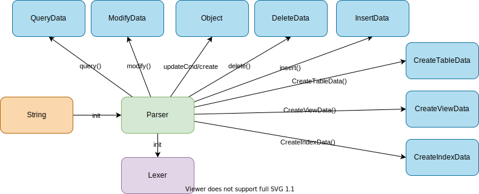

## Chapter 9: Parsing

### Overview



### 9.1. Lexer

1. Create `parse/Lexer.java`
    ```java
    package simpledb.parse;

    import java.io.IOException;
    import java.io.StreamTokenizer;
    import java.io.StringReader;
    import java.util.Arrays;
    import java.util.Collection;

    /*
     * Lexical analyzer supports the five types of tokens:
     * 1. Single-character delimiters
     * 2. Integer constants
     * 3. String constants
     * 4. Keywords
     * 5. Identifiers
     * eatXXX means extract the value, move to next token, and return the value.
     */
    public class Lexer {
      private Collection<String> keywords;
      private StreamTokenizer tok;

      public Lexer(String s) {
        initKeywords();
        tok = new StreamTokenizer(new StringReader(s));
        tok.ordinaryChar('.'); // disallow "." in identifiers
        tok.wordChars('_', '_'); // allow "_" in identifiers
        tok.lowerCaseMode(true); // ids and keywords are converted
        nextToken();
      }

      /*
       * Return true if the current token is
       * the specified delimiter character
       */
      public boolean matchDelim(char d) {
        return d == (char) tok.ttype;
      }

      /*
       * Return true if the current token is an integer
       */
      public boolean matchIntConstant() {
        return tok.ttype == StreamTokenizer.TT_NUMBER;
      }

      /*
       * Return true if the current token is a string.
       */
      public boolean matchStringConstant() {
        return '\'' == (char) tok.ttype;
      }

      /*
       * Return true if the current token is te speccified keyword.
       */
      public boolean matchKeyword(String w) {
        return tok.ttype == StreamTokenizer.TT_WORD && tok.sval.equals(w);
      }

      /*
       * Return true if the current token is a legal identifier.
       */
      public boolean matchId() {
        return tok.ttype == StreamTokenizer.TT_WORD && !keywords.contains(tok.sval);
      }

      // Methods to "eat" the current token

      /*
       * Move to next token if the current token is the delimiter.
       * Otherwise, throw exception.
       */
      public void eatDelim(char d) {
        if (!matchDelim(d))
          throw new BadSyntaxException();
        nextToken();
      }

      public int eatIntConstant() {
        if (!matchIntConstant())
          throw new BadSyntaxException();
        int i = (int) tok.nval;
        nextToken();
        return i;
      }

      public String eatStringConstant() {
        if (!matchStringConstant())
          throw new BadSyntaxException();
        String s = tok.sval;
        nextToken();
        return s;
      }

      public void eatKeyword(String w) {
        if (!matchKeyword(w))
          throw new BadSyntaxException();
        nextToken();
      }

      public String eatId() {
        if (!matchId())
          throw new BadSyntaxException();
        String s = tok.sval;
        nextToken();
        return s;
      }

      private void nextToken() {
        try {
          tok.nextToken();
        } catch (IOException e) {
          throw new BadSyntaxException();
        }
      }

      private void initKeywords() {
        keywords = Arrays.asList("select", "from", "where", "and",
            "insert", "into", "values", "delete", "update", "set",
            "create", "table", "int", "varchar", "view", "as", "index", "on");
      }
    }
    ```

1. Create `parse/BadSyntaxException.java`

    ```java
    package simpledb.parse;

    @SuppressWarnings("serial")
    public class BadSyntaxException extends RuntimeException {

    }
    ```
1. Add test `parse/LexerTest.java`

    ```java
    package simpledb.parse;

    import static org.junit.jupiter.api.Assertions.assertEquals;
    import static org.junit.jupiter.api.Assertions.assertFalse;
    import static org.junit.jupiter.api.Assertions.assertTrue;

    import org.junit.jupiter.api.Test;

    public class LexerTest {
      @Test
      public void testIdEqualsInt() {
        String s = "a = 10";
        Lexer lex = new Lexer(s);

        assertTrue(lex.matchId());
        String x = lex.eatId();
        lex.eatDelim('=');
        int y = lex.eatIntConstant();
        assertEquals("a", x);
        assertEquals(10, y);
      }

      @Test
      public void testIntEqualsId() {
        String s = "10 = a";
        Lexer lex = new Lexer(s);

        assertFalse(lex.matchId());
        int x = lex.eatIntConstant();
        lex.eatDelim('=');
        String y = lex.eatId();
        assertEquals(10, x);
        assertEquals("a", y);
      }
    }
    ```

### 9.2. Parser 1: Methods for parsing predicates, terms, expressions, constants, and fields

1. Create `parse/Parser.java`

    ```java
    package simpledb.parse;

    import simpledb.query.Constant;
    import simpledb.query.Expression;
    import simpledb.query.Predicate;
    import simpledb.query.Term;

    public class Parser {
      private Lexer lex;

      public Parser(String s) {
        lex = new Lexer(s);
      }

      // Methods for parsing predicates, terms, expressions, constants, and fields

      /*
       * move to next token and return the id
       */
      public String field() {
        return lex.eatId();
      }

      /*
       * Return new constant with string if match a string constant.
       * Otherwise return new constant with an integer.
       */
      public Constant constant() {
        if (lex.matchStringConstant())
          return new Constant(lex.eatStringConstant());
        else
          return new Constant(lex.eatIntConstant());
      }

      /*
       * Return new expression based on matchedId
       * use fields If matches id, otherwise constant
       */
      public Expression expression() {
        if (lex.matchId())
          return new Expression(field());
        else
          return new Expression(constant());
      }

      /*
       * term only supports equality comparison
       */
      public Term term() {
        Expression lhs = expression();
        lex.eatDelim('=');
        Expression rhs = expression();
        return new Term(lhs, rhs);
      }

      public Predicate predicate() {
        Predicate pred = new Predicate(term());
        if (lex.matchKeyword("and")) {
          lex.eatKeyword("and");
          pred.conjoinWith(predicate());
        }
        return pred;
      }
    }
    ```

1. Add conjoinWith to `query/Predicate.java`

    ```java
    public void conjoinWith(Predicate pred) {
      terms.addAll(pred.terms);
    }
    ```

1. Add `parse/ParserTest.java`

    ```java
    package simpledb.parse;

    import static org.junit.jupiter.api.Assertions.assertEquals;
    import static org.junit.jupiter.api.Assertions.assertFalse;
    import static org.junit.jupiter.api.Assertions.assertTrue;

    import org.junit.jupiter.api.Test;

    import simpledb.query.Constant;
    import simpledb.query.Expression;
    import simpledb.query.Predicate;
    import simpledb.query.Term;

    public class ParserTest {
      @Test
      public void testParseField() {
        String s = "a";
        Parser p = new Parser(s);
        String field = p.field();
        assertEquals("a", field);
      }

      @Test
      public void testParseConstantInt() {
        String s = "10";
        Parser p = new Parser(s);
        Constant cons = p.constant();
        assertEquals(10, cons.asInt());
      }

      @Test
      public void testParseConstantString() {
        String s = "'test'";
        Parser p = new Parser(s);
        Constant cons = p.constant();
        assertEquals("test", cons.asString());
      }

      @Test
      public void testParseExpressionField() {
        String s = "a";
        Parser p = new Parser(s);
        Expression exp = p.expression();
        assertTrue(exp.isFieldName()); // 'a' is a field
        assertEquals("a", exp.asFieldName()); // 'a' as field name
      }

      @Test
      public void testParseExpressionConstantString() {
        String s = "'test'";
        Parser p = new Parser(s);
        Expression exp = p.expression();
        assertFalse(exp.isFieldName());
        assertEquals(new Constant("test"), exp.asConstant());
      }

      @Test
      public void testParseExpressionConstantInt() {
        String s = "10";
        Parser p = new Parser(s);
        Expression exp = p.expression();
        assertFalse(exp.isFieldName());
        assertEquals(new Constant(10), exp.asConstant());
      }

      @Test
      public void testParseTerm() {
        String s = "a = 10";
        Parser p = new Parser(s);
        Term term = p.term();
        assertEquals("a=10", term.toString());
      }

      @Test
      public void testParsePredicate() {
        String s = "a = 10 AND b = 'test'";
        Parser p = new Parser(s);
        Predicate pred = p.predicate();
        assertEquals("a=10 and b=test", pred.toString());
      }
    }
    ```

1. Run test
    ```
    ./gradlew test
    ```

### 9.3. Parser 2: `SELECT`

1. Add `parse/QueryData.java`
    ```java
    package simpledb.parse;

    import java.util.Collection;
    import java.util.List;

    import simpledb.query.Predicate;

    /*
     * Data for the SQL select statement:
     * select <fields> from <tables> where <pred>
     */
    public class QueryData {
      private List<String> fields;
      private Collection<String> tables;
      private Predicate pred;

      public QueryData(List<String> fields, Collection<String> tables, Predicate pred) {
        this.fields = fields;
        this.tables = tables;
        this.pred = pred;
      }

      public List<String> fields() {
        return fields;
      }

      public Collection<String> tables() {
        return tables;
      }

      public Predicate predicate() {
        return pred;
      }

      public String toString() {
        String result = "select ";
        // fields
        result += String.join(", ", fields());
        result += " from ";
        // tables
        result += String.join(", ", tables());
        // where clause
        if (!pred.isEmpty())
          result += " where " + pred.toString();
        return result;
      }
    }
    ```
1. Add `parse/QueryDataTest.java`

    ```java
    package simpledb.parse;

    import static org.junit.jupiter.api.Assertions.assertEquals;

    import java.util.Arrays;

    import org.junit.jupiter.api.Test;

    import simpledb.query.Expression;
    import simpledb.query.Predicate;
    import simpledb.query.Term;

    public class QueryDataTest {
      @Test
      void testToStringWithFieldsAndTables() {
        Predicate pred = new Predicate();
        QueryData qd = new QueryData(Arrays.asList("f1", "f2", "f3"), Arrays.asList("tbl1", "tbl2"), pred);
        String expectedString = "select f1, f2, f3 from tbl1, tbl2";
        assertEquals(expectedString, qd.toString());
      }

      @Test
      void testToStringWithPredicate() {
        Term t = new Term(new Expression("f1"), new Expression("f2"));
        Predicate pred = new Predicate(t);
        QueryData qd = new QueryData(Arrays.asList("f1", "f2", "f3"), Arrays.asList("tbl1", "tbl2"), pred);
        String expectedString = "select f1, f2, f3 from tbl1, tbl2 where f1=f2";
        assertEquals(expectedString, qd.toString());
      }
    }
    ```
1. Run test

    ```
    ./gradlew test
    ```
1. Add the following code to `parse/Parser.java`

    ```java

    // Methods for parsing queries

    public QueryData query() {
      lex.eatKeyword("select");
      List<String> fields = selectList();
      lex.eatKeyword("from");
      Collection<String> tables = tableList();
      Predicate pred = new Predicate();
      if (lex.matchKeyword("where")) {
        lex.eatKeyword("where");
        pred = predicate();
      }
      return new QueryData(fields, tables, pred);
    }

    private List<String> selectList() {
      List<String> L = new ArrayList<>();
      L.add(field());
      if (lex.matchDelim(',')) {
        lex.eatDelim(',');
        L.addAll(selectList());
      }
      return L;
    }

    private Collection<String> tableList() {
      Collection<String> L = new ArrayList<>();
      L.add(lex.eatId());
      if (lex.matchDelim(',')) {
        lex.eatDelim(',');
        L.addAll(tableList());
      }
      return L;
    }
    ```
1. Add a test to `parse/ParserTest.java`

    ```java
    @Test
    public void testParseQuery() {
      String s = "select a, b from tbl1, tbl2 where a = 10 and b = 'test'";
      Parser p = new Parser(s);
      QueryData qd = p.query();
      assertEquals(Arrays.asList("a", "b"), qd.fields());
      assertEquals(Arrays.asList("tbl1", "tbl2"), qd.tables());
      assertFalse(qd.predicate().isEmpty());
      assertEquals("select a, b from tbl1, tbl2 where a=10 and b=test", qd.toString());
    }
    ```

### 9.4. Parser 3: `INSERT`

1. Add `updateCmd` and `insert`

    ```java
    // Methods for parsing the various update commands

    /*
     * Call corresponding private method based on the matched keyword:
     * 1. insert: insert()
     */
    public Object updateCmd() {
      if (lex.matchKeyword("insert"))
        return insert();
      else
        throw new BadSyntaxException();
    }

    /*
     * Parse insert SQL and return InsertData object
     */
    private InsertData insert() {
      lex.eatKeyword("insert");
      lex.eatKeyword("into");
      String tblname = lex.eatId();
      lex.eatDelim('(');
      List<String> flds = fieldList();
      lex.eatDelim(')');
      lex.eatKeyword("values");
      lex.eatDelim('(');
      List<Constant> vals = constList();
      lex.eatDelim(')');
      return new InsertData(tblname, flds, vals);
    }

    private List<String> fieldList() {
      List<String> L = new ArrayList<>();
      L.add(field());
      if (lex.matchDelim(',')) {
        lex.eatDelim(',');
        L.addAll(fieldList());
      }
      return L;
    }

    private List<Constant> constList() {
      List<Constant> L = new ArrayList<>();
      L.add(constant());
      if (lex.matchDelim(',')) {
        lex.eatDelim(',');
        L.addAll(constList());
      }
      return L;
    }
    ```

1. Add `parse/InsertData.java`

    ```java
    package simpledb.parse;

    import java.util.List;

    import simpledb.query.Constant;

    public class InsertData {
      private String tblname;
      private List<String> flds;
      private List<Constant> vals;

      public InsertData(String tblname, List<String> flds, List<Constant> vals) {
        this.tblname = tblname;
        this.flds = flds;
        this.vals = vals;
      }

      public String tableName() {
        return tblname;
      }

      public List<String> fields() {
        return flds;
      }

      public List<Constant> vals() {
        return vals;
      }
    }
    ```

1. Add a test

    ```java
    @Test
    public void testParseInsert() {
      String s = "insert into tbl(a, b) values (10, 'test')";
      Parser p = new Parser(s);
      InsertData insertData = (InsertData) p.updateCmd();
      assertEquals(Arrays.asList("a", "b"), insertData.fields());
      assertEquals("tbl", insertData.tableName());
      assertEquals(new Constant(10), insertData.vals().get(0));
      assertEquals(new Constant("test"), insertData.vals().get(1));
    }
    ```
1. Run test

    ```
    ./gradlew test
    ```

### 9.5. Parser 4: `DELETE`

1. Update `parse/Parser.java`

    1. Add the following to `updateCmd`.
        ```java
        if (lex.matchKeyword("delete"))
          return delete();
        ```

    1. Add `delete()` function.

      ```java
      /*
       * Parse delete SQL and return DeleteData object
       */
      public DeleteData delete() {
        lex.eatKeyword("delete");
        lex.eatKeyword("from");
        String tblname = lex.eatId();
        Predicate pred = new Predicate();
        if (lex.matchKeyword("where")) {
          lex.eatKeyword("where");
          pred = predicate();
        }
        return new DeleteData(tblname, pred);
      }
      ```
1. Add `parse/DeleteData.java`
    ```java
    package simpledb.parse;

    import simpledb.query.Predicate;

    /*
     * Data for the SQL delete statement
     */
    public class DeleteData {
      private String tblname;
      private Predicate pred;

      public DeleteData(String tblname, Predicate pred) {
        this.tblname = tblname;
        this.pred = pred;
      }

      public String tableName() {
        return tblname;
      }

      public Predicate pred() {
        return pred;
      }
    }
    ```
1. Add test to `parse/ParserTest.java`
    ```java
    @Test
    public void testParseDelete() {
      String s = "delete from tbl where a = 10 and b = 'test'";
      Parser p = new Parser(s);
      DeleteData deleteData = (DeleteData) p.updateCmd();
      assertEquals("tbl", deleteData.tableName());
      assertEquals("a=10 and b=test", deleteData.pred().toString());
    }
    ```
1. Run test
    ```
    ./gradlew test
    ```

### 9.6 Parser 5: `UPDATE`
1. Update `parse/Parser.java`
    1. Add the following to `updateCmd()`
        ```java
        if (lex.matchKeyword("update"))
          return modify();
        ```
    1. Add `modify()`

        ```java
        public ModifyData modify() {
          lex.eatKeyword("update");
          String tblname = lex.eatId();
          lex.eatKeyword("set");
          String fldname = field();
          lex.eatDelim('=');
          Expression newval = expression();
          Predicate pred = new Predicate();
          if (lex.matchKeyword("where")) {
            lex.eatKeyword("where");
            pred = predicate();
          }
          return new ModifyData(tblname, fldname, newval, pred);
        }
        ```

1. Add `parse/ModifyData.java`

    ```java
    package simpledb.parse;

    import simpledb.query.Expression;
    import simpledb.query.Predicate;

    /*
     * Data for the SQL update statement
     */
    public class ModifyData {
      private String tblname;
      private String fldname;
      private Expression newval;
      private Predicate pred;

      public ModifyData(String tblname, String fldname, Expression newval, Predicate pred) {
        this.tblname = tblname;
        this.fldname = fldname;
        this.newval = newval;
        this.pred = pred;
      }

      public String tableName() {
        return tblname;
      }

      public String targetField() {
        return fldname;
      }

      public Expression newValue() {
        return newval;
      }

      public Predicate pred() {
        return pred;
      }
    }
    ```
1. Add test to `parse/ParserTest.java`

    ```java
    @Test
    public void testParseModify() {
      String s = "update tbl set a = 10 where b = 'test'";
      Parser p = new Parser(s);
      ModifyData modifyData = (ModifyData) p.updateCmd();
      assertEquals("tbl", modifyData.tableName());
      assertEquals("a", modifyData.targetField());
      assertEquals(new Constant(10), modifyData.newValue().asConstant());
      assertEquals("b=test", modifyData.pred().toString());
    }
    ```

1. Run test

    ```
    ./gradlew test
    ```

### 9.7. Parser 6: `CREATE TABLE`

1. Add `parse/CreateTableData.java`
    ```java
    package simpledb.parse;

    import simpledb.record.Schema;

    public class CreateTableData {
        private String tblname;
        private Schema sch;

        public CreateTableData(String tblname, Schema sch) {
            this.tblname = tblname;
            this.sch = sch;
        }

        public String tableName() {
            return tblname;
        }

        public Schema newSchema() {
            return sch;
        }
    }
    ```
1. Update `parse/Parser.java`

    1. Add the following to `updateCmd()` function

        ```java
        if (lex.matchKeyword("create"))
          return create();
        ```
    1. Add `create()`

        ```java
        public Object create() {
          lex.eatKeyword("create");
          if (lex.matchKeyword("table"))
            return createTable();
          else
            throw new BadSyntaxException();
        }
        ```
    1. Add `createTable()`, `fieldDefs()`, `fieldDef()`, and `fieldType()`.
        ```java
        public CreateTableData createTable() {
          lex.eatKeyword("table");
          String tblname = lex.eatId();
          lex.eatDelim('(');
          Schema sch = fieldDefs();
          lex.eatDelim(')');
          return new CreateTableData(tblname, sch);
        }

        private Schema fieldDefs() {
          Schema schema = fieldDef();
          if (lex.matchDelim(',')) {
            lex.eatDelim(',');
            Schema schema2 = fieldDefs();
            schema.addAll(schema2);
          }
          return schema;
        }

        private Schema fieldDef() {
          String fldname = field();
          return fieldType(fldname);
        }

        /*
         * Extract field type (int or varchar) for the given field name
         * and add a field with the field type
         */
        private Schema fieldType(String fldname) {
          Schema schema = new Schema();
          if (lex.matchKeyword("int")) {
            lex.eatKeyword("int");
            schema.addIntField(fldname);
          } else if (lex.matchKeyword("varchar")) {
            lex.eatKeyword("varchar");
            int strlen = lex.eatIntConstant();
            lex.eatDelim('(');
            schema.addStringField(fldname, strlen);
          } else {
            throw new BadSyntaxException();
          }
          return schema;
        }
        ```
1. Add test to `parse/ParserTest.java`

    ```java
    @Test
    public void testParseCreateTable() {
      String s = "create table tbl (a int, b varchar(20))";
      Parser p = new Parser(s);
      CreateTableData createTableData = (CreateTableData) p.updateCmd();
      assertEquals("tbl", createTableData.tableName());
      assertEquals(INTEGER, createTableData.newSchema().type("a"));
      assertEquals(0, createTableData.newSchema().length("a"));
      assertEquals(VARCHAR, createTableData.newSchema().type("b"));
      assertEquals(20, createTableData.newSchema().length("b"));
    }
    ```

### 9.8. Parser 7: `CREATE VIEW`

1. Update `parse/Parser.java`
    1. Update `create()`
        ```java
        if (lex.matchKeyword("view"))
          return createView();
        ```
    1. Add `createView()`
        ```java
        /*
         * Parse create view SQL and return CreateViewData
         */
        private CreateViewData createView() {
          lex.eatKeyword("view");
          String viewname = lex.eatId();
          lex.eatKeyword("as");
          QueryData qd = query();
          return new CreateViewData(viewname, qd);
        }
        ```
1. Add `parse/CreateViewData.java`

    ```java
    package simpledb.parse;

    /*
     * Data for the SQL create view statement
     */
    public class CreateViewData {
      private String viewname;
      private QueryData qrydata;

      public CreateViewData(String viewname, QueryData qrydata) {
        this.viewname = viewname;
        this.qrydata = qrydata;
      }

      public String viewName() {
        return viewname;
      }

      public String viewDef() {
        return qrydata.toString();
      }
    }
    ```
1. Add test to `parse/ParserTest.java`

    ```java
    @Test
    public void testParseCreateView() {
      String s = "create view view_name as select a, b from tbl where a = 10 and b = 'test'";
      Parser p = new Parser(s);
      CreateViewData createViewData = (CreateViewData) p.updateCmd();
      assertEquals("view_name", createViewData.viewName());
      assertEquals("select a, b from tbl where a=10 and b=test", createViewData.viewDef());
    }
    ```
1. Run test

    ```
    ./gradlew test
    ```

### 9.9. Parser 8: `CREATE INDEX`

1. Add `parse/CreateIndexData.java`
    ```java
    package simpledb.parse;

    /*
     * Data for the SQL create index statement
     */
    public class CreateIndexData {
      private String idxname;
      private String tblname;
      private String fldname;

      public CreateIndexData(String idxname, String tblname, String fldname) {
        this.idxname = idxname;
        this.tblname = tblname;
        this.fldname = fldname;
      }

      public String indexName() {
        return idxname;
      }

      public String tableName() {
        return tblname;
      }

      public String fieldName() {
        return fldname;
      }
    }
    ```
1. Update `parse/Parser.java`

    1. Update `create()`

        ```java
        if (lex.matchKeyword("index"))
          return createIndex();
        ```

    1. Add `createIndex()` function

        ```java
          /*
         * Parse create index SQL and return CreateIndexData
         * SQL: CREATE INDEX <index_name> ON <tablename>(<fieldname>)
         */
        private CreateIndexData createIndex() {
          lex.eatKeyword("index");
          String idxname = lex.eatId();
          lex.eatKeyword("on");
          String tblname = lex.eatId();
          lex.eatDelim('(');
          String fldname = field();
          lex.eatDelim(')');
          return new CreateIndexData(idxname, tblname, fldname);
        }
        ```
1. Add test `parse/ParserTest.java`

    ```java
    @Test
    public void testParseCreateIndex() {
      String s = "create index test_idx on tbl(a)";
      Parser p = new Parser(s);
      CreateIndexData createIndexData = (CreateIndexData) p.updateCmd();
      assertEquals("test_idx", createIndexData.indexName());
      assertEquals("tbl", createIndexData.tableName());
      assertEquals("a", createIndexData.fieldName());
    }
    ```
