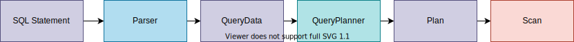

## Chapter 10: Planning

### Overview



### 10.1. Plan

#### 10.1.1. TablePlan

1. Add `Plan` interface `plan/Plan.java`

    ```java
    package simpledb.plan;

    import simpledb.query.Scan;
    import simpledb.record.Schema;

    /*
     * The interface implemented by each query plan.
     * There is a Plan class for each relational algebra operator.
     */
    public interface Plan {
      /*
       * Open a scan corresponding to this plan
       */
      public Scan open();

      /*
       * The estimated number of block accesses
       * that will occur when the scan is executed.
       * This value is used to calculate the estimated cost of the plan
       */
      public int blockAccessed();

      /*
       * The estimated number of output records.
       * This value is used to calculate the estimated cost of the plan
       */
      public int recordsOutput();

      /*
       * The estimated number of distinct records for the specified field
       * This value is used to calculate the estimated cost of the plan
       */
      public int distinctValues(String fldname);

      /*
       * Schema of output table
       */
      public Schema schema();
    }
    ```

1. Add `plan/TablePlan.java`

    ```java
    package simpledb.plan;

    import simpledb.metadata.MetadataMgr;
    import simpledb.metadata.StatInfo;
    import simpledb.query.Scan;
    import simpledb.record.Layout;
    import simpledb.record.Schema;
    import simpledb.record.TableScan;
    import simpledb.tx.Transaction;

    public class TablePlan implements Plan {
      private String tblname;
      private Transaction tx;
      private Layout layout;
      private StatInfo si;

      public TablePlan(Transaction tx, String tblname, MetadataMgr md) {
        this.tblname = tblname;
        this.tx = tx;
        layout = md.getLayout(tblname, tx);
        si = md.getStatInfo(tblname, layout, tx);
      }

      @Override
      public Scan open() {
        return new TableScan(tx, tblname, layout);
      }

      @Override
      public int blockAccessed() {
        return si.blocksAccessed();
      }

      @Override
      public int recordsOutput() {
        return si.recordsOutput();
      }

      @Override
      public int distinctValues(String fldname) {
        return si.distinctValues(fldname);
      }

      @Override
      public Schema schema() {
        return layout.schema();
      }
    }
    ```

1. Add the following code to `App.java`

    ```java
    // 10. Planning
    System.out.println("10.1. TablePlan-------------");
    metadataMgr.createTable("T1", sch1, tx); // create table in because tabcat doesn't have a record for T1 created above
    Plan p1 = new TablePlan(tx, "T1", metadataMgr);

    System.out.println("R(p1): " + p1.recordsOutput());
    System.out.println("B(p1): " + p1.blockAccessed());
    for (String fldname : sch1.fields())
      System.out.println("V(p1, " + fldname + "): " + p1.distinctValues(fldname));

    tx.commit();
    ```

1. Run
    ```
    ./gradlew run
    ```

    You can see output records, block accessed, and the distinct value for each fields:
    ```
    R(p1): 10
    B(p1): 1
    V(p1, A): 4
    V(p1, B): 4
    ```

#### 10.1.2. SelectPlan

1. Add the reductionFactor to `query/Term.java`

    ```java
    /*
     * Calculate the extent to which selecting on the term reduces the number of
     * records output by a query.
     * If reduction factor is 2, the term cuts the size in half.
     */
    public int reductionFactor(Plan p) {
      String lhsName;
      String rhsName;
      // max of 1/(distinct values of the field)
      if (lhs.isFieldName() && rhs.isFieldName()) {
        lhsName = lhs.asFieldName();
        rhsName = rhs.asFieldName();
        return Math.max(p.distinctValues(lhsName), p.distinctValues(rhsName));
      }
      if (lhs.isFieldName()) {
        lhsName = lhs.asFieldName();
        return p.distinctValues(lhsName); // 1/(distinct values of the field)
      }
      if (rhs.isFieldName()) {
        rhsName = rhs.asFieldName();
        return p.distinctValues(rhsName); // 1/(distinct values of the field)
      }
      if (lhs.asConstant().equals(rhs.asConstant())) // no change
        return 1;
      else
        return Integer.MAX_VALUE; // not match -> infinite reduction
    }

    /*
     * If the term is in the form of F=c, return c
     * otherwise, return null.
     */
    public Constant equatesWithConstant(String fldname) {
      if (lhs.isFieldName() && lhs.asFieldName().equals(fldname) && !rhs.isFieldName())
        return rhs.asConstant();
      else if (rhs.isFieldName() && rhs.asFieldName().equals(fldname) && !lhs.isFieldName())
        return lhs.asConstant();
      else
        return null;
    }

    /*
     * If the term is in the form of F1=F2, return the field name
     * otherwise, return null
     */
    public String equatesWithField(String fldname) {
      if (lhs.isFieldName() && lhs.asFieldName().equals(fldname) && rhs.isFieldName())
        return rhs.asFieldName();
      else if (rhs.isFieldName() && rhs.asFieldName().equals(fldname) && lhs.isFieldName())
        return lhs.asFieldName();
      else
        return null;
    }
    ```

1.  Add the reductionFactor to `query/Predicate.java`

    ```java
    /*
     * The product of all the term's reduction factors
     */
    public int reductionFactor(Plan p) {
      int factor = 1;
      for (Term t : terms)
        factor *= t.reductionFactor(p);
      return factor;
    }

    /*
     * Determine if there is a term of the form "F=c"
     * where F is the specified field and c is some constant.
     * If true, return the constant, otherwise return null.
     */
    public Object equatesWithConstant(String fldname) {
      for (Term t : terms) {
        Constant c = t.equatesWithConstant(fldname);
        if (c != null)
          return c;
      }
      return null;
    }

    /*
     * Determine if there is a term of the form "F1=F2"
     * where F1 is the specified field and F2 is another.
     * If true, return the F2 field name, otherwise return null.
     */
    public String equatesWithField(String fldname) {
      for (Term t : terms) {
        String s = t.equatesWithField(fldname);
        if (s != null)
          return s;
      }
      return null;
    }
    ```

1. Add `plan/SelectPlan.java`

    ```java
    package simpledb.plan;

    import simpledb.query.Predicate;
    import simpledb.query.Scan;
    import simpledb.query.SelectScan;
    import simpledb.record.Schema;

    /*
     * The Plan class corresponding to the select
     * relational algebra operator
     */
    public class SelectPlan implements Plan {
      private Plan p;
      private Predicate pred;

      public SelectPlan(Plan p, Predicate pred) {
        this.p = p;
        this.pred = pred;
      }

      @Override
      public Scan open() {
        Scan s = p.open();
        return new SelectScan(s, pred);
      }

      @Override
      public int blockAccessed() {
        return p.blockAccessed();
      }

      /*
       * Estimate the number of output records in the selectiion,
       * which is determined by the reduction factor of the predicate.
       */
      @Override
      public int recordsOutput() {
        return p.recordsOutput() / pred.reductionFactor(p);
      }

      @Override
      public int distinctValues(String fldname) {
        if (pred.equatesWithConstant(fldname) != null)
          return 1;
        else {
          String fldname2 = pred.equatesWithField(fldname);
          if (fldname2 != null)
            return Math.min(p.distinctValues(fldname), p.distinctValues(fldname2));
          else
            return p.distinctValues(fldname);
        }
      }

      @Override
      public Schema schema() {
        return p.schema();
      }
    }
    ```

1. Add the following code to `App.java` (before the last `tx.commit()`)

    ```java
    // Select node
    System.out.println("10.1.2. SelectPlan-------------");
    t = new Term(new Expression("A"), new Expression(new Constant(5)));
    pred = new Predicate(t);
    Plan p2 = new SelectPlan(p1, pred);
    System.out.println("R(p2): " + p2.recordsOutput());
    System.out.println("B(p2): " + p2.blockAccessed());
    for (String fldname : p2.schema().fields())
      System.out.println("V(p2, " + fldname + "): " + p2.distinctValues(fldname));
    ```

1. Run.

    ```
    ./gradlew run
    ```

    ```
    10.1.2. SelectPlan-------------
    R(p2): 2
    B(p2): 1
    V(p2, A): 1
    V(p2, B): 4
    ```

#### 10.1.3. ProjectPlan

1. Add `ProjectPlan`

    ```java
    package simpledb.plan;

    import java.util.List;

    import simpledb.query.ProjectScan;
    import simpledb.query.Scan;
    import simpledb.record.Schema;

    /*
     * Plan class corresponding to the project
     * relational algebra operator
     */
    public class ProjectPlan implements Plan {
      private Plan p;
      private Schema schema = new Schema();

      public ProjectPlan(Plan p, List<String> fieldlist) {
        this.p = p;
        for (String fldname : fieldlist)
          schema.add(fldname, p.schema());
      }

      @Override
      public Scan open() {
        Scan s = p.open();
        return new ProjectScan(s, schema.fields());
      }

      @Override
      public int blockAccessed() {
        return p.blockAccessed();
      }

      @Override
      public int recordsOutput() {
        return p.recordsOutput();
      }

      @Override
      public int distinctValues(String fldname) {
        return p.distinctValues(fldname);
      }

      @Override
      public Schema schema() {
        return schema;
      }
    }
    ```

1. Add the following to `App.java` (before the last `tx.commit()`)

    ```java
    // Project node
    System.out.println("10.1.3. ProjectPlan-------------");
    ProjectPlan p3 = new ProjectPlan(p2, fields);
    System.out.println("R(p3): " + p3.recordsOutput());
    System.out.println("B(p3): " + p3.blockAccessed());
    for (String fldname : p3.schema().fields())
      System.out.println("V(p2, " + fldname + "): " + p3.distinctValues(fldname));

    Scan s = p3.open();
    while (s.next())
      System.out.println(s.getString("B"));
    s.close();
    ```

1. Run
    ```
    ./gradlew run
    ```

    ```
    10.1.3. ProjectPlan-------------
    R(p3): 2
    B(p3): 1
    V(p2, B): 4
    ...
    rec5
    rec5
    ```
#### 10.1.4. ProductPlan

1. Add `plan/ProductPlan.java`

    ```java
    package simpledb.plan;

    import simpledb.query.ProductScan;
    import simpledb.query.Scan;
    import simpledb.record.Schema;

    public class ProductPlan implements Plan {
      private Plan p1;
      private Plan p2;
      private Schema schema = new Schema();

      public ProductPlan(Plan p1, Plan p2) {
        this.p1 = p1;
        this.p2 = p2;
        schema.addAll(p1.schema());
        schema.addAll(p2.schema());
      }

      @Override
      public Scan open() {
        Scan s1 = p1.open();
        Scan s2 = p2.open();
        return new ProductScan(s1, s2);
      }

      /*
       * Estimate the required block access
       * B(product(p1, p2)) = B(p1) + R(p1)*B(p2)
       */
      @Override
      public int blockAccessed() {
        return p1.blockAccessed() + p1.recordsOutput() * p2.blockAccessed();
      }

      /*
       * Estimate the number of output records
       * R(product(p1, p2)) = R(p1)*R(p2)
       */
      @Override
      public int recordsOutput() {
        return p1.recordsOutput() * p2.recordsOutput();
      }

      /*
       * Estimate the distinct number of field values.
       * The distinct value is same as the underlying query.
       */
      @Override
      public int distinctValues(String fldname) {
        if (p1.schema().hasField(fldname))
          return p1.distinctValues(fldname);
        else
          return p2.distinctValues(fldname);
      }

      @Override
      public Schema schema() {
        return schema;
      }
    }
    ```
1. Add the following code to `App.java`

    ```java
    // Product node
    System.out.println("10.1.4. ProductPlan-------------");
    metadataMgr.createTable("T2", sch2, tx); // tabcat doesn't have a record for T2 created above
    Plan p4 = new TablePlan(tx, "T2", metadataMgr);
    Plan p5 = new ProductPlan(p1, p4);
    Plan p6 = new SelectPlan(p5, pred);
    System.out.println("R(p6): " + p6.recordsOutput());
    System.out.println("B(p6): " + p6.blockAccessed());
    for (String fldname : p6.schema().fields())
      System.out.println("V(p6, " + fldname + "): " + p6.distinctValues(fldname));

    s = p6.open();
    s.beforeFirst(); // this is necessary for p1 to move to the first position
    while (s.next())
      System.out.println(
          "A: " + s.getInt("A") + ", B: " + s.getString("B") + ", C: " + s.getInt("C") + ", D: " + s.getString("D"));
    s.close();
    ```
1. Run

    ```
    ./gradlew run
    ```

    ```
    R(p6): 25
    B(p6): 11
    V(p6, A): 1
    V(p6, B): 4
    V(p6, C): 4
    V(p6, D): 4
    ```
### 10.2. Planner

#### 10.2.1 BasicQueryPlanner
#### 10.2.2. BasicUpdatePlanner
#### 10.2.3. QueryPlanner
#### 10.2.4. UpdatePlanner
