## Chapter 12: Indexing

### Overview
#### SimpleDB Classes



#### Data Structure



1. When **searching** for records with a search key, start from the root directory by comparing if the seach key and the dataval of each `DirEntry`. When finding the matching DirEntry, it'll go into the next level until it reaches the corresponding leaf block.
1. When **inserting** a new record, same as search, find the corresponding leaf block first, and then insert the new record to the leaf.
    1. If there's space to store the new record, just add the record to the appropriate position.
    1. When the block is full, need to **split** a block:
        1. if the dataval of the new record is larger than the last dataval of the block, we just need to add a new block and store the new record and return the `DirEntry` pointing to the new leaf block. The referenceing directory needs to insert the new `DirEntry` and splits the directory if it's already full.
        1. if the dataval of the new reocrod is in the middle of the leaf, we split the block in approximately half by guaranteeing all the records with the same dataval in the same block.
        1. if the dataval of the block is same for all slots, which means *overflow block*, add a new block referencing the overflow block and move the all records but one to the new block. In this way, it's possible to add new records to the leaf referenced by a directory.
        1. *When you split a block, you must place all records having the same dataval in the same block*

### 12.1. B-Tree Index

#### 12.2.1. Add BTreeIndex

1. Create `BTPage`
    ```java
    package simpledb.index.btree;

    import static java.sql.Types.INTEGER;

    import simpledb.file.BlockId;
    import simpledb.query.Constant;
    import simpledb.record.Layout;
    import simpledb.record.RID;
    import simpledb.record.Schema;
    import simpledb.tx.Transaction;

    /*
     * BTPage provides the common logic for BTreeLeaf and BTreeDir:
     * 1. store records in sorted order
     * 2. split a block when it's full
     */
    public class BTPage {
      private static String FLD_NAME_DATAVAL = "dataval";
      private static String FLD_NAME_BLOCK = "block";
      private static String FLD_NAME_ID = "id";
      private Transaction tx;
      private BlockId currentblk;
      private Layout layout;

      public BTPage(Transaction tx, BlockId currentblk, Layout layout) {
        this.tx = tx;
        this.currentblk = currentblk;
        this.layout = layout;
        tx.pin(currentblk);
      }

      /*
       * Return the slot position where the first record having the specified
       * search key should be.
       */
      public int findSlotBefore(Constant searchkey) {
        int slot = 0;
        while (slot < getNumRecs() && getDataVal(slot).compareTo(searchkey) < 0)
          slot++;
        return slot - 1;
      }

      public void close() {
        if (currentblk != null)
          tx.unpin(currentblk);
        currentblk = null;
      }

      public boolean isFull() {
        return slotpos(getNumRecs() + 1) >= tx.blockSize();
      }

      /*
       * Split the page at the specified position.
       */
      public BlockId split(int splitpos, int flag) {
        BlockId newblk = appendNew(flag);
        BTPage newpage = new BTPage(tx, newblk, layout);
        transferRecs(splitpos, newpage);
        newpage.setFlag(flag);
        newpage.close();
        return newblk;
      }

      public Constant getDataVal(int slot) {
        return getVal(slot, FLD_NAME_DATAVAL);
      }

      public int getFlag() {
        return tx.getInt(currentblk, 0);
      }

      public void setFlag(int val) {
        tx.setInt(currentblk, 0, val, true);
      }

      public BlockId appendNew(int flag) {
        BlockId blk = tx.append(currentblk.fileName());
        tx.pin(blk);
        format(blk, flag);
        return blk;
      }

      public void format(BlockId blk, int flag) {
        tx.setInt(blk, 0, flag, false);
        tx.setInt(blk, Integer.BYTES, 0, false);
        int recsize = layout.slotSize();
        for (int pos = 2 * Integer.BYTES; pos + recsize <= tx.blockSize(); pos += recsize)
          makeDefaultRecord(blk, pos);
      }

      private void makeDefaultRecord(BlockId blk, int pos) {
        for (String fldname : layout.schema().fields()) {
          int offset = layout.offset(fldname);
          if (layout.schema().type(fldname) == INTEGER)
            tx.setInt(blk, pos + offset, 0, false);
          else
            tx.setString(blk, pos + offset, "", false);
        }
      }

      // Methods called only by BTreeDir

      /*
       * Return the block number in the index record
       * at the specified slot
       */
      public int getChildNum(int slot) {
        return getInt(slot, FLD_NAME_BLOCK);
      }

      /*
       * Insert a directory at the specified slot.
       */
      public void insertDir(int slot, Constant val, int blknum) {
        insert(slot);
        setVal(slot, FLD_NAME_DATAVAL, val);
        setInt(slot, FLD_NAME_BLOCK, blknum);
      }

      public RID getDataRid(int slot) {
        return new RID(getInt(slot, FLD_NAME_BLOCK), getInt(slot, FLD_NAME_ID));
      }

      public void insertLeaf(int slot, Constant val, RID rid) {
        insert(slot);
        setVal(slot, FLD_NAME_DATAVAL, val);
        setInt(slot, FLD_NAME_BLOCK, rid.blockNumber());
        setInt(slot, FLD_NAME_ID, rid.slot());
      }

      public void delete(int slot) {
        for (int i = slot + 1; i < getNumRecs(); i++)
          copyRecord(i, i - 1);
        setNumRecs(getNumRecs() - 1);
      }

      /*
       * Return the number of index records in this page.
       */
      public int getNumRecs() {
        return tx.getInt(currentblk, Integer.BYTES);
      }

      private int getInt(int slot, String fldname) {
        int pos = fldpos(slot, fldname);
        return tx.getInt(currentblk, pos);
      }

      private String getString(int slot, String fldname) {
        int pos = fldpos(slot, fldname);
        return tx.getString(currentblk, pos);
      }

      private Constant getVal(int slot, String fldname) {
        int type = layout.schema().type(fldname);
        if (type == INTEGER)
          return new Constant(getInt(slot, fldname));
        else
          return new Constant(getString(slot, fldname));
      }

      private void setInt(int slot, String fldname, int val) {
        int pos = fldpos(slot, fldname);
        tx.setInt(currentblk, pos, val, true);
      }

      private void setString(int slot, String fldname, String val) {
        int pos = fldpos(slot, fldname);
        tx.setString(currentblk, pos, val, true);
      }

      private void setVal(int slot, String fldname, Constant val) {
        int type = layout.schema().type(fldname);
        if (type == INTEGER)
          setInt(slot, fldname, val.asInt());
        else
          setString(slot, fldname, val.asString());
      }

      private void setNumRecs(int n) {
        tx.setInt(currentblk, Integer.BYTES, n, true);
      }

      private void insert(int slot) {
        for (int i = getNumRecs(); i > slot; i--)
          copyRecord(i - 1, i);
        setNumRecs(getNumRecs() + 1);
      }

      private void copyRecord(int from, int to) {
        Schema sch = layout.schema();
        for (String fldname : sch.fields())
          setVal(to, fldname, getVal(from, fldname));
      }

      private void transferRecs(int slot, BTPage dest) {
        int destslot = 0;
        while (slot < getNumRecs()) {
          dest.insert(destslot);
          Schema sch = layout.schema();
          for (String fldname : sch.fields())
            dest.setVal(destslot, fldname, getVal(slot, fldname));
          delete(slot);
          destslot++;
        }
      }

      private int fldpos(int slot, String fldname) {
        int offset = layout.offset(fldname);
        return slotpos(slot) + offset;
      }

      private int slotpos(int slot) {
        int slotsize = layout.slotSize();
        return Integer.BYTES + Integer.BYTES + (slot * slotsize);
      }
    }
    ```

    1. Block structure: `<flag><number of records><slot 1><slot 2>....`
    1. `flag` stores different values for `BTreeDir` and `BTreeLeaf`.
    1. `insert(slot)` moves all the subsequent records to right by one slot.
    1. `delete(slot)` moves all the subsequent records to left by one slot.
    1. `transferRecs` transfers all the records after the specified slot to the destination BTPage.
    1. `split`: create a new block and BTPage with new block, transfer the records after the specified slot position to the new BTPage, close the new page and return the new block.
1. Create `DirEntry`
    ```java
    package simpledb.index.btree;

    import simpledb.query.Constant;

    /*
     * A directory entry has two components:
     * 1. the block number of the child block
     * 2. the dataval of the first record in the block
     */
    public class DirEntry {
      private Constant dataval; // dataval of the first record
      private int blocknum; // child block

      public DirEntry(Constant dataval, int blocknum) {
        this.dataval = dataval;
        this.blocknum = blocknum;
      }

      public Constant dataval() {
        return dataval;
      }

      public int blockNumber() {
        return blocknum;
      }
    }
    ```
1. Create `BTreeLeaf`
    ```java
    package simpledb.index.btree;

    import simpledb.file.BlockId;
    import simpledb.query.Constant;
    import simpledb.record.Layout;
    import simpledb.record.RID;
    import simpledb.tx.Transaction;

    /*
     * BTreeLeaf stores the contents of a B-Tree leaf block
    */
    public class BTreeLeaf {
      private Transaction tx;
      private Layout layout;
      private Constant searchkey;
      private BTPage contents;
      private int currentslot;
      private String filename;

      public BTreeLeaf(Transaction tx, BlockId blk, Layout layout, Constant searchkey) {
        this.tx = tx;
        this.layout = layout;
        this.searchkey = searchkey;
        contents = new BTPage(tx, blk, layout);
        currentslot = contents.findSlotBefore(searchkey); // move currentslot to the slot whose next slot has the search key
        filename = blk.fileName();
      }

      public void close() {
        contents.close();
      }

      public boolean next() {
        currentslot++;
        if (currentslot >= contents.getNumRecs())
          return tryOverflow();
        else if (contents.getDataVal(currentslot).equals(searchkey))
          return true;
        else
          return tryOverflow();
      }

      public RID getDataRid() {
        return contents.getDataRid(currentslot);
      }

      public void delete(RID datarid) {
        while (next())
          if (getDataRid().equals(datarid)) {
            contents.delete(currentslot);
            return;
          }
      }

      /*
       * Insert a new leaf record having the specified dataRID and previously-specified search key.
       */
      public DirEntry insert(RID datarid) {
        // If the new record does not fit in the page, split the page and return directory entry for the new page.
        if (contents.getFlag() >= 0 && contents.getDataVal(0).compareTo(searchkey) > 0) {
          Constant firstval = contents.getDataVal(0);
          BlockId newblk = contents.split(0, contents.getFlag());
          currentslot = 0;
          contents.setFlag(-1);
          contents.insertLeaf(currentslot, searchkey, datarid);
          return new DirEntry(firstval, newblk.number());
        }

        currentslot++;
        contents.insertLeaf(currentslot, searchkey, datarid);
        if (!contents.isFull())
          return null;

        // if page is full, split it
        Constant firstkey = contents.getDataVal(0);
        Constant lastkey = contents.getDataVal(contents.getNumRecs() - 1);
        if (lastkey.equals(firstkey)) {
          // create an overflow block to hold all but the first record
          BlockId newblk = contents.split(1, contents.getFlag());
          contents.setFlag(newblk.number());
          return null;
        } else {
          int splitpos = contents.getNumRecs() / 2; // split into half
          Constant splitkey = contents.getDataVal(splitpos);
          if (splitkey.equals(firstkey)) {
            // move right, looking for the next key
            while (contents.getDataVal(splitpos).equals(splitkey))
              splitpos++;
            splitkey = contents.getDataVal(splitpos);
          } else {
            // move left, looking for first entry having that key
            while (contents.getDataVal(splitpos - 1).equals(splitkey))
              splitpos--;
          }
          BlockId newblk = contents.split(splitpos, -1);
          return new DirEntry(splitkey, newblk.number());
        }
      }

      private boolean tryOverflow() {
        Constant firstkey = contents.getDataVal(0);
        int flag = contents.getFlag();
        if (!searchkey.equals(firstkey) || flag < 0)
          return false;
        contents.close();
        BlockId nextblk = new BlockId(filename, flag);
        contents = new BTPage(tx, nextblk, layout);
        currentslot = 0;
        return true;
      }
    }
    ```
1. Create `BTreeDir`
    ```java
    package simpledb.index.btree;

    import simpledb.file.BlockId;
    import simpledb.query.Constant;
    import simpledb.record.Layout;
    import simpledb.tx.Transaction;

    /*
     * B-Tree directory block
     */
    public class BTreeDir {
      private Transaction tx;
      private Layout layout;
      private BTPage contents;
      private String filename;

      BTreeDir(Transaction tx, BlockId blk, Layout layout) {
        this.tx = tx;
        this.layout = layout;
        contents = new BTPage(tx, blk, layout);
        filename = blk.fileName();
      }

      public void close() {
        contents.close();
      }

      /*
       * Move to the leaf node for the search key
       */
      public int search(Constant searchkey) {
        BlockId childblk = findChildBlock(searchkey);
        while (contents.getFlag() > 0) { // until reaching the leaf node
          contents.close();
          contents = new BTPage(tx, childblk, layout);
          childblk = findChildBlock(searchkey);
        }
        return childblk.number();
      }

      /*
       * Create a new root block.
       * The new block will have two children:
       * 1. the old root
       * 2. the specified block
       */
      public void makeNewRoot(DirEntry e) {
        Constant firstval = contents.getDataVal(0);
        int level = contents.getFlag();
        BlockId newblk = contents.split(0, level); // transfer all records
        DirEntry oldroot = new DirEntry(firstval, newblk.number());
        insertEntry(oldroot);
        insertEntry(e);
        contents.setFlag(level + 1);
      }

      /*
       * insert a new directory entry into the B-Tree block.
       * 1. If block is at level 0, the entry is just inserted there.
       * 2. Otherwise, the entry is inserted into the leaf node
       * Return the DirEntry if the block split
       */
      public DirEntry insert(DirEntry e) {
        if (contents.getFlag() == 0)
          return insertEntry(e);
        BlockId childblk = findChildBlock(e.dataVal());
        BTreeDir child = new BTreeDir(tx, childblk, layout);
        DirEntry myentry = child.insert(e);
        child.close();
        return (myentry != null) ? insertEntry(myentry) : null;
      }

      /*
       * Insert a new directory entry
       */
      private DirEntry insertEntry(DirEntry e) {
        int newslot = 1 + contents.findSlotBefore(e.dataVal());
        contents.insertDir(newslot, e.dataVal(), e.blockNumber());
        if (!contents.isFull())
          return null;
        int level = contents.getFlag();
        int splitpos = contents.getNumRecs() / 2;
        Constant splitval = contents.getDataVal(splitpos);
        BlockId newblk = contents.split(splitpos, level);
        return new DirEntry(splitval, newblk.number());
      }

      private BlockId findChildBlock(Constant searchkey) {
        int slot = contents.findSlotBefore(searchkey);
        if (contents.getDataVal(slot+1).equals(searchkey))
          slot++;
        int blknum = contents.getChildNum(slot);
        return new BlockId(filename, blknum);
      }
    }
    ```
1. Create `BTreeIndex`
    ```java
    package simpledb.index.btree;

    import static java.sql.Types.INTEGER;

    import simpledb.file.BlockId;
    import simpledb.index.Index;
    import simpledb.query.Constant;
    import simpledb.record.Layout;
    import simpledb.record.RID;
    import simpledb.record.Schema;
    import simpledb.tx.Transaction;

    public class BTreeIndex implements Index {
      private static final String DIR_FLD_BLOCK = "block";
      private static final String DIR_FLD_DATAVAL = "dataval";
      private Transaction tx;
      private Layout dirLayout;
      private Layout leafLayout;
      private String leaftbl;
      private BTreeLeaf leaf = null;
      private BlockId rootblk;

      public BTreeIndex(Transaction tx, String idxname, Layout leafLayout) {
        this.tx = tx;

        // deal with the leaves
        leaftbl = idxname + "leaf";
        this.leafLayout = leafLayout;
        if (tx.size(leaftbl) == 0) {
          BlockId blk = tx.append(leaftbl);
          BTPage node = new BTPage(tx, blk, leafLayout);
          node.format(blk, -1); // -1 means no overflow block
        }

        // deal with the directory
        Schema dirsch = new Schema();
        dirsch.add(DIR_FLD_BLOCK, leafLayout.schema());
        dirsch.add(DIR_FLD_DATAVAL, leafLayout.schema());
        String dirtbl = idxname + "dir";
        dirLayout = new Layout(dirsch);
        rootblk = new BlockId(dirtbl, 0);
        if (tx.size(dirtbl) == 0) {
          // create new root block
          tx.append(dirtbl);
          BTPage node = new BTPage(tx, rootblk, dirLayout);
          node.format(rootblk, 0);
          // insert initial directory entry
          int fldtype = dirsch.type(DIR_FLD_DATAVAL);
          Constant minval = (fldtype == INTEGER) ? new Constant(Integer.MIN_VALUE) : new Constant("");
          node.insertDir(0, minval, 0);
          node.close();
        }
      }

      /*
       * Travere the directory to find the leaf block corresponding to the specified
       * search key.
       * The leaf page is kept open, for use by the methods next and getDataRid.
       */
      @Override
      public void beforeFirst(Constant searchkey) {
        close();
        BTreeDir root = new BTreeDir(tx, rootblk, dirLayout);
        int blknum = root.search(searchkey);
        root.close();
        BlockId leafblk = new BlockId(leaftbl, blknum);
        leaf = new BTreeLeaf(tx, leafblk, leafLayout, searchkey);
      }

      @Override
      public boolean next() {
        return leaf.next();
      }

      @Override
      public RID getDataRid() {
        return leaf.getDataRid();
      }

      /*
       * insert the datarid to the position where the record with the dataval locates.
       * 1. if the leaf is not full, the process just finishes
       * 2. if the leaf splits, add the new node from the root.
       * 3. if the root splits, make a new root.
       */
      @Override
      public void insert(Constant dataval, RID datarid) {
        beforeFirst(dataval);
        DirEntry e = leaf.insert(datarid);
        leaf.close();
        if (e == null) // the leaf wasn't full
          return;

        // if leaf was full and split occurs
        BTreeDir root = new BTreeDir(tx, rootblk, dirLayout);
        DirEntry e2 = root.insert(e);
        if (e2 != null) // if root was split
          root.makeNewRoot(e2);
        root.close();
      }

      /*
       * 1. traverse to find the leaf page containing the record
       * 2. delete the record by datarid
       */
      @Override
      public void delete(Constant dataval, RID datarid) {
        beforeFirst(dataval);
        leaf.delete(datarid);
        leaf.close();
      }

      @Override
      public void close() {
        if (leaf != null)
          leaf.close();
      }

      /*
       * Estimate the number of block accesses
       * required to find all index records haivg a particular search key.
       */
      public static int searchCost(int numblocks, int rpb) {
        return 1 + (int) (Math.log(numblocks) / Math.log(rpb));
      }
    }
    ```
1. Add Test
1. Run test
    ```
    ./gradlew test
    ```

#### 12.2.2. Use BTreeIndex
1. Replace `DummyIndex` with `BTreeIndex` in `metadata/IndexInfo.java`.

    ```java
    public Index open() {
      return new BTreeIndex(tx, idxname, idxLayout);
    }

    public int blocksAccessed() {
      int rpb = tx.blockSize() / idxLayout.slotSize();
      int numBlocks = si.recordsOutput() / rpb;
      return BTreeIndex.searchCost(numBlocks, rpb);
    }
    ```

    Remove `app/src/main/java/simpledb/index/DummyIndex.java`

1. Add the following code to `App.java`

    ```java
    // 12 Indexing
    System.out.println("12. Indexing-------------");
    tx = new Transaction(fm, lm, bm);
    metadataMgr = new MetadataMgr(false, tx);
    sch = new Schema();
    sch.addStringField("fld1", 10);
    sch.addIntField("fld2");
    metadataMgr.createTable("T3", sch, tx);
    metadataMgr.createIndex("T3_fld1_idx", "T3", "fld1", tx);

    Plan plan = new TablePlan(tx, "T3", metadataMgr);
    Map<String, IndexInfo> indexes = metadataMgr.getIndexInfo("T3", tx);
    IndexInfo ii = indexes.get("fld1");
    Index idx = ii.open();

    // insert 2 records into T3
    UpdateScan us = (UpdateScan) plan.open();
    us.beforeFirst();
    n = 2;
    System.out.println("Inserting " + n + " records into T3.");
    for (int i = 0; i < n; i++) {
      System.out.println("Inserting " + i + " into T3.");
      us.insert();
      us.setString("fld1", "rec" + i % 2);
      us.setInt("fld2", i % 2);
      // insert index record
      Constant dataval = us.getVal("fld1");
      RID datarid = us.getRid();
      System.out.println("insert index " + dataval + " " + datarid);
      idx.insert(dataval, datarid);
    }

    // Get records without index
    us.beforeFirst();
    while (us.next()) {
      System.out.println("Got data from T3 without index. RID:" + us.getRid() + ", fld1: " + us.getString("fld1"));
    }
    us.close();
    tx.commit(); // need to flush index to disk

    // Get records where fld1 = "rec0" with index
    us = (UpdateScan) plan.open();
    idx = ii.open();
    System.out.println("Get records fld1=rec0 using index ------------------------------------------");
    idx.beforeFirst(new Constant("rec0"));
    while (idx.next()) {
      RID datarid = idx.getDataRid();
      us.moveToRid(datarid);
      System.out.println(String.format("Got data from T3 with index (rec0). RID:" + us.getRid() + ", fld1: " + us.getString("fld1")));
    }
    System.out.println("Get records fld1=rec1 using index ------------------------------------------");
    idx.beforeFirst(new Constant("rec1"));
    while (idx.next()) {
      RID datarid = idx.getDataRid();
      us.moveToRid(datarid);
      System.out
          .println(String.format("Got data from T3 with index (rec1). RID:" + us.getRid() + ", fld1: " + us.getString("fld1")));
    }

    idx.close();
    tx.commit();
    ```

    This code does the followings:
    1. Create table `T3` with `fld1` (varchar) and `fld2` (int) fields
    1. Insert two records to `T3` table.
    1. Insert two index records to `T3_fld1_idx` index.
    1. Search records with searchkey `fld1=rec0` using the index
    1. Search records with searchkey `fld1=rec1` using the index

1. Run.

    ```
    rm -rf app/datadir && ./gradlew run
    ```

    You'll see the logs:
    ```
    Got data from T3 with index (rec0). RID:[0, 0], fld1: rec0]
    Got data from T3 with index (rec1). RID:[0, 1], fld1: rec1
    ```
### 12.2. Plan

#### 12.2.1. IndexSelectPlan

```java
  @Override
  public boolean next() {
    boolean ok = idx.next();
    if (ok) {
      RID rid = idx.getDataRid();
      ts.moveToRid(rid);
    }
    return ok;
  }
```

1. Add `index/planner/IndexSelectPlan.java`
    ```java
    package simpledb.index.planner;

    import simpledb.index.Index;
    import simpledb.index.query.IndexSelectScan;
    import simpledb.metadata.IndexInfo;
    import simpledb.plan.Plan;
    import simpledb.query.Constant;
    import simpledb.query.Scan;
    import simpledb.record.Schema;
    import simpledb.record.TableScan;

    public class IndexSelectPlan implements Plan {
      private Plan p;
      private IndexInfo ii;
      private Constant val;

      public IndexSelectPlan(Plan p, IndexInfo ii, Constant val) {
        this.p = p;
        this.ii = ii;
        this.val = val;
      }

      @Override
      public Scan open() {
        TableScan ts = (TableScan) p.open();
        Index idx = ii.open();
        return new IndexSelectScan(ts, idx, val);
      }

      @Override
      public int blockAccessed() {
        return ii.blocksAccessed() + recordsOutput();
      }

      @Override
      public int recordsOutput() {
        return ii.recordsOutput();
      }

      @Override
      public int distinctValues(String fldname) {
        return ii.distinctValues(fldname);
      }

      @Override
      public Schema schema() {
        return p.schema();
      }
    }
    ```
1. Add `index/query/IndexSelectScan.java`
    ```java
    package simpledb.index.query;

    import simpledb.index.Index;
    import simpledb.query.Constant;
    import simpledb.query.Scan;
    import simpledb.record.RID;
    import simpledb.record.TableScan;

    public class IndexSelectScan implements Scan {
      private TableScan ts;
      private Index idx;
      private Constant val;

      public IndexSelectScan(TableScan ts, Index idx, Constant val) {
        this.ts = ts;
        this.idx = idx;
        this.val = val;
        beforeFirst();
      }

      @Override
      public void beforeFirst() {
        idx.beforeFirst(val);
      }

      @Override
      public boolean next() {
        boolean ok = idx.next();
        if (ok) {
          RID rid = idx.getDataRid();
          ts.moveToRid(rid);
        }
        return ok;
      }

      @Override
      public int getInt(String fldname) {
        return ts.getInt(fldname);
      }

      @Override
      public String getString(String fldname) {
        return ts.getString(fldname);
      }

      @Override
      public Constant getVal(String fldname) {
        return ts.getVal(fldname);
      }

      @Override
      public boolean hasField(String fldname) {
        return ts.hasField(fldname);
      }

      @Override
      public void close() {
        idx.close();
        ts.close();
      }
    }
    ```
#### 12.2.2. IndexJoinPlan
1. Add `index/planner/IndexJoinPlan.java`
    ```java
    package simpledb.index.planner;

    import simpledb.index.Index;
    import simpledb.index.query.IndexJoinScan;
    import simpledb.metadata.IndexInfo;
    import simpledb.plan.Plan;
    import simpledb.query.Scan;
    import simpledb.record.Schema;
    import simpledb.record.TableScan;

    public class IndexJoinPlan implements Plan {
      private Plan p1;
      private Plan p2;
      private IndexInfo ii;
      private String joinfield;
      private Schema sch = new Schema();

      public IndexJoinPlan(Plan p1, Plan p2, IndexInfo ii, String joinfield) {
        this.p1 = p1;
        this.p2 = p2;
        this.ii = ii;
        this.joinfield = joinfield;
        sch.addAll(p1.schema());
        sch.addAll(p2.schema());
      }

      @Override
      public Scan open() {
        Scan s = p1.open();
        TableScan ts = (TableScan) p2.open();
        Index idx = ii.open();
        return new IndexJoinScan(s, idx, joinfield, ts);
      }

      /*
       * B(indexjoin(p1,p2,idx)) = B(p1) + R(p1)*B(idx) + R(idexjoin(p1,p2,idx))
       */
      @Override
      public int blockAccessed() {
        return p1.blockAccessed()
            + (p1.recordsOutput() * ii.blocksAccessed())
            + recordsOutput();
      }

      /*
       * R(indexjoin(p1,p2,idx)) = R(p1)*R(idx)
       */
      @Override
      public int recordsOutput() {
        return p1.recordsOutput() * ii.recordsOutput();
      }

      @Override
      public int distinctValues(String fldname) {
        if (p1.schema().hasField(fldname))
          return p1.distinctValues(fldname);
        else
          return p2.distinctValues(fldname);
      }

      @Override
      public Schema schema() {
        return sch;
      }
    }
    ```
1. Add `index/query/IndexJoinScan.java`

    ```java
    package simpledb.index.query;

    import simpledb.index.Index;
    import simpledb.query.Constant;
    import simpledb.query.Scan;
    import simpledb.record.TableScan;

    /*
     * LHS: Scan
     * RHS: TableScan + index
     */
    public class IndexJoinScan implements Scan {
      private Scan lhs;
      private Index idx;
      private String joinfield;
      private TableScan rhs;

      public IndexJoinScan(Scan s, Index idx, String joinfield, TableScan ts) {
        this.lhs = s;
        this.idx = idx;
        this.joinfield = joinfield;
        this.rhs = ts;
        beforeFirst();
      }

      @Override
      public void beforeFirst() {
        lhs.beforeFirst();
        lhs.next();
        resetIndex();
      }

      /*
       * move to the next index record if possible
       * otherwise move to the next LHS record and the first index record
       */
      @Override
      public boolean next() {
        while (true) {
          if (idx.next()) {
            rhs.moveToRid(idx.getDataRid());
            return true;
          }
          if (!lhs.next())
            return false;
          resetIndex();
        }
      }

      @Override
      public int getInt(String fldname) {
        if (rhs.hasField(fldname))
          return rhs.getInt(fldname);
        else
          return lhs.getInt(fldname);
      }

      @Override
      public String getString(String fldname) {
        if (rhs.hasField(fldname))
          return rhs.getString(fldname);
        else
          return lhs.getString(fldname);
      }

      @Override
      public Constant getVal(String fldname) {
        if (rhs.hasField(fldname))
          return rhs.getVal(fldname);
        else
          return lhs.getVal(fldname);
      }

      @Override
      public boolean hasField(String fldname) {
        return rhs.hasField(fldname) || lhs.hasField(fldname);
      }

      @Override
      public void close() {
        lhs.close();
        idx.close();
        rhs.close();
      }

      private void resetIndex() {
        Constant searchkey = lhs.getVal(joinfield);
        idx.beforeFirst(searchkey);
      }
    }
    ```
#### 12.2.3. IndexUpdatePlanner
1. Add `index/planner/IndexUpdatePlanner.java`

    ```java
    package simpledb.index.planner;

    import java.util.Iterator;
    import java.util.Map;

    import simpledb.index.Index;
    import simpledb.metadata.IndexInfo;
    import simpledb.metadata.MetadataMgr;
    import simpledb.parse.CreateIndexData;
    import simpledb.parse.CreateTableData;
    import simpledb.parse.CreateViewData;
    import simpledb.parse.DeleteData;
    import simpledb.parse.InsertData;
    import simpledb.parse.ModifyData;
    import simpledb.plan.Plan;
    import simpledb.plan.SelectPlan;
    import simpledb.plan.TablePlan;
    import simpledb.plan.UpdatePlanner;
    import simpledb.query.Constant;
    import simpledb.query.UpdateScan;
    import simpledb.record.RID;
    import simpledb.tx.Transaction;

    public class IndexUpdatePlanner implements UpdatePlanner {
      private MetadataMgr mdm;

      public IndexUpdatePlanner(MetadataMgr mdm) {
        this.mdm = mdm;
      }

      @Override
      public int executeInsert(InsertData data, Transaction tx) {
        String tblname = data.tableName();
        Plan p = new TablePlan(tx, tblname, mdm);

        // first, insert the record
        UpdateScan s = (UpdateScan) p.open();
        s.insert();
        RID rid = s.getRid();

        // then insert an index record for every index
        Map<String, IndexInfo> indexes = mdm.getIndexInfo(tblname, tx);
        Iterator<Constant> valIter = data.vals().iterator();
        for (String fldname : data.fields()) {
          Constant val = valIter.next();
          s.setVal(fldname, val);

          IndexInfo ii = indexes.get(fldname);
          if (ii != null) {
            Index idx = ii.open();
            idx.insert(val, rid);
            idx.close();
          }
        }
        s.close();
        return 1;
      }

      @Override
      public int executeDelete(DeleteData data, Transaction tx) {
        String tblname = data.tableName();
        Plan p = new TablePlan(tx, tblname, mdm);
        Map<String, IndexInfo> indexes = mdm.getIndexInfo(tblname, tx);

        UpdateScan s = (UpdateScan) p.open();
        int count = 0;
        while (s.next()) {
          // first delete index from every index
          RID rid = s.getRid();
          for (Map.Entry<String, IndexInfo> entry : indexes.entrySet()) {
            Constant val = s.getVal(entry.getKey());
            Index idx = entry.getValue().open();
            idx.delete(val, rid);
            idx.close();
          }

          // then delete the record
          s.delete();
          count++;
        }
        s.close();
        return count;
      }

      @Override
      public int executeModify(ModifyData data, Transaction tx) {
        String tblname = data.tableName();
        String fldname = data.targetField();
        Plan p = new TablePlan(tx, tblname, mdm);
        p = new SelectPlan(p, data.pred());

        IndexInfo ii = mdm.getIndexInfo(tblname, tx).get(fldname);
        Index idx = (ii == null) ? null : ii.open();

        UpdateScan s = (UpdateScan) p.open();
        int count = 0;
        while (s.next()) {
          // first, update the record
          Constant newval = data.newValue().evaluate(s);
          Constant oldval = s.getVal(fldname);
          s.setVal(data.targetField(), newval);

          // then update the index if exists
          if (idx != null) {
            RID rid = s.getRid();
            idx.delete(oldval, rid);
            idx.insert(newval, rid);
          }
          count++;
        }
        if (idx != null)
          idx.close();
        s.close();
        return count;
      }

      @Override
      public int executeCreateTable(CreateTableData data, Transaction tx) {
        mdm.createTable(data.tableName(), data.newSchema(), tx);
        return 0;
      }

      @Override
      public int executeCreateView(CreateViewData data, Transaction tx) {
        mdm.createView(data.viewName(), data.viewDef(), tx);
        return 0;
      }

      @Override
      public int executeCreateIndex(CreateIndexData data, Transaction tx) {
        mdm.createIndex(data.indexName(), data.tableName(), data.fieldName(), tx);
        return 0;
      }
    }
    ```

#### 12.2.4. Use IndexUpdatePlanner

1. Update `BasicUpdatePlanner` with `IndexUpdatePlanner` in `SimpleDB.java`

1. Update `client/network/JdbcNetworkDriverExample.java`

    ```java
    package simpledb.client.network;

    import java.sql.Connection;
    import java.sql.Driver;
    import java.sql.ResultSet;
    import java.sql.SQLException;
    import java.sql.Statement;

    import simpledb.jdbc.network.NetworkDriver;

    public class JdbcNetworkDriverExample {
      public static void main(String[] args) {
        Driver d = new NetworkDriver();
        String url = "jdbc:simpledb://localhost";
        try (Connection conn = d.connect(url, null);
            Statement stmt = conn.createStatement()) {
          // 1. create table student
          String sql = "create table STUDENT (Sid int, SName varchar(10), MajorId int, GradYear int)";
          stmt.executeUpdate(sql);

          // 2. create index
          sql = "create index student_sid_idx on student(sid)";
          stmt.executeUpdate(sql);

          // 3. select tables
          sql = "select tblname, slotsize from tblcat";
          ResultSet rs = stmt.executeQuery(sql);
          while (rs.next())
            System.out.println(String.format("table: %s, slotsize: %d", rs.getString("tblname"), rs.getInt("slotsize")));

          // 4. insert record to student table
          for (int i = 1; i <= 100; i++) {
            int gradYear = 100 + i % 7;
            int majorId = i % 13;
            String name = "name" + i;
            sql = String.format("insert into student(Sid, SName, MajorId, GradYear) values (%d, '%s', %d, %d)",
                i, name, majorId, gradYear);
            stmt.executeUpdate(sql);
          }

          // 5. select records from student table
          System.out.println("select all records from student table ------");
          sql = "select Sid, SName, MajorId, GradYear from student";
          rs = stmt.executeQuery(sql);
          while (rs.next())
            System.out.println(String.format("Sid: %d, Sname: %s, MajorId: %d, GradYear: %d", rs.getInt("Sid"),
                rs.getString("SName"), rs.getInt("MajorId"), rs.getInt("GradYear")));

          // 6. select records from student table with condition
          System.out.println("select records (sid =1000) from student table ------");
          sql = "select Sid, SName, MajorId, GradYear from student where sid = 1000";
          rs = stmt.executeQuery(sql);
          while (rs.next())
            System.out.println(String.format("Sid: %d, Sname: %s, MajorId: %d, GradYear: %d", rs.getInt("Sid"),
                rs.getString("SName"), rs.getInt("MajorId"), rs.getInt("GradYear")));
        } catch (SQLException e) {
          e.printStackTrace();
        }
      }
    }
    ```

1. Run server
    ```
    rm -rf app/datadir && ./gradlew startServer
    ```
1. Run client
    ```
    ./gradlew networkclient
    ```

    ```
    table: tblcat, slotsize: 28
    table: fldcat, slotsize: 56
    table: viewcat, slotsize: 128
    table: idxcat, slotsize: 64
    table: student, slotsize: 30
    select all records from student table ------
    ...
    Sid: 94, Sname: name94, MajorId: 3, GradYear: 103
    Sid: 95, Sname: name95, MajorId: 4, GradYear: 104
    Sid: 96, Sname: name96, MajorId: 5, GradYear: 105
    Sid: 97, Sname: name97, MajorId: 6, GradYear: 106
    Sid: 98, Sname: name98, MajorId: 7, GradYear: 100
    Sid: 99, Sname: name99, MajorId: 8, GradYear: 101
    Sid: 100, Sname: name100, MajorId: 9, GradYear: 102
    select records (sid =100) from student table ------
    Sid: 100, Sname: name100, MajorId: 9, GradYear: 102
    ```
### 12.3. Hash Index (Optional)

### Exercise 1: Support SQL to create index when creating table

```
create table T (A int, B varchar(9), index (A), C int, index(B))
```

1. parser
1. planner

### Exercise 2: Support inserting index records when running `executeCreateIndex` for an existing table

### Exercise 3: Support `drop index` statement

