# Chapter 14: Effective Buffer Utilization

## 14.1. Multibuffer Product



1. Add `multibuffer/BufferNeeds.java`
    ```java
    package simpledb.multibuffer;

    /*
     * provide a static methods to estimate
     * the optimal number of buffers to allocate for a scan.
     */
    public class BufferNeeds {
      /*
       * return the highest root that
       * is less than the number of available buffers
       * <BUG FIX: We reserve a couple of buffers so that we don't run completely
       * out.>
       *
       * @param size the size of the output file
       */
      public static int bestRoot(int available, int size) {
        int avail = available - 2; // reserve a couple
        if (avail <= 1)
          return 1;
        int k = Integer.MAX_VALUE;
        double i = 1.0;
        while (k > avail) {
          i++;
          k = (int) Math.ceil(Math.pow(size, 1 / i));
        }
        return k;
      }

      /*
       * return the heighest factor that
       * is less than the available buffers
       * <BUG FIX: We reserve a couple of buffers so that we don't run completely
       * out.>
       *
       * @param size the size of the output file
       */
      public static int bestFactor(int available, int size) {
        int avail = available - 2; // reserve a couple
        if (avail <=1)
          return 1;
        int k = size;
        double i = 1.0;
        while (k > avail) {
          i++;
          k = (int) Math.ceil(size / i);
        }
        return k;
      }
    }
    ```
1. Add `availableBuffs` method to `tx/Transaction.java`
    ```java
    public int availableBuffs() {
      return bm.available();
    }
    ```

1. Add `multibuffer/ChunkScan.java`

    ```java
    package simpledb.multibuffer;

    import static java.sql.Types.INTEGER;

    import java.util.ArrayList;
    import java.util.List;

    import simpledb.file.BlockId;
    import simpledb.query.Constant;
    import simpledb.query.Scan;
    import simpledb.record.Layout;
    import simpledb.record.RecordPage;
    import simpledb.tx.Transaction;

    public class ChunkScan implements Scan {
      private List<RecordPage> buffs = new ArrayList<>();
      private Transaction tx;
      private String filename;
      private Layout layout;
      private int startbnum;
      private int endbnum;
      private int currentbnum;
      private RecordPage rp;
      private int currentslot;

      public ChunkScan(Transaction tx, String filename, Layout layout, int startbnum, int endbnum) {
        this.tx = tx;
        this.filename = filename;
        this.layout = layout;
        this.startbnum = startbnum;
        this.endbnum = endbnum;
        for (int i = startbnum; i <= endbnum; i++) {
          BlockId blk = new BlockId(filename, i);
          buffs.add(new RecordPage(tx, blk, layout));
        }
        moveToBlock(startbnum);
      }

      public void close() {
        for (int i = 0; i < buffs.size(); i++) {
          BlockId blk = new BlockId(filename, startbnum + i);
          tx.unpin(blk);
        }
      }

      public void beforeFirst() {
        moveToBlock(startbnum);
      }

      public boolean next() {
        currentslot = rp.nextUsedSlot(currentslot);
        while (currentslot < 0) {
          if (currentbnum == endbnum)
            return false;

          moveToBlock(rp.block().number() + 1);
          currentslot = rp.nextUsedSlot(currentslot);
        }
        return true;
      }

      public int getInt(String fldname) {
        return rp.getInt(currentslot, fldname);
      }

      public String getString(String fldname) {
        return rp.getString(currentslot, fldname);
      }

      public Constant getVal(String fldname) {
        if (layout.schema().type(fldname) == INTEGER)
          return new Constant(getInt(fldname));
        else
          return new Constant(getString(fldname));
      }

      public boolean hasField(String fldname) {
        return layout.schema().hasField(fldname);
      }

      private void moveToBlock(int blknum) {
        currentbnum = blknum;
        rp = buffs.get(currentbnum - startbnum);
        currentslot = -1;
      }
    }
    ```
1. Add `multibuffer/MultibufferProductPlan.java`
    ```java
    package simpledb.multibuffer;

    import simpledb.materialize.MaterializePlan;
    import simpledb.materialize.TempTable;
    import simpledb.plan.Plan;
    import simpledb.query.Scan;
    import simpledb.query.UpdateScan;
    import simpledb.record.Schema;
    import simpledb.tx.Transaction;

    public class MultibufferProductPlan implements Plan {
      private Transaction tx;
      private Plan lhs;
      private Plan rhs;
      private Schema schema = new Schema();

      public MultibufferProductPlan(Transaction tx, Plan lhs, Plan rhs) {
        this.tx = tx;
        this.lhs = new MaterializePlan(tx, lhs);
        this.rhs = rhs;
        schema.addAll(lhs.schema());
        schema.addAll(rhs.schema());
      }

      @Override
      public Scan open() {
        Scan leftscan = lhs.open();
        TempTable tt = copyRecordsFrom(rhs);
        return new MultibufferProductScan(tx, leftscan, tt.tableName(), tt.getLayout());
      }

      @Override
      public int blockAccessed() {
        int avail = tx.availableBuffs();
        int size = new MaterializePlan(tx, rhs).blockAccessed();
        int numchunks = size / avail;
        return rhs.blockAccessed() + (lhs.blockAccessed() * numchunks);
      }

      @Override
      public int recordsOutput() {
        return lhs.recordsOutput() * rhs.recordsOutput();
      }
      @Override
      public int distinctValues(String fldname) {
        if (lhs.schema().hasField(fldname))
          return lhs.distinctValues(fldname);
        else
          return rhs.distinctValues(fldname);
      }
      @Override
      public Schema schema() {
        return schema;
      }

      private TempTable copyRecordsFrom(Plan p) {
        Scan src = p.open();
        Schema sch = p.schema();
        TempTable t = new TempTable(tx, sch);
        UpdateScan dest = t.open();
        while (src.next()) {
          dest.insert();
          for (String fldname : sch.fields())
            dest.setVal(fldname, src.getVal(fldname));
        }
        src.close();
        dest.close();
        return t;
      }
    }
    ```

    If you already have added `preprocessingCost()` to Plan interface, you need to implement it.
    ```java
    /*
     * 1. Materialize LHS (MaterializePlan)
     * 2. Read and write RHS (copyRecordsFrom)
     */
    @Override
    public int preprocessingCost() {
      return (lhs.preprocessingCost() // materialize preprocessing
          + rhs.blockAccessed() // read from rhs (input cost)
          + blockAccessed()); // write to temp table
    }
    ```
1. Add `multibuffer/MultibufferProductScan.java`

    ```java
    package simpledb.multibuffer;

    import simpledb.query.Constant;
    import simpledb.query.ProductScan;
    import simpledb.query.Scan;
    import simpledb.record.Layout;
    import simpledb.tx.Transaction;

    public class MultibufferProductScan implements Scan {
      private Transaction tx;
      private Scan lhsscan;
      private Scan rhsscan = null;
      private Scan prodscan;
      private String filename;
      private Layout layout;
      private int chunksize;
      private int nextblknum;
      private int filesize;

      public MultibufferProductScan(Transaction tx, Scan lhsscan, String tblname, Layout layout) {
        this.tx = tx;
        this.lhsscan = lhsscan;
        this.filename = tblname + ".tbl";
        this.layout = layout;
        filesize = tx.size(filename);
        int available = tx.availableBuffs();
        chunksize = BufferNeeds.bestFactor(available, filesize);
        beforeFirst();
      }

      @Override
      public void beforeFirst() {
        nextblknum = 0;
        useNextChunk();
      }

      @Override
      public boolean next() {
        while (!prodscan.next())
          if (!useNextChunk())
            return false;
        return true;
      }

      @Override
      public int getInt(String fldname) {
        return prodscan.getInt(fldname);
      }

      @Override
      public String getString(String fldname) {
        return prodscan.getString(fldname);
      }

      @Override
      public Constant getVal(String fldname) {
        return prodscan.getVal(fldname);
      }

      @Override
      public boolean hasField(String fldname) {
        return prodscan.hasField(fldname);
      }

      @Override
      public void close() {
        prodscan.close();
      }

      private boolean useNextChunk() {
        if (nextblknum >= filesize)
          return false;
        if (rhsscan != null)
          rhsscan.close();
        int end = nextblknum + chunksize - 1;
        if (end >= filesize)
          end = filesize - 1;
        rhsscan = new ChunkScan(tx, filename, layout, nextblknum, end);
        lhsscan.beforeFirst();
        prodscan = new ProductScan(lhsscan, rhsscan);
        nextblknum = end + 1;
        return true;
      }
    }
    ```
1. Add `ChunkScanTest` and `TableScanTest`

    `ChunkScanTest`: pin/unpin target block only once
    ```java
    package simpledb.multibuffer;

    import static org.junit.jupiter.api.Assertions.assertEquals;
    import static org.junit.jupiter.api.Assertions.assertFalse;
    import static org.junit.jupiter.api.Assertions.assertTrue;
    import static org.mockito.ArgumentMatchers.any;
    import static org.mockito.Mockito.never;
    import static org.mockito.Mockito.times;
    import static org.mockito.Mockito.verify;
    import static org.mockito.Mockito.when;

    import org.junit.jupiter.api.Test;
    import org.junit.jupiter.api.extension.ExtendWith;
    import org.mockito.Mock;
    import org.mockito.junit.jupiter.MockitoExtension;

    import simpledb.file.BlockId;
    import simpledb.query.Scan;
    import simpledb.record.Layout;
    import simpledb.record.Schema;
    import simpledb.tx.Transaction;

    @ExtendWith(MockitoExtension.class)
    public class ChunkScanTest {
      // tx, filenam, layout, startblk, endblk
      // tx.pin unpin only once

      @Mock
      private Transaction tx;

      @Test
      public void testChunkScanInit() {
        String filename = "filename";
        int startblk = 0;
        int endblk = 4;
        Schema sch = new Schema();
        sch.addIntField("intfld");
        Layout layout = new Layout(sch);
        new ChunkScan(tx, filename, layout, startblk, endblk);
        for (int i = startblk; i <= endblk; i++) {
          verify(tx).pin(new BlockId(filename, i)); // pin all blocks
          verify(tx, never()).unpin(new BlockId(filename, i)); // never unpin any blocks
        }
      }

      /*
       * pin/unpin only twice for three records in two blocks.
       * you can compare with TableScanTest
       */
      @Test
      public void testChunkScanGetInt() {
        String filename = "filename";
        int startblk = 0;
        int endblk = 1;
        Schema sch = new Schema();
        sch.addIntField("intfld");
        Layout layout = new Layout(sch);
        when(tx.blockSize()).thenReturn(16);
        when(tx.getInt(new BlockId(filename, startblk), 0)).thenReturn(1); // flag
        when(tx.getInt(new BlockId(filename, startblk), 4)).thenReturn(1); // intfld
        when(tx.getInt(new BlockId(filename, startblk), 0 + layout.slotSize())).thenReturn(1); // flag
        when(tx.getInt(new BlockId(filename, startblk), 4 + layout.slotSize())).thenReturn(2); // intfld
        when(tx.getInt(new BlockId(filename, startblk + 1), 0)).thenReturn(1); // flag
        when(tx.getInt(new BlockId(filename, startblk + 1), 4)).thenReturn(3); // intfld

        Scan scan = new ChunkScan(tx, filename, layout, startblk, endblk);
        // when initializing ChunkScan, it already pins the specified range of blocks
        verify(tx, times(2)).pin(any(BlockId.class));

        // read first time
        assertTrue(scan.next());
        assertEquals(1, scan.getInt("intfld"));
        assertTrue(scan.next());
        assertEquals(2, scan.getInt("intfld"));
        assertTrue(scan.next());
        assertEquals(3, scan.getInt("intfld"));
        assertFalse(scan.next());

        // read second time
        scan.beforeFirst();
        assertTrue(scan.next());
        assertEquals(1, scan.getInt("intfld"));
        assertTrue(scan.next());
        assertEquals(2, scan.getInt("intfld"));
        assertTrue(scan.next());
        assertEquals(3, scan.getInt("intfld"));
        assertFalse(scan.next());

        // no additional pin when getting values
        verify(tx, times(2)).pin(any(BlockId.class));
        verify(tx, never()).unpin(any(BlockId.class));

        scan.close();
        verify(tx, times(2)).unpin(any(BlockId.class));
      }

      @Test
      public void testChunkScanClose() {
        String filename = "filename";
        int startblk = 0;
        int endblk = 4;
        Schema sch = new Schema();
        sch.addIntField("intfld");
        Layout layout = new Layout(sch);
        Scan scan = new ChunkScan(tx, filename, layout, startblk, endblk);
        verify(tx, never()).unpin(any(BlockId.class));
        scan.close();
        for (int i = startblk; i <= endblk; i++) {
          verify(tx).unpin(new BlockId(filename, i)); // unpin all blocks
        }
      }
    }
    ```

    `TableScanTest`: pin/unpin target block every time reading value
    ```java
    package simpledb.record;

    import static org.junit.jupiter.api.Assertions.assertEquals;
    import static org.junit.jupiter.api.Assertions.assertFalse;
    import static org.junit.jupiter.api.Assertions.assertTrue;
    import static org.mockito.ArgumentMatchers.any;
    import static org.mockito.Mockito.times;
    import static org.mockito.Mockito.verify;
    import static org.mockito.Mockito.when;

    import org.junit.jupiter.api.Test;
    import org.junit.jupiter.api.extension.ExtendWith;
    import org.mockito.Mock;
    import org.mockito.junit.jupiter.MockitoExtension;

    import simpledb.file.BlockId;
    import simpledb.query.Scan;
    import simpledb.tx.Transaction;

    @ExtendWith(MockitoExtension.class)
    public class TableScanTest {
      @Mock
      private Transaction tx;

      /*
       * pin/unpin every time the scan reads value
       * you can compare with ChunkScanTest
       */
      @Test
      public void testTableScan() {
        String tblname = "test_tbl";
        String filename = tblname + ".tbl";
        Schema sch = new Schema();
        sch.addIntField("intfld");
        Layout layout = new Layout(sch);
        when(tx.blockSize()).thenReturn(16);
        when(tx.size(filename)).thenReturn(2);
        when(tx.getInt(new BlockId(filename, 0), 0)).thenReturn(1); // flag
        when(tx.getInt(new BlockId(filename, 0), 4)).thenReturn(1); // intfld
        when(tx.getInt(new BlockId(filename, 0), 0 + layout.slotSize())).thenReturn(1); // flag
        when(tx.getInt(new BlockId(filename, 0), 4 + layout.slotSize())).thenReturn(2); // intfld
        when(tx.getInt(new BlockId(filename, 1), 0)).thenReturn(1); // flag
        when(tx.getInt(new BlockId(filename, 1), 4)).thenReturn(3); // intfld
        when(tx.getInt(new BlockId(filename, 1), 0 + layout.slotSize())).thenReturn(0); // flag

        Scan scan = new TableScan(tx, tblname, layout);
        verify(tx, times(1)).pin(new BlockId(filename, 0));
        scan.beforeFirst();

        // read first time
        assertTrue(scan.next());
        assertEquals(1, scan.getInt("intfld"));
        assertTrue(scan.next());
        assertEquals(2, scan.getInt("intfld"));
        assertTrue(scan.next());
        assertEquals(3, scan.getInt("intfld"));
        assertFalse(scan.next());
        verify(tx, times(3)).pin(any(BlockId.class));
        verify(tx, times(2)).unpin(any(BlockId.class));

        // read second time
        scan.beforeFirst();
        assertTrue(scan.next());
        assertEquals(1, scan.getInt("intfld"));
        assertTrue(scan.next());
        assertEquals(2, scan.getInt("intfld"));
        assertTrue(scan.next());
        assertEquals(3, scan.getInt("intfld"));
        assertFalse(scan.next());
        verify(tx, times(5)).pin(any(BlockId.class));
        verify(tx, times(4)).unpin(any(BlockId.class));

        scan.close();
        verify(tx, times(5)).unpin(any(BlockId.class));
      }
    }
    ```

## 14.2. Hashjoin



## 14.3. Compare Join Algorithms

## 14.4. Multibuffer Sorting (Optional)
